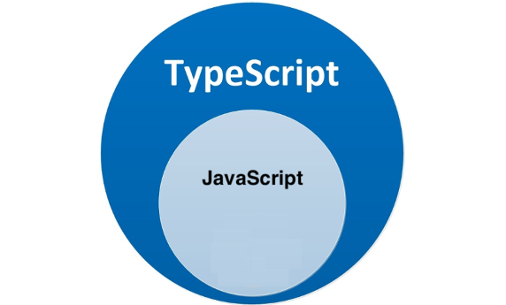
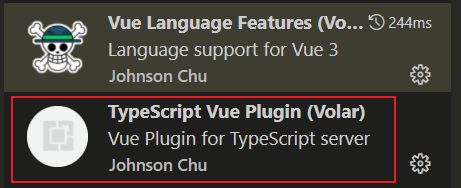

# TypeScript基本概念

## TypeScript 是什么？

**目标：能够说出什么是typescript**

**内容：**

- [TS 官方文档](https://www.typescriptlang.org/)
- [TS 中文参考 - 不再维护](https://www.tslang.cn/)


- **`TypeScript` 简称：TS，是 JavaScript 的超集**，简单来说就是：JS 有的 TS 都有



- TypeScript = `Type` + JavaScript（在 JS 基础之上，**为 JS 添加了类型支持**）
- TypeScript 是*微软*开发的开源编程语言，可以在任何运行 JavaScript 的地方运行


## 为什么要有typescript  

**目标：能够说出为什么需要有typescript** 

**内容：** 

- 背景：JS 的类型系统存在“先天缺陷”弱类型，JS 代码中绝大部分错误都是类型错误（Uncaught TypeError） 
  - 开发的时候，定义的变量本应该就有类型
- 这些经常出现的错误，导致了在使用 JS 进行项目开发时，增加了找 Bug、改 Bug 的时间，严重影响开发效率

为什么会这样？ var num = 18 num.toLowerCase()

- 从编程语言的动静来区分，**TypeScript 属于静态类型的编程语言**，**JavaScript 属于动态类型的编程语言**
  - 静态类型：**编译**期做类型检查
  - 动态类型：**执行**期做类型检查
- 代码编译和代码执行的顺序：1 编译 2 执行

- 对于 JS 来说：需要等到代码真正去执行的时候才能发现错误（晚）
- 对于 TS 来说：在代码编译的时候（代码执行前）就可以发现错误（早）

并且，配合 VSCode 等开发工具，TS 可以提前到**在编写代码的同时就发现代码中的错误**，减少找 Bug、改 Bug 时间  

对比：

- 使用 JS：
  1. 在 VSCode 里面写代码
  2. 在浏览器中运行代码 --> 运行时，才会发现错误【晚】
- 使用 TS：
  1. 在 VSCode 里面写代码 --> 写代码的同时，就会发现错误【早】
  2. 在浏览器中运行代码


Vue 3 源码使用 TS 重写、Angular 默认支持 TS、React 与 TS 完美配合，TypeScript  已成为大中型前端 项目的首选编程语言

目前，前端最新的开发技术栈：

1. React： TS + Hooks
2. Vue： TS + Vue3 

  - 注意： Vue2 对 TS 的支持不好~   

## 安装编译 TS 的工具包   

**目标：**能够安装ts的工具包来编译ts

**内容：**

- 问题：为什么要安装编译 TS 的工具包?
- 回答：Node.js/浏览器，只认识 JS 代码，不认识 TS 代码。需要先将 TS 代码转化为 JS 代码，然后才能运行
- 安装命令：`npm i -g typescript`  或者 `yarn global add typescript`
  - typescript 包：用来编译 TS 代码的包，提供了 `tsc` 命令，实现了 TS -> JS 的转化
  - *注意：Mac 电脑安装全局包时，需要添加 `sudo` 获取权限：`sudo npm i -g typescript`*  yarn 全局安装：`sudo yarn global add typescript`
- 验证是否安装成功：tsc –v(查看 typescript 的版本)


##  编译并运行 TS 代码

**目标：**能够理解typescript的运行步骤

**内容：**

1. 创建 hello.ts 文件（注意：**TS 文件的后缀名为 `.ts`**）
2. 将 TS 编译为 JS：在终端中输入命令，`tsc hello.ts`（此时，在同级目录中会出现一个同名的 JS 文件）
3. 执行 JS 代码：在终端中输入命令，`node hello.js`

1 创建 ts 文件  ===>  2 编译 TS  ===>  3 执行 JS  

- 说明：所有合法的 JS 代码都是 TS 代码，有 JS 基础只需要学习 TS 的类型即可 
- 注意：由 TS 编译生成的 JS 文件，代码中就没有类型信息了

**真正在开发过程中，其实不需要自己手动的通过tsc把ts文件转成js文件，这些工作应该交给webpack或者vite来完成**

## 创建基于TS的vue项目

**目标**：能够使用vite创建vue-ts模板的项目

**内容：**

基于vite创建一个vue项目，使用typescript模板

```bash
yarn create vite vite-ts-demo  --template vue-ts
```

# TypeScript基础

## 类型注解

**目标：**能够理解什么是typescript的类型注解

**内容：**

- TypeScript 是 JS 的超集，TS 提供了 JS 的所有功能，并且额外的增加了：**类型系统**
  - 所有的 JS 代码都是 TS 代码
  - **JS 有类型**（比如，number/string 等），但是 **JS 不会检查变量的类型是否发生变化**，而 TS 会检查
- TypeScript 类型系统的主要优势：**可以显示标记出代码中的意外行为，从而降低了发生错误的可能性**

**示例代码**:

```ts
let age = 18

let age: number = 18
```

- 说明：代码中的 `: number` 就是**类型注解**
- 作用：**为变量添加类型约束**。比如，上述代码中，约定变量 age 的类型为 number 类型
- 解释：**约定了什么类型，就只能给变量赋值该类型的值，否则，就会报错**
- 约定了类型之后，代码的提示就会非常的清晰
- 错误演示：

```ts
// 错误代码：
// 错误原因：将 string 类型的值赋值给了 number 类型的变量，类型不一致
let age: number = '18'
```

## TypeScript类型概述

**目标：**能够理解TypeScript中有哪些数据类型

**内容：**

可以将 TS 中的常用基础类型细分为两类：

+ JS 已有类型
  + 原始类型，简单类型（`number/string/boolean/null/undefined`） 
  + 复杂数据类型（数组，对象，函数等）

+ TS 新增类型
  + 联合类型
  + 自定义类型（类型别名）
  + 接口
  + 元组
  + 字面量类型
  + 枚举
  + void
  + ...

## TypeScript原始数据类型

- 原始类型：number/string/boolean/null/undefined
- 特点：简单，这些类型，完全按照 JS 中类型的名称来书写

```ts
let age: number = 18
let myName: string = '老师'
let isLoading: boolean = false

// 等等...
```

##  数组类型

**目标：**掌握ts中数组类型的两种写法

**内容：**

- 数组类型的两种写法：
  - 推荐使用 `number[]` 写法

```ts
// 写法一：
let numbers: number[] = [1, 3, 5]
// 写法二：
let strings: Array<string> = ['a', 'b', 'c']
```

## 联合类型

**目标：**能够通过联合类型将多个类型组合成一个类型

**内容：**

需求：数组中既有 number 类型，又有 string 类型，这个数组的类型应该如何写?

```ts
let arr: (number | string)[] = [1, 'a', 3, 'b']
```

- 解释：`|`（竖线）在 TS 中叫做**联合类型**，即：由两个或多个其他类型组成的类型，表示可以是这些类型中的任意一种
- 注意：这是 TS 中联合类型的语法，只有一根竖线，不要与 JS 中的或（|| 或）混淆了

```jsx
  let timer: number | null = null
  timer = setInterval(() => {}, 1000)

  // 定义一个数组，数组中可以有数字或者字符串, 需要注意 | 的优先级
  let arr: (number | string)[] = [1, 'abc', 2]
```

## 类型别名

**目标：**能够使用类型别名给类型起别名

**内容：**

- `类型别名（自定义类型）`：为任意类型起别名
- 使用场景：当同一类型（复杂）被多次使用时，可以通过类型别名，**简化该类型的使用**

```ts
type CustomArray = (number | string)[]

let arr1: CustomArray = [1, 'a', 3, 'b']
let arr2: CustomArray = ['x', 'y', 6, 7]
```

- 解释:
  1. 使用 `type` 关键字来创建自定义类型
  2. 类型别名（比如，此处的 *CustomArray*）可以是任意合法的变量名称
  3. 推荐使用大写字母开头
  4. 创建类型别名后，直接使用该类型别名作为变量的类型注解即可

## 函数类型

### 基本使用

**目标：**能够给函数指定类型

**内容：**

- 函数的类型实际上指的是：`函数参数`和`返回值`的类型
- 为函数指定类型的两种方式：
  1. 单独指定参数、返回值的类型
  2. 同时指定参数、返回值的类型

1. 单独指定参数、返回值的类型：

```ts
// 函数声明
function add(num1: number, num2: number): number {
  return num1 + num2
}

// 箭头函数
const add = (num1: number, num2: number): number => {
  return num1 + num2
}
```

2. 同时指定参数、返回值的类型:

```ts
type AddFn = (num1: number, num2: number) => number

const add: AddFn = (num1, num2) => {
  return num1 + num2
}
```

- 解释：当函数作为表达式时，可以通过类似箭头函数形式的语法来为函数添加类型
- 注意：这种形式只适用于函数表达式

### void 类型

**目标：**能够了解void类型的使用

**内容：**

- 如果函数没有返回值，那么，函数返回值类型为：`void`

```ts
function greet(name: string): void {
  console.log('Hello', name)
}
```

- 注意：
  - 如果一个函数没有返回值，此时，在 TS 的类型中，应该使用 `void` 类型

```ts
// 如果什么都不写，此时，add 函数的返回值类型为： void
const add = () => {}
// 这种写法是明确指定函数返回值类型为 void，与上面不指定返回值类型相同
const add = (): void => {}

// 但，如果指定 返回值类型为 undefined，此时，函数体中必须显示的 return undefined 才可以
const add = (): undefined => {
  // 此处，返回的 undefined 是 JS 中的一个值
  return undefined
}
```

### 可选参数

**目标：**能够使用?给函数指令可选参数类型

**内容：**

- 使用函数实现某个功能时，参数可以传也可以不传。这种情况下，在给函数参数指定类型时，就用到**可选参数**了
- 比如，数组的 slice 方法，可以 `slice()` 也可以 `slice(1)` 还可以 `slice(1, 3)` 

```ts
function mySlice(start?: number, end?: number): void {
  console.log('起始索引：', start, '结束索引：', end)
}
```

- 可选参数：在可传可不传的参数名称后面添加 `?`（问号）
- 注意：**可选参数只能出现在参数列表的最后**，也就是说可选参数后面不能再出现必选参数

## 对象类型

### 基本使用

**目标：**掌握对象类型的基本使用

**内容：**

- JS 中的对象是由属性和方法构成的，而 **TS 对象的类型就是在描述对象的结构**（有什么类型的属性和方法）
- 对象类型的写法:

```ts
// 空对象
let person: {} = {}

// 有属性的对象
let person: { name: string } = {
  name: '同学'
}

// 既有属性又有方法的对象
// 在一行代码中指定对象的多个属性类型时，使用 `;`（分号）来分隔
let person: { name: string; sayHi(): void } = {
  name: 'jack',
  sayHi() {}
}

// 对象中如果有多个类型，可以换行写：
// 通过换行来分隔多个属性类型，可以去掉 `;`
let person: {
  name: string
  sayHi(): void
} = {
  name: 'jack',
  sayHi() {}
}


// 练习
指定学生的类型
姓名
性别
成绩
身高

学习
打游戏
```

- 解释:
  1. 使用 `{}` 来描述对象结构
  2. 属性采用`属性名: 类型`的形式
  3. 方法采用`方法名(): 返回值类型`的形式

### 箭头函数形式的方法类型

- 方法的类型也可以使用箭头函数形式

```ts
{
    greet(name: string):string,
    greet: (name: string) => string
}


type Person = {
  greet: (name: string) => void
  greet(name: string):void
}

let person: Person = {
  greet(name) {
    console.log(name)
  }
}
```

### 对象可选属性

- 对象的属性或方法，也可以是可选的，此时就用到**可选属性**了
- 比如，我们在使用 `axios({ ... })` 时，如果发送 GET 请求，method 属性就可以省略
- 可选属性的语法与函数可选参数的语法一致，都使用 `?` 来表示

```ts
type Config = {
  url: string
  method?: string
}

function myAxios(config: Config) {
  console.log(config)
}
```

### 使用类型别名

- 注意：直接使用 `{}` 形式为对象添加类型，会降低代码的可读性（不好辨识类型和值）
- 推荐：**使用类型别名为对象添加类型**

```ts
// 创建类型别名
type Person = {
  name: string
  sayHi(): void
}

// 使用类型别名作为对象的类型：
let person: Person = {
  name: 'jack',
  sayHi() {}
}
```

### 练习

```
创建两个对象：
学生对象

指定对象的类型
姓名
性别
成绩
身高

学习
打游戏
```

## 接口类型

### 基本使用

当一个对象类型被多次使用时，一般会使用接口（`interface`）来描述对象的类型，达到复用的目的

- 解释：
  1. 使用 `interface` 关键字来声明接口
  2. 接口名称(比如，此处的 IPerson)，可以是任意合法的变量名称，推荐以 `I` 开头
  3. 声明接口后，直接使用接口名称作为变量的类型
  4. 因为每一行只有一个属性类型，因此，属性类型后没有 ;(分号)

```ts
interface IPerson {
  name: string
  age: number
  sayHi(): void
}


let person: IPerson = {
  name: 'jack',
  age: 19,
  sayHi() {}
}
```

### interface vs type

- interface（接口）和 type（类型别名）的对比：
- 相同点：都可以给对象指定类型
- 不同点:
  - 接口，只能为对象指定类型
  - 类型别名，不仅可以为对象指定类型，实际上可以为任意类型指定别名
- 推荐：**能使用 type 就是用 type**

```ts
interface IPerson {
  name: string
  age: number
  sayHi(): void
}

// 为对象类型创建类型别名
type IPerson = {
  name: string
  age: number
  sayHi(): void
}

// 为联合类型创建类型别名
type NumStr = number | string
```

### 接口继承

- 如果两个接口之间有相同的属性或方法，可以将**公共的属性或方法抽离出来，通过继承来实现复用**
- 比如，这两个接口都有 x、y 两个属性，重复写两次，可以，但很繁琐

```ts
interface Point2D { x: number; y: number }
interface Point3D { x: number; y: number; z: number }
```

- 更好的方式:

```ts
interface Point2D { x: number; y: number }
// 继承 Point2D
interface Point3D extends Point2D {
  z: number
}
```

- 解释：
  1. 使用 `extends`(继承)关键字实现了接口 Point3D 继承 Point2D
  2. 继承后，Point3D 就有了 Point2D 的所有属性和方法(此时，Point3D 同时有 x、y、z 三个属性)

## 元组类型

- 场景：在地图中，使用经纬度坐标来标记位置信息
- 可以使用数组来记录坐标，那么，该数组中只有两个元素，并且这两个元素都是数值类型

```ts
let position: number[] = [116.2317, 39.5427]
```

- 使用 number[] 的缺点：不严谨，因为该类型的数组中可以出现任意多个数字
- 更好的方式：`元组 Tuple`
- 元组类型是另一种类型的数组，它确切地知道包含多少个元素，**以及特定索引对应的类型**

```ts
let position: [number, number] = [39.5427, 116.2317]
```

- 解释：
  1. 元组类型可以确切地标记出有多少个元素，以及每个元素的类型
  2. 该示例中，元素有两个元素，每个元素的类型都是 number

---

## 类型推论

- 在 TS 中，某些没有明确指出类型的地方，**TS 的类型推论机制会帮助提供类型**
- 换句话说：由于类型推论的存在，这些地方，类型注解可以省略不写
- 发生类型推论的 2 种常见场景:
  1. 声明变量并初始化时
  2. 决定函数返回值时

```ts
// 变量 age 的类型被自动推断为：number
let age = 18

// 函数返回值的类型被自动推断为：number
function add(num1: number, num2: number): number {
  return num1 + num2
}
```

- 推荐：**能省略类型注解的地方就省略**（~~偷懒~~，充分利用TS类型推论的能力，提升开发效率）
- 技巧：如果不知道类型，可以通过鼠标放在变量名称上，利用 VSCode 的提示来查看类型

## 字面量类型

### 基本使用

- 思考以下代码，两个变量的类型分别是什么?

```ts
let str1 = 'Hello TS'
const str2 = 'Hello TS'
```

- 通过 TS 类型推论机制，可以得到答案：
  1. 变量 str1 的类型为：string
  2. 变量 str2 的类型为：'Hello TS'

- 解释:

1. str1 是一个变量(let)，它的值可以是任意字符串，所以类型为:string
2. str2 是一个常量(const)，它的值不能变化只能是 'Hello TS'，所以，它的类型为:'Hello TS'

- 注意：此处的 'Hello TS'，就是一个**字面量类型**，也就是说某个特定的字符串也可以作为 TS 中的类型
- 任意的 JS 字面量（比如，对象、数字等）都可以作为类型使用
  - 字面量：`{ name: 'jack' }` `[]` `18` `20` `'abc'` `false` `function() {}`

### 使用模式和场景

- 使用模式：**字面量类型配合联合类型一起使用**
- 使用场景：用来表示一组明确的可选值列表
- 比如，在贪吃蛇游戏中，游戏的方向的可选值只能是上、下、左、右中的任意一个

```ts
// 使用自定义类型:
type Direction = 'up' | 'down' | 'left' | 'right'

function changeDirection(direction: Direction) {
  console.log(direction)
}

// 调用函数时，会有类型提示：
changeDirection('up')
```

- 解释：参数 direction 的值只能是 up/down/left/right 中的任意一个
- 优势：相比于 string 类型，使用字面量类型更加精确、严谨

## 枚举类型 

### 基本使用

- 枚举的功能类似于**字面量类型+联合类型组合**的功能，也可以表示一组明确的可选值
- 枚举：定义一组命名常量。它描述一个值，该值可以是这些命名常量中的一个

```ts
// 创建枚举
enum Direction { Up, Down, Left, Right }

// 使用枚举类型
function changeDirection(direction: Direction) {
  console.log(direction)
}

// 调用函数时，需要应该传入：枚举 Direction 成员的任意一个
// 类似于 JS 中的对象，直接通过 点（.）语法 访问枚举的成员
changeDirection(Direction.Up)
```

- 解释:
  1. 使用 `enum` 关键字定义枚举
  2. 约定枚举名称以大写字母开头
  3. 枚举中的多个值之间通过 `,`（逗号）分隔
  4. 定义好枚举后，直接使用枚举名称作为类型注解

### 数字枚举

- 问题：我们把枚举成员作为了函数的实参，它的值是什么呢?
- 解释：通过将鼠标移入 Direction.Up，可以看到枚举成员 Up 的值为 0
- 注意：枚举成员是有值的，默认为：从 0 开始自增的数值
- 我们把，枚举成员的值为数字的枚举，称为：`数字枚举`
- 当然，也可以给枚举中的成员初始化值

```ts
// Down -> 11、Left -> 12、Right -> 13
enum Direction { Up = 10, Down, Left, Right }

enum Direction { Up = 2, Down = 4, Left = 8, Right = 16 }
```

### 字符串枚举

- 字符串枚举：枚举成员的值是字符串
- 注意：字符串枚举没有自增长行为，因此，**字符串枚举的每个成员必须有初始值**

```ts
enum Direction {
  Up = 'UP',
  Down = 'DOWN',
  Left = 'LEFT',
  Right = 'RIGHT'
}
```

### 枚举实现原理

- 枚举是 TS 为数不多的非 JavaScript 类型级扩展(不仅仅是类型)的特性之一
- 因为：其他类型仅仅被当做类型，而枚举不仅用作类型，还提供值(枚举成员都是有值的)
- 也就是说，其他的类型会在编译为 JS 代码时自动移除。但是，**枚举类型会被编译为 JS 代码**

```ts
enum Direction {
  Up = 'UP',
  Down = 'DOWN',
  Left = 'LEFT',
  Right = 'RIGHT'
}

// 会被编译为以下 JS 代码：
var Direction;

(function (Direction) {
  Direction['Up'] = 'UP'
  Direction['Down'] = 'DOWN'
  Direction['Left'] = 'LEFT'
  Direction['Right'] = 'RIGHT'
})(Direction || Direction = {})
```

- 说明：枚举与前面讲到的字面量类型+联合类型组合的功能类似，都用来表示一组明确的可选值列表
- 一般情况下，**推荐使用字面量类型+联合类型组合的方式**，因为相比枚举，这种方式更加直观、简洁、高效

## any 类型

- **原则:不推荐使用 any**!这会让 TypeScript 变为 “AnyScript”(失去 TS 类型保护的优势)
- 因为当值的类型为 any 时，可以对该值进行任意操作，并且不会有代码提示

```ts
let obj: any = { x: 0 }

obj.bar = 100
obj()
const n: number = obj
```

- 解释:以上操作都不会有任何类型错误提示，即使可能存在错误
- 尽可能的避免使用 any 类型，除非临时使用 any 来“避免”书写很长、很复杂的类型
- 其他隐式具有 any 类型的情况
  1. 声明变量不提供类型也不提供默认值
  2. 函数参数不加类型
- 注意：因为不推荐使用 any，所以，这两种情况下都应该提供类型

---

## 类型断言 

有时候你会比 TS 更加明确一个值的类型，此时，可以使用类型断言来指定更具体的类型。 比如，

```ts
const aLink = document.getElementById('link')
```

- 注意：该方法返回值的类型是 HTMLElement，该类型只包含所有标签公共的属性或方法，不包含 a 标签特有的 href 等属性
- 因此，这个**类型太宽泛(不具体)**，无法操作 href 等 a 标签特有的属性或方法
- 解决方式：这种情况下就需要**使用类型断言指定更加具体的类型**
- 使用类型断言：

```ts
const aLink = document.getElementById('link') as HTMLAnchorElement
```

- 解释:
  1. 使用 `as` 关键字实现类型断言
  2. 关键字 as 后面的类型是一个更加具体的类型（HTMLAnchorElement 是 HTMLElement 的子类型）
  3. 通过类型断言，aLink 的类型变得更加具体，这样就可以访问 a 标签特有的属性或方法了

- 另一种语法，使用 `<>` 语法，这种语法形式不常用知道即可:

```ts
// 该语法，知道即可：
const aLink = <HTMLAnchorElement>document.getElementById('link')
```

# TypeScript泛型   

## 泛型-基本介绍

- **泛型是可以在保证类型安全前提下，让函数等与多种类型一起工作，从而实现复用**，常用于：函数、接口、class 中
- 需求：创建一个 id 函数，传入什么数据就返回该数据本身(也就是说，参数和返回值类型相同)

```ts
function id(value: number): number { return value }
```

- 比如，id(10) 调用以上函数就会直接返回 10 本身。但是，该函数只接收数值类型，无法用于其他类型
- 为了能让函数能够接受任意类型，可以将参数类型修改为 any。但是，这样就失去了 TS 的类型保护，类型不安全

```ts
function id(value: any): any { return value }
```

- **泛型在保证类型安全(不丢失类型信息)的同时，可以让函数等与多种不同的类型一起工作，灵活可复用**
- 实际上，在 C# 和 Java 等编程语言中，泛型都是用来实现可复用组件功能的主要工具之一

## 泛型-泛型函数

定义泛型函数

```ts
function id<Type>(value: Type): Type { return value }

function id<T>(value: T): T { return value }
```

- 解释:
  1. 语法：在函数名称的后面添加 `<>`(尖括号)，**尖括号中添加类型变量**，比如此处的 Type
  2. **类型变量 Type，是一种特殊类型的变量，它处理类型而不是值**
  3. **该类型变量相当于一个类型容器**，能够捕获用户提供的类型(具体是什么类型由用户调用该函数时指定)
  4. 因为 Type 是类型，因此可以将其作为函数参数和返回值的类型，表示参数和返回值具有相同的类型
  5. 类型变量 Type，可以是任意合法的变量名称

调用泛型函数

```ts
const num = id<number>(10)
const str = id<string>('a')
```

- 解释：
  1. 语法：在函数名称的后面添加 `<>`(尖括号)，**尖括号中指定具体的类型**，比如，此处的 number
  2. 当传入类型 number 后，这个类型就会被函数声明时指定的类型变量 Type 捕获到
  3. 此时，Type 的类型就是 number，所以，函数 id 参数和返回值的类型也都是 number

- 同样，如果传入类型 string，函数 id 参数和返回值的类型就都是 string
- 这样，通过泛型就做到了让 id 函数与多种不同的类型一起工作，**实现了复用的同时保证了类型安全**

## 简化泛型函数调用

```ts
// 省略 <number> 调用函数
let num = id(10)
let str = id('a')
```

- 解释:
  1. 在调用泛型函数时，**可以省略 `<类型>` 来简化泛型函数的调用**
  2. 此时，TS 内部会采用一种叫做**类型参数推断**的机制，来根据传入的实参自动推断出类型变量 Type 的类型
  3. 比如，传入实参 10，TS 会自动推断出变量 num 的类型 number，并作为 Type 的类型

- 推荐：使用这种简化的方式调用泛型函数，使代码更短，更易于阅读
- 说明：**当编译器无法推断类型或者推断的类型不准确时，就需要显式地传入类型参数**

## 泛型约束

- 默认情况下，泛型函数的类型变量 Type 可以代表多个类型，这导致无法访问任何属性
- 比如，id('a') 调用函数时获取参数的长度：

```ts
function id<Type>(value: Type): Type {
  console.log(value.length)
  return value
}

id('a')
```

- 解释：Type 可以代表任意类型，无法保证一定存在 length 属性，比如 number 类型就没有 length
- 此时，就需要**为泛型添加约束来`收缩类型`(缩窄类型取值范围)**
- 添加泛型约束收缩类型，主要有以下两种方式：1 指定更加具体的类型  2 添加约束

## 指定更加具体的类型

比如，将类型修改为 `Type[]`(Type 类型的数组)，因为只要是数组就一定存在 length 属性，因此就可以访问了

```ts
function id<Type>(value: Type[]): Type[] {
  console.log(value.length)
  return value
}
```

## 添加约束

```ts
// 创建一个接口
interface ILength { length: number }

// Type extends ILength 添加泛型约束
// 解释：表示传入的 类型 必须满足 ILength 接口的要求才行，也就是得有一个 number 类型的 length 属性
function id<Type extends ILength>(value: Type): Type {
  console.log(value.length)
  return value
}
```

- 解释:
  1. 创建描述约束的接口 ILength，该接口要求提供 length 属性
  2. 通过 `extends` 关键字使用该接口，为泛型(类型变量)添加约束
  3. 该约束表示：**传入的类型必须具有 length 属性**
- 注意:传入的实参(比如，数组)只要有 length 属性即可（类型兼容性)

## 多个类型变量

泛型的类型变量可以有多个，并且**类型变量之间还可以约束**(比如，第二个类型变量受第一个类型变量约束)
比如，创建一个函数来获取对象中属性的值：

```ts
function getProp<Type, Key extends keyof Type>(obj: Type, key: Key) {
  return obj[key]
}
let person = { name: 'jack', age: 18 }
getProp(person, 'name')
```

- 解释:
  1. 添加了第二个类型变量 Key，两个类型变量之间使用 `,` 逗号分隔。
  2. **keyof 关键字接收一个对象类型，生成其键名称(可能是字符串或数字)的联合类型**。
  3. 本示例中 `keyof Type` 实际上获取的是 person 对象所有键的联合类型，也就是：`'name' | 'age'`
  4. 类型变量 Key 受 Type 约束，可以理解为：Key 只能是 Type 所有键中的任意一个，或者说只能访问对象中存在的属性

```ts
// Type extends object 表示： Type 应该是一个对象类型，如果不是 对象 类型，就会报错
// 如果要用到 对象 类型，应该用 object ，而不是 Object
function getProperty<Type extends object, Key extends keyof Type>(obj: Type, key: Key) {
  return obj[key]
}
```

---

## 泛型接口

泛型接口：接口也可以配合泛型来使用，以增加其灵活性，增强其复用性

```ts
interface IdFunc<Type> {
  id: (value: Type) => Type
  ids: () => Type[]
}

let obj: IdFunc<number> = {
  id(value) { return value },
  ids() { return [1, 3, 5] }
}
```

- 解释:
  1. 在接口名称的后面添加 `<类型变量>`，那么，这个接口就变成了泛型接口。
  2. 接口的类型变量，对接口中所有其他成员可见，也就是**接口中所有成员都可以使用类型变量**。
  3. 使用泛型接口时，**需要显式指定具体的类型**(比如，此处的 IdFunc<nunber>)。
  4. 此时，id 方法的参数和返回值类型都是 number;ids 方法的返回值类型是 number[]。

## JS 中的泛型接口

实际上，JS 中的数组在 TS 中就是一个泛型接口。

```ts
const strs = ['a', 'b', 'c']
// 鼠标放在 forEach 上查看类型
strs.forEach

const nums = [1, 3, 5]
// 鼠标放在 forEach 上查看类型
nums.forEach
```

- 解释:当我们在使用数组时，TS 会根据数组的不同类型，来自动将类型变量设置为相应的类型
- 技巧:可以通过 Ctrl + 鼠标左键(Mac：Command + 鼠标左键)来查看具体的类型信息

# TypeScript与Vue

> 参考链接：https://vuejs.org/guide/typescript/composition-api.html
>
> vue3配合ts中，还需要额外安装一个vscode插件：Typescript Vue Plugin



## defineProps与Typescript

> 目标：掌握defineProps如何配合ts使用

1. defineProps配合vue默认语法进行类型校验（运行时声明）

```ts
// 运行时声明
defineProps({
  money: {
    type: Number,
    required: true
  },
  car: {
    type: String,
    required: true
  }
})
```

2. defineProps配合ts的泛型定义props类型校验，这样更直接

```ts
// 使用ts的泛型指令props类型
defineProps<{
  money: number
  car?: string
}>()
```

3. props可以通过解构来指定默认值

```ts
<script lang="ts" setup>
// 使用ts的泛型指令props类型
const { money, car = '小黄车' } = defineProps<{
  money: number
  car?: string
}>()
</script>
```


如果提供的默认值需要在模板中渲染，需要额外添加配置

https://vuejs.org/guide/extras/reactivity-transform.html#explicit-opt-in

```json
// vite.config.js
export default {
  plugins: [
    vue({
      reactivityTransform: true
    })
  ]
}
```


## defineEmits与Typescript

> 目标：掌握defineEmit如何配合ts使用

1. defineEmits配合运行时声明

```ts
const emit = defineEmits(['change', 'update'])
```

2. defineEmits配合ts 类型声明，可以实现更细粒度的校验

```ts
const emit = defineEmits<{
  (e: 'changeMoney', money: number): void
  (e: 'changeCar', car: string): void
}>()
```

## ref与Typescript

> 目标：掌握ref配合ts如何使用

1. 通过泛型指定value的值类型，如果是简单值，该类型可以省略

```ts
const money = ref<number>(10)

const money = ref(10)
```

2. 如果是复杂类型，推荐指定泛型

```ts
type Todo = {
  id: number
  name: string
  done: boolean
}
const list = ref<Todo[]>([])

setTimeout(() => {
  list.value = [
    { id: 1, name: '吃饭', done: false },
    { id: 2, name: '睡觉', done: true }
  ]
})
```

## computed与Typescript

> 目标：掌握computed配合typescript如何使用

1. 通过泛型可以指定computed计算属性的类型，通常可以省略

```ts
const leftCount = computed<number>(() => {
  return list.value.filter((item) => item.done).length
})
console.log(leftCount.value)
```

## 事件处理与Typescript

> 目标：掌握事件处理函数配合typescript如何使用

```ts
const move = (e: MouseEvent) => {
  mouse.value.x = e.pageX
  mouse.value.y = e.pageY
}

<h1 @mousemove="move($event)">根组件</h1>
```

## Template Ref与Typescript

> 目标：掌握ref操作DOM时如何配合Typescript使用

```ts
const imgRef = ref<HTMLImageElement | null>(null)

onMounted(() => {
  console.log(imgRef.value?.src)
})
```

如何查看一个DOM对象的类型：通过控制台进行查看

```
document.createElement('img').__proto__
```


## 可选链操作符 

**目标：**掌握js中的提供的可选链操作符语法

**内容**

+ **可选链**操作符( **`?.`** )允许读取位于连接对象链深处的属性的值，而不必明确验证链中的每个引用是否有效。
+ 参考文档：https://developer.mozilla.org/zh-CN/docs/Web/JavaScript/Reference/Operators/Optional_chaining

```jsx
let nestedProp = obj.first?.second;
console.log(res.data?.data)
obj.fn?.()

if (obj.fn) {
    obj.fn()
}
obj.fn && obj.fn()

// 等价于
let temp = obj.first;
let nestedProp = ((temp === null || temp === undefined) ? undefined : temp.second);
```

## 非空断言

**目标：**掌握ts中的非空断言的使用语法

**内容：**

+ 如果我们明确的知道对象的属性一定不会为空，那么可以使用非空断言 `!`

```ts
// 告诉typescript, 明确的指定obj不可能为空
let nestedProp = obj!.second;
```

+ 注意：非空断言一定要确保有该属性才能使用，不然使用非空断言会导致bug

# TypeScript类型声明文件

## 基本介绍

今天几乎所有的 JavaScript 应用都会引入许多第三方库来完成任务需求。
这些第三方库不管是否是用 TS 编写的，最终都要编译成 JS 代码，才能发布给开发者使用。
我们知道是 TS 提供了类型，才有了代码提示和类型保护等机制。 

但在项目开发中使用第三方库时，你会发现它们几乎都有相应的 TS 类型，这些类型是怎么来的呢? `类型声明文件`

- **类型声明文件：用来为已存在的 JS 库提供类型信息**

- TS 中有两种文件类型：1 `.ts` 文件 2 `.d.ts` 文件
- .ts 文件:
  1. `既包含类型信息又可执行代码`
  2. 可以被编译为 .js 文件，然后，执行代码
  3. 用途：编写程序代码的地方
- .d.ts 文件:
  1. `只包含类型信息`的类型声明文件
  2. **不会生成 .js 文件，仅用于提供类型信息,在.d.ts文件中不允许出现可执行的代码，只用于提供类型**
  3. 用途：为 JS 提供类型信息

- 总结：.ts 是 `implementation`(代码实现文件)；**.d.ts 是 declaration(类型声明文件)**
- 如果要为 JS 库提供类型信息，要使用 `.d.ts` 文件

## 内置类型声明文件

- TS 为 JS 运行时可用的所有标准化内置 API 都提供了声明文件
- 比如，在使用数组时，数组所有方法都会有相应的代码提示以及类型信息:

```ts
const strs = ['a', 'b', 'c']
// 鼠标放在 forEach 上查看类型
strs.forEach
```

- 实际上这都是 TS 提供的内置类型声明文件
- 可以通过 Ctrl + 鼠标左键(Mac：Command + 鼠标左键)来查看内置类型声明文件内容
- 比如，查看 forEach 方法的类型声明，在 VSCode 中会自动跳转到 `lib.es5.d.ts` 类型声明文件中
- 当然，像 window、document 等 BOM、DOM API 也都有相应的类型声明(`lib.dom.d.ts`)

## 第三方库类型声明文件

- 目前，几乎所有常用的第三方库都有相应的类型声明文件
- 第三方库的类型声明文件有两种存在形式:1 库自带类型声明文件 2 由 DefinitelyTyped 提供。 

1. 库自带类型声明文件：比如，axios

  - 查看 `node_modules/axios` 目录

解释：这种情况下，正常导入该库，**TS 就会自动加载库自己的类型声明文件**，以提供该库的类型声明。

2. 由 DefinitelyTyped 提供

- DefinitelyTyped 是一个 github 仓库，用来提供高质量 TypeScript 类型声明
- [DefinitelyTyped 链接](https://github.com/DefinitelyTyped/DefinitelyTyped/)
- 可以通过 npm/yarn 来下载该仓库提供的 TS 类型声明包，这些包的名称格式为:`@types/*`
- 比如，@types/react、@types/lodash 等
- 说明：在实际项目开发时，如果你使用的第三方库没有自带的声明文件，VSCode 会给出明确的提示

```ts
import _ from 'lodash'

// 在 VSCode 中，查看 'lodash' 前面的提示
```

- 解释：当安装 `@types/*` 类型声明包后，**TS 也会自动加载该类声明包**，以提供该库的类型声明
- 补充：TS 官方文档提供了一个页面，可以来查询 @types/* 库
- [@types/* 库](https://www.typescriptlang.org/dt)

## 自定义类型声明文件-共享数据

> 项目内共享类型

- 如果多个 .ts 文件中都用到同一个类型，此时可以创建 .d.ts 文件提供该类型，实现类型共享。
- 操作步骤:
  1. 创建 index.d.ts 类型声明文件。
  2. 创建需要共享的类型，并使用 export 导出(TS 中的类型也可以使用 import/export 实现模块化功能)。
  3. 在需要使用共享类型的 .ts 文件中，通过 import 导入即可(.d.ts 后缀导入时，直接省略)。

自定义类型声明文件-为js提供声明

> 为已有 JS 文件提供类型声明

1. 在将 JS 项目迁移到 TS 项目时，为了让已有的 .js 文件有类型声明。 
2. 成为库作者，创建库给其他人使用。

- 演示:基于最新的 ESModule(import/export)来为已有 .js 文件，创建类型声明文件。 

> 类型声明文件的使用说明

- 说明:TS 项目中也可以使用 .js 文件。
- 说明:在导入 .js 文件时，TS 会自动加载与 .js 同名的 .d.ts 文件，以提供类型声明。
- declare 关键字:用于类型声明，为其他地方(比如，.js 文件)已存在的变量声明类型，而不是创建一个新的变量。
  1. 对于 type、interface 等这些明确就是 TS 类型的(只能在 TS 中使用的)，可以省略 declare 关键字。
  2. 对于 let、function 等具有双重含义(在 JS、TS 中都能用)，应该使用 declare 关键字，明确指定此处用于类型声明。

```jsx
let count = 10
let songName = '痴心绝对'
let position = {
  x: 0,
  y: 0
}

function add(x, y) {
  return x + y
}

function changeDirection(direction) {
  console.log(direction)
}

const fomartPoint = point => {
  console.log('当前坐标：', point)
}

export { count, songName, position, add, changeDirection, fomartPoint }

```

定义类型声明文件

```jsx
declare let count:number

declare let songName: string

interface Position {
  x: number,
  y: number
}

declare let position: Position

declare function add (x :number, y: number) : number

type Direction = 'left' | 'right' | 'top' | 'bottom'

declare function changeDirection (direction: Direction): void

type FomartPoint = (point: Position) => void

declare const fomartPoint: FomartPoint

export {
  count, songName, position, add, changeDirection, FomartPoint, fomartPoint
}
```

# 综合练习 


## Axios与Typescript


## 项目搭建

引入通用样式(资料中已经准备好)

```jsx
import './styles/index.css'
```

封装频道组件和新闻列表组件

`components/Channel.vue`

```jsx
<script lang="ts" setup></script>

<template>
  <ul class="catagtory">
    <li class="select">开发者资讯</li>
    <li>ios</li>
    <li>c++</li>
    <li>android</li>
    <li>css</li>
    <li>数据库</li>
    <li>区块链</li>
    <li>go</li>
    <li>产品</li>
    <li>后端</li>
    <li>linux</li>
    <li>人工智能</li>
    <li>php</li>
    <li>javascript</li>
    <li>架构</li>
    <li>前端</li>
    <li>python</li>
    <li>java</li>
    <li>算法</li>
    <li>面试</li>
    <li>科技动态</li>
    <li>js</li>
    <li>设计</li>
    <li>数码产品</li>
    <li>html</li>
    <li>软件测试</li>
    <li>测试开发</li>
  </ul>
</template>

<style scoed lang="less"></style>

```

`components/NewsList.vue`

```jsx
<script lang="ts" setup></script>

<template>
  <div className="list">
    <div className="article_item">
      <h3 className="van-ellipsis">python数据预处理 ：数据标准化</h3>
      <div className="img_box">
        
      </div>
      <div className="info_box">
        <span>13552285417</span>
        <span>0评论</span>
        <span>2018-11-29T17:02:09</span>
      </div>
    </div>
  </div>
</template>

<style scoed lang="less"></style>

```

根组件中渲染

```jsx
<script setup lang="ts">
import Channel from './components/Channel.vue'
import NewsList from './components/NewsList.vue'
</script>

<template>
  <Channel></Channel>
  <NewsList></NewsList>
</template>

<style></style>

```

## 接口说明

获取频道列表 

http://geek.itheima.net/v1_0/channels

获取频道新闻

http://geek.itheima.net/v1_0/articles?channel_id=频道id&timestamp=时间戳

## pinia环境搭建


## 获取频道数据


## 频道高亮效果


## 文章列表数据获取
