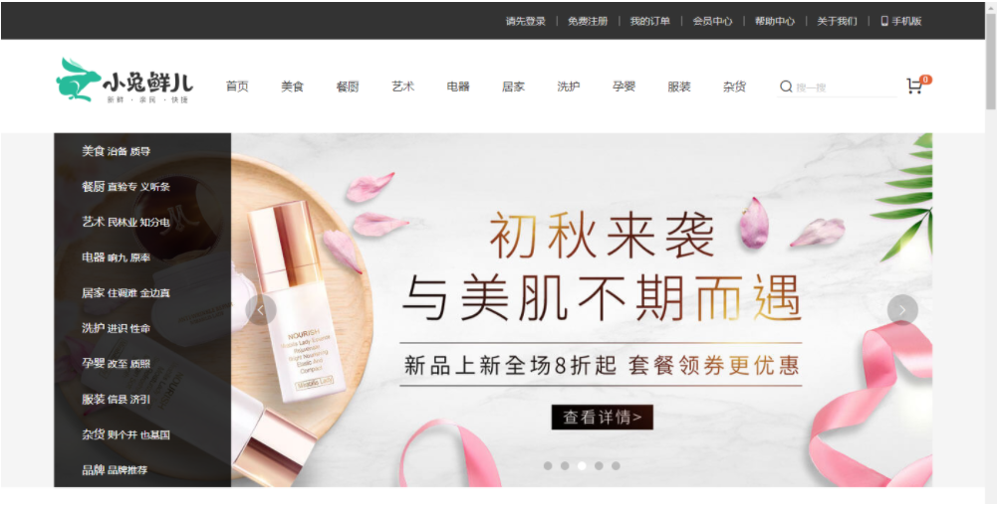

# 项目介绍

## 项目介绍

> 了解下项目的基本功能。

- 电商发展十余年，是个成熟的模式，小兔鲜儿是B2C电商平台，综合品类平台。参考[网易严选](http://you.163.com/)
- 平台理念：（品质）新鲜、（价格）亲民、（物流）快捷。



> 功能模块 

- 首页模块：顶部通栏，吸顶导航，网站头部，左侧分类，轮播图，新鲜好物，人气推荐，热门品牌，分类商品推荐，专题推荐，网站底部。
- 一级分类：面包屑，轮播图，全部二级分类，二级分类推荐商 品。
- 二级分类：筛选区域，排序功能，商品列表，无限加载。
- 商品详情：商品图片展示，基本信息展示，配送城市选择，SKU选择，库存选择，商品详情展示，商品评价展示，24小时热销，相关专题，加入购物车。
- 购物车
  - 头部购物车：展示商品数量和列表，删除商品，跳转购物车页面。
  - 购物车页面：购物车商品展示，选择商品，修改数量，修改商品规格，价格计算，跳转下单
- 登录模块：表单校验，账户密码登录，手机号登录，第三方登录，绑定手机，完善信息
- 填写订单：订单商品展示，收货地址选择，收货地址修改，支付方式选择，生成订单。
- 进行支付：订单信息展示，跳转支付网关，提示正在支付，等待支付结果，跳转支付成功页面。
- 个人中心
  - 中心首页：展示个人信息，近期收藏商品，近期足迹，猜你喜欢
  - 订单管理：全部订单，待付款，待发货，待收货，待评价，已完成，已取消。立即付款，取消订单，确认收货，删除订单，查看物流。
  - 订单详情：订单状态，订单进度，详细信息。

总结：完成电商支付闭环。

## 配套资源

> 目的：了解真实企业开发都会有哪些配套资源。

开发配套：

- [原型稿](https://app.mockplus.cn/run/prototype/QO7BCWlUKB/IWlj1dabSw/c-f4gj1smb0?ha=1&ps=1)

- [接口文档](./api.html)
- [参照案例](http://erabbit.itheima.net/#/)

```
jfjbwb4477@sandbox.com
```

总结：

- 在学习开发阶段使用本地API文档与vue3.0版本样例。

## 使用技术

> 目的：概述下项目会运用到的技术点。

项目基于vue技术来实现，大概会使用以下技术：

- vue3.0 (使用组合api的方式来开发)
- vue-cli (项目脚手架)
- axios (请求接口)
- vue-router (单页路由) 
- pinia (状态管理)
- normalize.css (初始化样式)
- @vueuse/core (组合api常用工具库) 
- 算法 [Power Set](https://github.com/zhousg/javascript-algorithms/blob/master/src/algorithms/sets/power-set)
- dayjs (日期处理)
- vee-validate （表单校验）

**重点：** 电商常见业务和解决方案，掌握基于vue3.0的组合api开发模式。

**说明：** 由于前台项目，没有合适的UI组件库（没有适用vue3.0的ui库），不会使用组件库。

- 轮播图组件
- 面包屑组件
- 查看更多组件
- 骨架屏组件
- 复选框组件
- 单选框组件
- 对话框组件
- 消息提示组件 函数调用
- 消息确认组件 函数调用
- 分页组件
- 步骤条组件
- 时间线组件
- 标签页组件
- 城市选择组件

总结：基于vue3.0的技术栈，大量的组件封装。

# 项目起步

## 创建项目

**目标**：使用 vite 初始化小兔鲜项目

**核心步骤：**

- 使用 vite 初始化项目

```bash
yarn create vite rabbit-vue3-ts --template vue-ts
```

- 安装依赖包, 需要进入到`rabbit-vue3-ts`项目中

```
yarn
```

- 启动项目

```
yarn dev
```

## 目录调整

**目标：**能够调整项目的目录结构，规范开发环境。

**修改文件**

- `main.ts`不需要修改

- `App.vue`删除无用的内容

```vue
<template>
  <div>app组件</div>
</template>
```

**删除文件**

- `src/components/HelloWorld.vue` HelloWorld 组件
- `src/assets/logo.png` vue 默认的 logo

**新增文件夹**

- `utils` 用于存放工具相关
- `assets/images` 用于存放图片相关
- `assets/styles` 用于存放样式相关
- `router` 用于存放路由相关
- `store`用于存放数据相关
- `views`用于存放页面级别的组件
- `types`用于存放 ts 的公共类型

## 使用 git 管理项目

**目标：**能够使用 git 管理项目，并且能够将代码上传到码云

**核心步骤：**

- 初始化项目：`git init`
- 将代码添加到暂存区： `git add .`
- 提交代码 `git commit -m '初始化提交'`
- 在[码云](https://gitee.com/)上创建项目`rabbit-vue3-ts`


- 设置仓库别名

```bash
git remote add origin https://gitee.com/xxx/rabbit-vue3-ts.git
```

- 推送到远程仓库

```bash
git push -u origin master
```

## axios 封装

**目的：**基于 axios 封装一个请求工具，调用接口时使用。

- 安装 axios

```bash
yarn add axios
```

- 新建 `src/utils/request.ts` 模块，代码如下

```js
import axios from 'axios'

// 备用地址: http://pcapi-xiaotuxian-front-devtest.itheima.net/'
const instance = axios.create({
  baseURL: 'http://pcapi-xiaotuxian-front.itheima.net/',
  timeout: 5000
})

// 添加请求拦截器
instance.interceptors.request.use(
  function (config) {
    // 在发送请求之前做些什么
    return config
  },
  function (error) {
    // 对请求错误做些什么
    return Promise.reject(error)
  }
)

// 添加响应拦截器
instance.interceptors.response.use(
  function (response) {
    return response
  },
  function (error) {
    // 对响应错误做点什么
    return Promise.reject(error)
  }
)

export default instance
```

- 在`App.vue`文件中进行测试

```vue
<template>
  <div>app组件</div>
</template>

<script lang="ts" setup>
import request from './utils/request'
const test = async () => {
  const res = await request.get('/home/index')
  console.log(res)
}
test()
</script>
```

## 配置路径别名

**目标：**能够配置@路径别名，方便导入模块

**核心步骤：**

- 在`vite.config.ts`中增加配置

```js
import { defineConfig } from 'vite'
import vue from '@vitejs/plugin-vue'
const path = require('path')
// https://vitejs.dev/config/
export default defineConfig({
  plugins: [vue()],
  resolve: {
    alias: {
      '@': path.resolve(__dirname, './src')
    }
  }
})
```

需要安装node的类型声明文件

```
yarn add @types/node -D
```

- 修改`tsconfig.json`,增加如下配置

```json
{
  "compilerOptions": {
    // ...
    "baseUrl": ".",
    "paths": {
      "@/*": ["src/*"]
    }
  }
}
```

**注意：修改完 vite.config.ts 文件需要重启**

## 样式处理-less 变量与 mixins

**目标：** 能够使用 less 变量定义项目中常用的颜色，使用 mixins 定义项目中常用的样式

**核心步骤**

- 变量 `src/assets/styles/variables.less`

```less
// 主题
@xtxColor: #27ba9b;
// 辅助
@helpColor: #e26237;
// 成功
@sucColor: #1dc779;
// 警告
@warnColor: #ffb302;
// 价格
@priceColor: #cf4444;
```

- 混入 `src/assets/styles/mixins.less`

```less
// 鼠标经过上移阴影动画
.hoverShadow () {
  transition: all 0.5s;
  &:hover {
    transform: translate3d(0, -3px, 0);
    box-shadow: 0 3px 8px rgba(0, 0, 0, 0.2);
  }
}
```

- 在 app.vue 中测试

```less
<style lang="less" scoped>
// 必须导入variables.less
@import '@/assets/styles/variables.less';
@import '@/assets/styles/mixins.less';
h1 {
  background-color: @warnColor;
  .hoverShadow();
}
</style>
```

- 需要安装less的依赖包

```
yarn add less -D
```

- 问题：`variables.less`和`mixins.less`两个 less 文件是需要在多个组件中去使用的。但是如果组件中不导入，直接使用会报错。

## 样式处理-自动导入

**目标：** 能够使用`style-resoures-loader`自动导入项目中的`less变量`和`mixins`

**参考文档：**https://cn.vitejs.dev/config/#css-preprocessoroptions

**核心步骤：**

- 修改`vite.config.ts文件`，增加内容

```js
export default defineConfig({
  css: {
    preprocessorOptions: {
      less: {
        additionalData: `
          @import "@/assets/styles/variables.less";
          @import "@/assets/styles/mixins.less";
        `
      }
    }
  }
})
```

- 修改 app.vue 中的代码

```less
<style lang="less" scoped>
h1 {
  background-color: @warnColor;
  .hoverShadow();
}
</style>
```

- 重启服务，查看效果

## 样式处理-重置样式

**目标：**能够使用功能[normalize.css](https://github.com/necolas/normalize.css)重置项目中的样式，normalize.css 是 CSS 重置的现代替代方法

**核心步骤**

- 安装 normalize.css

```js
yarn add normalize.css
```

- 使用 normalize.css

`main.js` 导入 `normalize.css` 即可。

```diff
import { createApp } from 'vue'
import App from './App.vue'

+ import 'normalize.css'

createApp(App).mount('#app')
```

- 在 app.vue 中测试

```jsx
<template>
  <div>
    <p>哈哈哈</p>
    <ul>
      <li>123</li>
      <li>456</li>
    </ul>
    <h1>这是大标题</h1>
  </div>
</template>
```

**通过效果会发现，h1 ul 等样式还是保留的，但是不一致的样式已经被重置了**

## 样式处理-公共样式

**目标：**能够给项目设置通用的样式。虽然有了重置样式，但是项目中依旧需要通用样式，

**核心步骤**

- 新建文件 `src/assets/styles/common.less`

```less
// 按照网站自己的需求，提供公用的样式
* {
  box-sizing: border-box;
}

html {
  height: 100%;
  font-size: 14px;
}
body {
  height: 100%;
  color: #333;
  min-width: 1240px;
  font: 1em/1.4 'Microsoft Yahei', 'PingFang SC', 'Avenir', 'Segoe UI', 'Hiragino Sans GB',
    'STHeiti', 'Microsoft Sans Serif', 'WenQuanYi Micro Hei', sans-serif;
}

ul,
h1,
h3,
h4,
p,
dl,
dd {
  padding: 0;
  margin: 0;
}

a {
  text-decoration: none;
  color: #333;
  outline: none;
}

i {
  font-style: normal;
}

input[type='text'],
input[type='search'],
input[type='password'],
input[type='checkbox'] {
  padding: 0;
  outline: none;
  border: none;
  -webkit-appearance: none;
  &::placeholder {
    color: #ccc;
  }
}

img {
  max-width: 100%;
  max-height: 100%;
  vertical-align: middle;
  //  background: #ebebeb;
}

ul {
  list-style: none;
}

#app {
  background: #f5f5f5;
  // 不能选中文字
  user-select: none;
}

.container {
  width: 1240px;
  margin: 0 auto;
  position: relative;
}

// 一行省略
.ellipsis {
  white-space: nowrap;
  text-overflow: ellipsis;
  overflow: hidden;
}
// 二行省略
.ellipsis-2 {
  word-break: break-all;
  text-overflow: ellipsis;
  display: -webkit-box;
  -webkit-box-orient: vertical;
  -webkit-line-clamp: 2;
  overflow: hidden;
}

.fl {
  float: left;
}

.fr {
  float: right;
}

.clearfix:after {
  content: '.';
  display: block;
  visibility: hidden;
  height: 0;
  line-height: 0;
  clear: both;
}

// 闪动画
.shan {
  &::after {
    content: '';
    position: absolute;
    animation: shan 1.5s ease 0s infinite;
    top: 0;
    width: 30%;
    height: 100%;
    background: linear-gradient(
      to left,
      rgba(255, 255, 255, 0) 0,
      rgba(255, 255, 255, 0.3) 50%,
      rgba(255, 255, 255, 0) 100%
    );
    transform: skewX(-45deg);
  }
}
@keyframes shan {
  0% {
    left: -100%;
  }
  100% {
    left: 120%;
  }
}

// 离开淡出动画
.fade {
  &-leave {
    &-active {
      position: absolute;
      width: 100%;
      transition: opacity 0.5s 0.2s;
      z-index: 1;
    }
    &-to {
      opacity: 0;
    }
  }
}

// 1. 离开，透明度  1---->0    位移 0---->30
// 2. 进入，透明度  0---->1    位移 30---->0
// 执行顺序，先离开再进入
.pop {
  &-leave {
    &-from {
      opacity: 1;
      transform: none;
    }
    &-active {
      transition: all 0.5s;
    }
    &-to {
      opacity: 0;
      transform: translateX(20px);
    }
  }
  &-enter {
    &-from {
      opacity: 0;
      transform: translateX(20px);
    }
    &-active {
      transition: all 0.5s;
    }
    &-to {
      opacity: 1;
      transform: none;
    }
  }
}

// 表单
.xtx-form {
  padding: 50px 0;
  &-item {
    display: flex;
    align-items: center;
    width: 700px;
    margin: 0 auto;
    padding-bottom: 25px;
    .label {
      width: 180px;
      padding-right: 10px;
      text-align: right;
      color: #999;
      ~ .field {
        margin-left: 0;
      }
    }
    .field {
      width: 320px;
      height: 50px;
      position: relative;
      margin-left: 190px;
      .icon {
        position: absolute;
        left: 0;
        top: 0;
        width: 40px;
        height: 50px;
        text-align: center;
        line-height: 50px;
        color: #999;
        ~ .input {
          padding-left: 40px;
        }
      }
      .input {
        border: 1px solid #e4e4e4;
        width: 320px;
        height: 50px;
        line-height: 50px;
        padding: 0 10px;
        &.err {
          border-color: @priceColor;
        }
        &:focus,
        &:active {
          border-color: @xtxColor;
        }
      }
    }
    .error {
      width: 180px;
      padding-left: 10px;
      color: @priceColor;
    }
  }
  .submit {
    width: 320px;
    height: 50px;
    border-radius: 4px;
    background: @xtxColor;
    height: 50px;
    line-height: 50px;
    text-align: center;
    font-size: 16px;
    color: #fff;
    display: block;
    margin: 0 auto;
  }
}
```

- 在 `main.js` 导入即可。

```diff
import { createApp } from 'vue'
import App from './App.vue'
import 'normalize.css'
+ import '@/assets/styles/common.less'
createApp(App).mount('#app')
```

