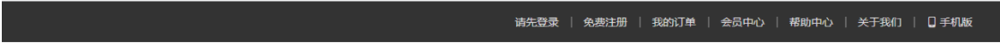
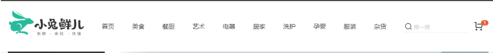
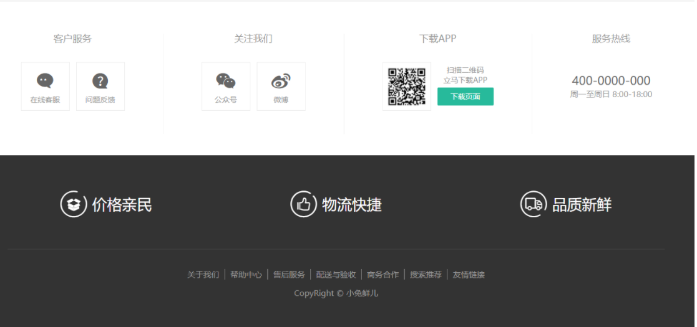

# Layout模块

## 首页布局-配置路由

> 目标：能够配置小兔鲜儿项目中的一级路由

**核心代码：**

（1）安装依赖包

```bash
yarn add vue-router
```

（2）创建组件`views/layout/index.vue`

```vue
<script lang="ts" setup name="Layout"></script>
<template>
  <div>layout组件</div>
</template>

<style lang="less" scoped></style>

```

（3）创建组件`views/login/index.vue`

```vue
<script lang="ts" setup name="Login"></script>
<template>
  <div>login组件</div>
</template>

<style lang="less" scoped></style>

```

（4）创建文件`router/index.ts`

```ts
import { createRouter, createWebHashHistory } from 'vue-router'
import Layout from '@/views/layout/index.vue'
const router = createRouter({
  history: createWebHashHistory(),
  routes: [
    {
      path: '/',
      component: Layout
    },
    {
      path: '/login',
      component: () => import('@/views/Login/index.vue')
    }
  ]
})
export default router

```

（5）在`main.ts`中导入

```ts
import { createApp } from 'vue'
import App from './App.vue'
import 'normalize.css'
import '@/assets/styles/common.less'
import router from './router'

const app = createApp(App)
app.use(router)
app.mount('#app')

```

（6）修改`App.vue`

```vue
<template>
  <RouterView></RouterView>
</template>

```

## name的说明

https://github.com/vbenjs/vite-plugin-vue-setup-extend

(1)安装

```
yarn add vite-plugin-vue-setup-extend -D
```

（2）配置 vite.config.js中

```js
import vueSetupExtend from 'vite-plugin-vue-setup-extend'

export default defineConfig({
  plugins: [vue(), vueSetupExtend()],
})
```


## 首页布局-顶部通栏

> 目标：能够完成Layout组件的顶部通栏布局



**核心代码：**

（1）在 `src/index.html` 引入字体图标文件

```html
<meta name="viewport" content="width=device-width, initial-scale=1.0" />
<link
  rel="stylesheet"
  href="//at.alicdn.com/t/font_2143783_iq6z4ey5vu.css"
/>
<title>小兔鲜儿</title>
```

（2）然后，新建头部导航组件

`layout/components/app-topnav.vue`

```vue
<script lang="ts" setup name="AppTopnav"></script>

<template>
  <nav class="app-topnav">
    <div class="container">
      <ul>
        <li>
          <a href="javascript:;"><i class="iconfont icon-user"></i>周杰伦</a>
        </li>
        <li><a href="javascript:;">退出登录</a></li>
        <li><a href="javascript:;">请先登录</a></li>
        <li><a href="javascript:;">免费注册</a></li>
        <li><a href="javascript:;">我的订单</a></li>
        <li><a href="javascript:;">会员中心</a></li>
        <li><a href="javascript:;">帮助中心</a></li>
        <li><a href="javascript:;">关于我们</a></li>
        <li>
          <a href="javascript:;"><i class="iconfont icon-phone"></i>手机版</a>
        </li>
      </ul>
    </div>
  </nav>
</template>

<style scoped lang="less">
.app-topnav {
  background: #333;
  ul {
    display: flex;
    height: 53px;
    justify-content: flex-end;
    align-items: center;
    li {
      a {
        padding: 0 15px;
        color: #cdcdcd;
        line-height: 1;
        display: inline-block;
        i {
          font-size: 14px;
          margin-right: 2px;
        }
        &:hover {
          color: @xtxColor;
        }
      }
      ~ li {
        a {
          border-left: 2px solid #666;
        }
      }
    }
  }
}
</style>

```

（3）在 `src/views/layout/index.vue` 中导入使用

```html
<script lang="ts" setup>
import AppTopnav from './components/app-topnav.vue'
</script>

<template>
  <AppTopnav></AppTopnav>
</template>

<style lang="less" scoped></style>

```

## 首页布局-头部布局

> 目标：能够完成Layout组件的头部布局



**核心代码**

（1）在  `src/views/layout/components/` 下新建 `app-header.vue` 组件，基础布局如下：

```vue
<script lang="ts" setup name="AppHeader">
//
</script>

<template>
  <header class="app-header">
    <div class="container">
      <h1 class="logo"><RouterLink to="/">小兔鲜</RouterLink></h1>
      <ul class="app-header-nav">
        <li class="home"><RouterLink to="/">首页</RouterLink></li>
        <li><a href="#">美食</a></li>
        <li><a href="#">餐厨</a></li>
        <li><a href="#">艺术</a></li>
        <li><a href="#">电器</a></li>
        <li><a href="#">居家</a></li>
        <li><a href="#">洗护</a></li>
        <li><a href="#">孕婴</a></li>
        <li><a href="#">服装</a></li>
        <li><a href="#">杂货</a></li>
      </ul>
      <div class="search">
        <i class="iconfont icon-search"></i>
        <input type="text" placeholder="搜一搜" />
      </div>
      <div class="cart">
        <a class="curr" href="#">
          <i class="iconfont icon-cart"></i><em>2</em>
        </a>
      </div>
    </div>
  </header>
</template>

<style scoped lang="less">
.app-header {
  background: #fff;
  .container {
    display: flex;
    align-items: center;
  }
  .logo {
    width: 200px;
    a {
      display: block;
      height: 132px;
      width: 100%;
      text-indent: -9999px;
      background: url('@/assets/images/logo.png') no-repeat center 18px /
        contain;
    }
  }
  .app-header-nav {
    width: 820px;
    display: flex;
    padding-left: 40px;
    position: relative;
    z-index: 998;
    li {
      margin-right: 40px;
      width: 38px;
      text-align: center;
      a {
        font-size: 16px;
        line-height: 32px;
        height: 32px;
        display: inline-block;
          &:hover {
            color: @xtxColor;
            border-bottom: 1px solid @xtxColor;
          }
      }
    }
  }
  .search {
    width: 170px;
    height: 32px;
    position: relative;
    border-bottom: 1px solid #e7e7e7;
    line-height: 32px;
    .icon-search {
      font-size: 18px;
      margin-left: 5px;
    }
    input {
      width: 140px;
      padding-left: 5px;
      color: #666;
    }
  }
  .cart {
    width: 50px;
    .curr {
      height: 32px;
      line-height: 32px;
      text-align: center;
      position: relative;
      display: block;
      .icon-cart {
        font-size: 22px;
      }
      em {
        font-style: normal;
        position: absolute;
        right: 0;
        top: 0;
        padding: 1px 6px;
        line-height: 1;
        background: @helpColor;
        color: #fff;
        font-size: 12px;
        border-radius: 10px;
        font-family: Arial;
      }
    }
  }
}
</style>

```

（2）在 `src/views/layout.vue` 中导入使用。

```diff
<script lang="ts" setup>
import AppTopnav from './components/app-topnav.vue'
+ import AppHeader from './components/app-header.vue'
</script>

<template>
  <AppTopnav></AppTopnav>
+   <AppHeader></AppHeader>
</template>

<style lang="scss" scoped></style>

```

（3）在`assets/images/`中提供图片，在素材中已经提供

:::danger 注意

因为在后面的吸顶交互里，我们需要复用导航部分，所以这里我们先直接把他拆分出来，拆分成一个单独的组件

:::

（4）新建`layout/compoennts/app-header-nav.vue`组件

```vue
<script lang="ts" setup name="AppHeaderNav"></script>

<template>
  <ul class="app-header-nav">
    <li class="home"><RouterLink to="/">首页</RouterLink></li>
    <li><a href="#">美食</a></li>
    <li><a href="#">餐厨</a></li>
    <li><a href="#">艺术</a></li>
    <li><a href="#">电器</a></li>
    <li><a href="#">居家</a></li>
    <li><a href="#">洗护</a></li>
    <li><a href="#">孕婴</a></li>
    <li><a href="#">服装</a></li>
    <li><a href="#">杂货</a></li>
  </ul>
</template>

<style lang="less" scoped>
.app-header-nav {
  width: 820px;
  display: flex;
  padding-left: 40px;
  position: relative;
  z-index: 998;
  li {
    margin-right: 40px;
    width: 38px;
    text-align: center;
    a {
      font-size: 16px;
      line-height: 32px;
      height: 32px;
      display: inline-block;
    }
  }
}
</style>

```

（5）在`layout/components/app-header.vue`中

```diff
<script lang="ts" setup>
+ import AppHeaderNavVue from './app-header-nav.vue'
</script>


<template>
  <header class="app-header">
    <div class="container">
      <h1 class="logo"><RouterLink to="/">小兔鲜</RouterLink></h1>
+      <AppHeaderNavVue></AppHeaderNavVue>
      // ...
    </div>
  </header>
</template>
```

## 首页布局-底部

> 目标：能够完成Layout布局的底部布局效果



**核心代码：**

（1）在 `src/views/layout/components/` 下新建 `app-footer.vue` 组件，基础布局如下：

```vue
<script lang="ts" setup name="AppFooter"></script>

<template>
  <footer class="app_footer">
    <!-- 联系我们 -->
    <div class="contact">
      <div class="container">
        <dl>
          <dt>客户服务</dt>
          <dd><i class="iconfont icon-kefu"></i> 在线客服</dd>
          <dd><i class="iconfont icon-question"></i> 问题反馈</dd>
        </dl>
        <dl>
          <dt>关注我们</dt>
          <dd><i class="iconfont icon-weixin"></i> 公众号</dd>
          <dd><i class="iconfont icon-weibo"></i> 微博</dd>
        </dl>
        <dl>
          <dt>下载APP</dt>
          <dd class="qrcode"></dd>
          <dd class="download">
            <span>扫描二维码</span>
            <span>立马下载APP</span>
            <a href="javascript:;">下载页面</a>
          </dd>
        </dl>
        <dl>
          <dt>服务热线</dt>
          <dd class="hotline">
            400-0000-000 <small>周一至周日 8:00-18:00</small>
          </dd>
        </dl>
      </div>
    </div>
    <!-- 其它 -->
    <div class="extra">
      <div class="container">
        <div class="slogan">
          <a href="javascript:;">
            <i class="iconfont icon-footer01"></i>
            <span>价格亲民</span>
          </a>
          <a href="javascript:;">
            <i class="iconfont icon-footer02"></i>
            <span>物流快捷</span>
          </a>
          <a href="javascript:;">
            <i class="iconfont icon-footer03"></i>
            <span>品质新鲜</span>
          </a>
        </div>
        <!-- 版权信息 -->
        <div class="copyright">
          <p>
            <a href="javascript:;">关于我们</a>
            <a href="javascript:;">帮助中心</a>
            <a href="javascript:;">售后服务</a>
            <a href="javascript:;">配送与验收</a>
            <a href="javascript:;">商务合作</a>
            <a href="javascript:;">搜索推荐</a>
            <a href="javascript:;">友情链接</a>
          </p>
          <p>CopyRight © 小兔鲜儿</p>
        </div>
      </div>
    </div>
  </footer>
</template>

<style scoped lang="less">
.app_footer {
  overflow: hidden;
  background-color: #f5f5f5;
  padding-top: 20px;
  .contact {
    background: #fff;
    .container {
      padding: 60px 0 40px 25px;
      display: flex;
    }
    dl {
      height: 190px;
      text-align: center;
      padding: 0 72px;
      border-right: 1px solid #f2f2f2;
      color: #999;
      &:first-child {
        padding-left: 0;
      }
      &:last-child {
        border-right: none;
        padding-right: 0;
      }
    }
    dt {
      line-height: 1;
      font-size: 18px;
    }
    dd {
      margin: 36px 12px 0 0;
      float: left;
      width: 92px;
      height: 92px;
      padding-top: 10px;
      border: 1px solid #ededed;
      .iconfont {
        font-size: 36px;
        display: block;
        color: #666;
      }
      &:hover {
        .iconfont {
          color: @xtxColor;
        }
      }
      &:last-child {
        margin-right: 0;
      }
    }
    .qrcode {
      width: 92px;
      height: 92px;
      padding: 7px;
      border: 1px solid #ededed;
    }
    .download {
      padding-top: 5px;
      font-size: 14px;
      width: auto;
      height: auto;
      border: none;
      span {
        display: block;
      }
      a {
        display: block;
        line-height: 1;
        padding: 10px 25px;
        margin-top: 5px;
        color: #fff;
        border-radius: 2px;
        background-color: @xtxColor;
      }
    }
    .hotline {
      padding-top: 20px;
      font-size: 22px;
      color: #666;
      width: auto;
      height: auto;
      border: none;
      small {
        display: block;
        font-size: 15px;
        color: #999;
      }
    }
  }
  .extra {
    background-color: #333;
  }
  .slogan {
    height: 178px;
    line-height: 58px;
    padding: 60px 100px;
    border-bottom: 1px solid #434343;
    display: flex;
    justify-content: space-between;
    a {
      height: 58px;
      line-height: 58px;
      color: #fff;
      font-size: 28px;
      i {
        font-size: 50px;
        vertical-align: middle;
        margin-right: 10px;
        font-weight: 100;
      }
      span {
        vertical-align: middle;
        text-shadow: 0 0 1px #333;
      }
    }
  }
  .copyright {
    height: 170px;
    padding-top: 40px;
    text-align: center;
    color: #999;
    font-size: 15px;
    p {
      line-height: 1;
      margin-bottom: 20px;
    }
    a {
      color: #999;
      line-height: 1;
      padding: 0 10px;
      border-right: 1px solid #999;
      &:last-child {
        border-right: none;
      }
    }
  }
}
</style>

```

（2）在 `src/views/layout.vue` 中导入使用。

```vue
<script lang="ts" setup>
import AppTopnav from './components/app-topnav.vue'
import AppHeader from './components/app-header.vue'
import AppFooter from './components/app-footer.vue'
</script>

<template>
  <AppTopnav></AppTopnav>
  <AppHeader></AppHeader>
  <main class="app-body">
    <!-- 路由出口 -->
  </main>
  <AppFooter></AppFooter>
</template>

<style lang="less" scoped>
.app-body {
  min-height: 600px;
}
</style>

```

## 使用pinia管理数据

> 目标：能够集成pinia环境，统一管理项目中的数据

**核心步骤：**

（1）安装pinia

```bash
yarn add pinia
```

（2）在`main.ts`中注册pinia

```ts
import { createApp } from 'vue'
import App from '@/App.vue'
// 引入通用样式，浏览器表现是一致的
import 'normalize.css'
// 引入项目中一些通用样式
import '@/assets/styles/common.less'
import router from '@/router'
import { createPinia } from 'pinia'
const app = createApp(App)
app.use(router)

app.use(createPinia())
app.mount('#app')
```

（3）创建文件`store/modules/category.ts`,用于管理category模块的数据

```tsx
import { defineStore } from 'pinia'
export default defineStore('category', {
  state: () => ({
    money: 100,
  }),
})

```

（4）创建`store/index.ts`统一管理所有的模块

```ts
import useCategoryStore from './modules/category'

export default function useStore() {
  return {
    category: useCategoryStore(),
  }
}

```

（5）在`layout/components/app-header-nav.vue`中测试

```ts
import useStore from '@/store'
const { home } = useStore()
console.log(home.money)
```

## 头部分类导航-渲染

> 目标：能够发送请求完成分类导航的渲染

**核心代码：**

（1）在`store/category.ts`中提供state和actions

```ts
import { defineStore } from 'pinia'
import request from '@/utils/request'
export default defineStore('category', {
  state: () => ({
    categoryList: [],
  }),
  actions: {
    async getAllCategory() {
      const res = await request.get('/home/category/head')
      console.log(res)
    },
  },
})
```

（2）在`layout/components/app-header-nav.vue`中发送请求

```ts
<script lang="ts" setup>
import useStore from '@/store'
const { category } = useStore()
category.getAllCategory()
</script>
```

（3）在`types/data.d.ts`中定义数据类型

```ts
// 所有的接口的通用类型
export interface ApiRes<T> {
  code: string
  msg: string
  result: T
}

// 单个分类的类型
export type CategoryItem = {
  id: string
  name: string
  picture: string
}

```

（4）修改`store/category.ts`，给axios请求增加泛型

```ts
import { defineStore } from 'pinia'
import request from '@/utils/request'
import { ApiRes, CategoryItem } from '@/types/data'
export default defineStore('category', {
  state: () => ({
    list: [] as CategoryItem[],
  }),
  actions: {
    async getAllCategory() {
      const res = await request.get<ApiRes<CategoryItem[]>>(
        '/home/category/head'
      )
      this.list = res.data.result
    },
  },
})
```

（5）渲染分类导航 在`layout/components/app-header-nav.vue`中

```tsx
<template>
  <ul class="app-header-nav">
    <li class="home"><RouterLink to="/">首页</RouterLink></li>
    <li v-for="item in category.list" :key="item.id">
      <a href="#">{{ item.name }}</a>
    </li>
  </ul>
</template>
```

## 头部分类导航渲染-完善二级分类

完善子级分类布局 `src/views/layout/components/app-header-nav.vue`

```vue
<script lang="ts" setup>
import useStore from '@/store'
const { category } = useStore()
category.getAllCategory()
</script>

<template>
  <ul class="app-header-nav">
    <li class="home"><RouterLink to="/">首页</RouterLink></li>
    <li v-for="item in home.categoryList" :key="item.id">
      <a href="#">{{ item.name }}</a>

      <!-- 新增++++++++ -->
      <div class="layer">
        <ul>
          <li v-for="i in 10" :key="i">
            <a href="#">
              
              <p>果干</p>
            </a>
          </li>
        </ul>
      </div>
      <!-- 新增++++++++ -->
    </li>
  </ul>
</template>


<style scoed lang="less">
.app-header-nav {
  width: 820px;
  display: flex;
  padding-left: 40px;
  position: relative;
  z-index: 998;
  position: relative;
  z-index: 998;
  > li {
    margin-right: 40px;
    width: 38px;
    text-align: center;
    > a {
      font-size: 16px;
      line-height: 32px;
      height: 32px;
      display: inline-block;
      &:hover {
        color: @xtxColor;
        border-bottom: 1px solid @xtxColor;
      }
    }
    // 新增样式
    &:hover {
      > a {
        color: @xtxColor;
        border-bottom: 1px solid @xtxColor;
      }
      > .layer {
        height: 132px;
        opacity: 1;
      }
    }
  }
}
// 新增样式
.layer {
  width: 1240px;
  background-color: #fff;
  position: absolute;
  left: -200px;
  top: 56px;
  height: 0;
  overflow: hidden;
  opacity: 0;
  box-shadow: 0 0 5px #ccc;
  transition: all 0.2s 0.1s;
  ul {
    display: flex;
    flex-wrap: wrap;
    padding: 0 70px;
    align-items: center;
    height: 132px;
    li {
      width: 110px;
      text-align: center;
      img {
        width: 60px;
        height: 60px;
      }
      p {
        padding-top: 10px;
      }
      &:hover {
        p {
          color: @xtxColor;
        }
      }
    }
  }
}
</style>

```

## 头部分类导航渲染-二级分类渲染

> 根据数据渲染二级分类

修改types/data.d.ts的类型

```ts
// 单个分类的类型
export type CategoryItem = {
  id: string
  name: string
  picture: string
  children: CategoryItem[]
}
```

动态渲染

```vue
<template>
  <ul class="app-header-nav">
    <li class="home"><RouterLink to="/">首页</RouterLink></li>
    <li v-for="item in home.categoryList" :key="item.id">
      <a href="#">{{ item.name }}</a>

      <!-- 新增++++++++ -->
      <div class="layer">
        <ul>
          <li v-for="sub in item.children" :key="sub.id">
            <a href="#">
              
              <p>{{ sub.name }}</p>
            </a>
          </li>
        </ul>
      </div>
      <!-- 新增++++++++ -->
    </li>
  </ul>
</template>
```

## 头部分类导航渲染-优化

::: danger 问题

刷新页面，会发现导航加载之前，就闪一下，用户体验不好。

:::

思路：定义一个常量数据和后台保持一致（约定好9大分类），这样不请求后台就能展示一级分类，不至于白屏。

+ 定义九个分类常量数据 `src/store/constants.ts`

```js
// 顶级分类
export const topCategory = [
  '居家',
  '美食',
  '服饰',
  '母婴',
  '个护',
  '严选',
  '数码',
  '运动',
  '杂项',
]

```

+ 在pinia中提供初始值

```js
import { topCategory } from '../constants'
const defaultCategory = topCategory.map((item) => {
  return {
    name: item,
  }
})

const useHomeStore = defineStore('category', {
  state: () => ({
    categoryList: defaultCategory as CategoryItem[],
  }),
})
```

## 配置二级路由

+ 创建首页组件`views/home/index.vue`

```vue
<template>
  <div class="home">首页</div>
</template>

<script lang="ts" setup name="Home">
</script>

<style></style>

```

+ 创建分类组件`views/category/index.vue`

```vue
<template>
  <div class="category">分类组件</div>
</template>

<script lang="ts" name="TopCategory" setup>
</script>

<style></style>

```

+ 创建二级分类组件`views/category/sub.vue`

```vue
<script lang="ts" setup name="SubCategory">

</script>
<template>
  <div class="category">二级分类组件</div>
</template>

<style></style>

```

+ 配置路由规则

```js
import { createRouter, createWebHashHistory } from 'vue-router'
import Layout from '@/views/layout/index.vue'
import Home from '@/views/home/index.vue'
const router = createRouter({
  history: createWebHashHistory(),
  routes: [
    {
      path: '/',
      component: Layout,
      children: [
        {
          path: '',
          component: Home,
        },
        {
          path: '/category/:id',
          component: () => import('@/views/category/index.vue'),
        },
        {
          path: '/category/sub/:id',
          component: () => import('@/views/category/sub.vue'),
        },
      ],
    },
    {
      path: '/login',
      component: () => import('@/views/login/index.vue'),
    },
  ],
})

export default router

```

+ 点击分类-切换菜单`components/app-header-nav.vue`

```diff
<template>
  <ul class="app-header-nav">
    <li class="home"><RouterLink to="/">首页</RouterLink></li>
    <li v-for="item in list" :key="item.id">
+      <RouterLink :to="`/category/${item.id}`">{{ item.name }}</RouterLink>
      <div class="layer">
        <ul>
          <li v-for="sub in item.children" :key="sub.id">
+            <RouterLink :to="`/category/sub/${sub.id}`">
              
+              <p>{{ sub.name }}</p>
            </RouterLink>
          </li>
        </ul>
      </div>
    </li>
  </ul>
</template>
```

+ 指定二级路由出口`src/views/layout/index.vue`

```vue
<template>
  <AppTopnav></AppTopnav>
  <AppHeader></AppHeader>
  <div class="app-body">
    <!-- 路由出口 -->
    <RouterView></RouterView>
  </div>
  <AppFooter></AppFooter>
</template>
```

## 分类导航显示隐藏

> 实现点击的时候跳转，且能关闭二级分类弹窗。

描述：由于是单页面路由跳转不会刷新页面，css的hover一直触发无法关闭分类弹窗。

大致逻辑：

- 鼠标进入一级分类展示对应的二级分类弹窗
- 点击一级分类，二级分类，隐藏二级分类弹窗
- 离开一级分类，二级分类，隐藏二级分类弹窗

落地代码

1）在pinia给一级分类加open控制显示隐藏 `src/store/modules/category.ts`

```diff
async getAllCategory() {
  const res = await request.get<ApiRes<CategoryItem[]>>(
    '/home/category/head'
  )
  // 1. 给每一个一级分类添加一个open属性，用于控制显示隐藏
+  res.data.result.forEach((item) => {
+    item.open = false
+  })
  this.list = res.data.result
},
```

需要给types/data.d.ts文件中新增一个属性

```diff
// 单个分类的类型
export type CategoryItem = {
  id: string
  name: string
  picture: string
+  open: boolean
  children: CategoryItem[]
}
```

2）pinia中添加了 show hide 方法控制显示和隐藏 

```js
show(id: string) {
  const category = this.list.find((item) => item.id === id)
  category!.open = true
},
hide(id: string) {
  const category = this.list.find((item) => item.id === id)
  category!.open = false
},
```

3）头部导航组件 实现显示和隐藏 `src/components/app-header-nav.vue`

```diff

<template>
  <ul class="app-header-nav">
    <li class="home"><RouterLink to="/">首页</RouterLink></li>
    <li
      v-for="item in category.categoryList"
      :key="item.id"
+      @mouseenter="category.show(item.id)"
+      @mouseleave="category.hide(item.id)"
    >
      <!-- <a href="#">{{ item.name }}</a> -->
      <RouterLink
+        @click="category.hide(item.id)"
        :to="`/category/${item.id}`"
        >{{ item.name }}</RouterLink
      >
      <!-- 新增++++++++ -->
+      <div class="layer" :class="{ open: item.open }">
        <ul>
          <li v-for="sub in item.children" :key="sub.id">
            <RouterLink
+              @click="category.hide(item.id)"
              :to="`/category/sub/${sub.id}`"
            >
              
              <p>{{ sub.name }}</p>
            </RouterLink>
          </li>
        </ul>
      </div>
      <!-- 新增++++++++ -->
    </li>
  </ul>
</template>


<style scoped lang="less">
.app-header-nav {
  width: 820px;
  display: flex;
  padding-left: 40px;
  position: relative;
  z-index: 998;
  > li {
    margin-right: 40px;
    width: 38px;
    text-align: center;
    > a {
      font-size: 16px;
      line-height: 32px;
      height: 32px;
      display: inline-block;
    }
    &:hover {
      > a {
        color: @xtxColor;
        border-bottom: 1px solid @xtxColor;
      }
-      > .layer {
-          height: 132px;
-          opacity: 1;
-      }
    }
  }
}
.layer {
+  &.open {
+    height: 132px;
+    opacity: 1;
+  }
  width: 1240px;
  background-color: #fff;
  position: absolute;
  left: -200px;
  top: 56px;
  height: 0;
  overflow: hidden;
  opacity: 0;
  box-shadow: 0 0 5px #ccc;
  transition: all 0.2s 0.1s;
  ul {
    display: flex;
    flex-wrap: wrap;
    padding: 0 70px;
    align-items: center;
    height: 132px;
    li {
      width: 110px;
      text-align: center;
      img {
        width: 60px;
        height: 60px;
      }
      p {
        padding-top: 10px;
      }
      &:hover {
        p {
          color: @xtxColor;
        }
      }
    }
  }
}
</style>

```

## 头部分类导航-吸顶功能

> 电商网站的首页内容会比较多，页面比较长，为了能让用户在滚动浏览内容的过程中都能够快速的切换到其它分类。需要分类导航一直可见，所以需要一个吸顶导航的效果。
>
> 目标:完成头部组件吸顶效果的实现

**交互要求**

1. 滚动距离大于等于78个px的时候，组件会在顶部固定定位
2. 滚动距离小于78个px的时候，组件消失隐藏

**实现思路**

1. 准备一个吸顶组件，准备一个类名，控制显示隐藏
2. 监听页面滚动，判断滚动距离，距离大于78px添加类名

**核心代码：**

（1）新建吸顶导航组件`src/Layout/components/app-header-sticky.vue` 

```tsx
<script lang="ts" setup name="AppHeaderSticky">
import AppHeaderNav from './app-header-nav.vue'
</script>

<template>
  <div class="app-header-sticky">
    <div class="container">
      <RouterLink class="logo" to="/" />
      <AppHeaderNav />
      <div class="right">
        <RouterLink to="/">品牌</RouterLink>
        <RouterLink to="/">专题</RouterLink>
      </div>
    </div>
  </div>
</template>

<style scoped lang="less">
.app-header-sticky {
  width: 100%;
  height: 80px;
  position: fixed;
  left: 0;
  top: 0;
  z-index: 999;
  background-color: #fff;
  border-bottom: 1px solid #e4e4e4;
  .container {
    display: flex;
    align-items: center;
  }
  .logo {
    width: 200px;
    height: 80px;
    background: url(@/assets/images/logo.png) no-repeat right 2px;
    background-size: 160px auto;
  }
  .right {
    width: 220px;
    display: flex;
    text-align: center;
    padding-left: 40px;
    border-left: 2px solid @xtxColor;
    a {
      width: 38px;
      margin-right: 40px;
      font-size: 16px;
      line-height: 1;
      &:hover {
        color: @xtxColor;
      }
    }
  }
}
</style>

```

（2）Layout首页引入吸顶导航组件

```diff
<script lang="ts" setup>
import AppTopnav from './components/app-topnav.vue'
import AppHeader from './components/app-header.vue'
import AppFooter from './components/app-footer.vue'
+import AppHeaderSticky from './components/app-header-sticky.vue'
</script>
<template>
  <AppTopnav></AppTopnav>
  <AppHeader></AppHeader>
+  <AppHeaderSticky></AppHeaderSticky>
  <div class="app-body">
    <!-- 路由出口 -->
    <RouterView></RouterView>
  </div>
  <AppFooter></AppFooter>
</template>

<style lang="less" scoped>
.app-body {
  min-height: 600px;
}
</style>

```

（3）提供样式，控制sticky的显示和隐藏

```diff
.app-header-sticky {
  width: 100%;
  height: 80px;
  position: fixed;
  left: 0;
  top: 0;
  z-index: 999;
  background-color: #fff;
  border-bottom: 1px solid #e4e4e4;
+  transform: translateY(-100%);
+  &.show {
+    transition: all 0.3s linear;
+    transform: translateY(0%);
+  }
```

（4）给window注册scroll事件，获取滚动距离

```js
<script lang="ts" setup>
import { onBeforeUnmount, onMounted, ref } from 'vue'
import AppHeaderNav from './app-header-nav.vue'
const y = ref(0)
const onScroll = () => {
  y.value = document.documentElement.scrollTop
}
onMounted(() => {
  window.addEventListener('scroll', onScroll)
})
onBeforeUnmount(() => {
  window.removeEventListener('scroll', onScroll)
})
</script>
```

（5）控制sticky的显示和隐藏

```vue
 <div class="app-header-sticky" :class="{show:y>=78}">
```

（6）修复bug，为了吸顶头部的内容不遮住不吸顶的头部。

```vue
<div class="container" v-show="y>=78">
```

## 头部分类导航-吸顶重构

> [vueuse/core](https://vueuse.org/core/useWindowScroll/) : 组合式API常用复用逻辑的集合
>
> 目标： 使用  vueuse/core 重构吸顶功能

**核心步骤**

（1）安装@vueuse/core 包，它封装了常见的一些交互逻辑

```bash
yarn add @vueuse/core
```

（2）在吸顶导航中使用

`src/components/app-header-sticky.vue` 

```vue
<script lang="ts" setup>
import AppHeaderNav from './app-header-nav.vue'
import { useWindowScroll } from '@vueuse/core'
// 控制是否显示吸顶组件
const { y } = useWindowScroll()
</script>
```

