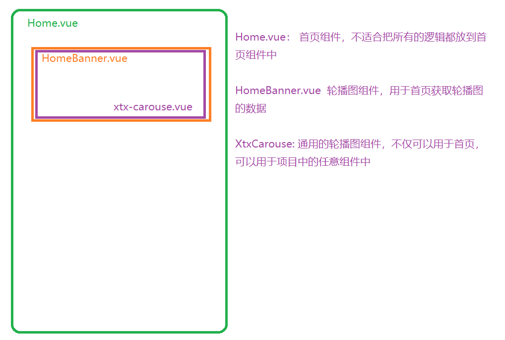
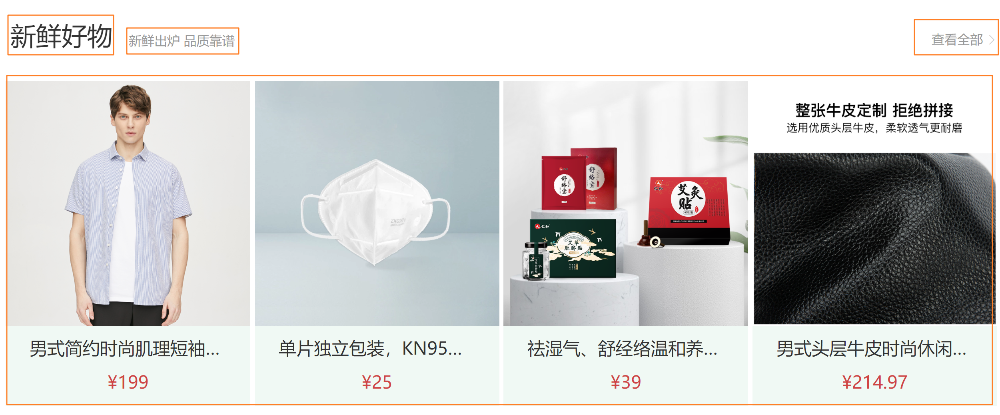
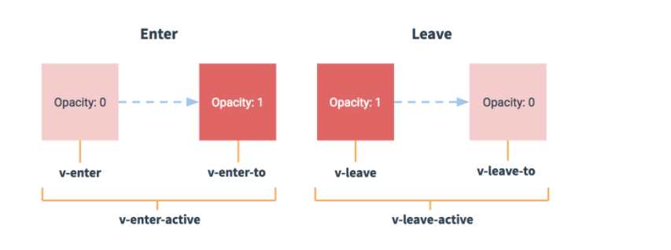
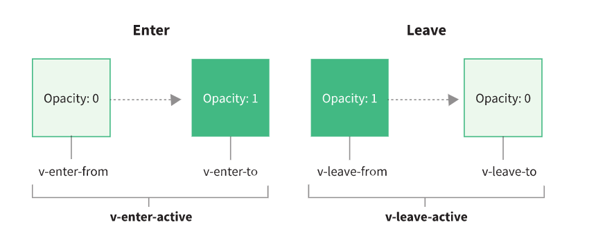

# 首页模块

## 左侧分类基本结构

> 目标:  将banner部分拆分成左侧分类与轮播图两个功能

（1）拆分左侧分类组件

`home/components/home-category.vue`

```html
<script>
export default {
  name: 'HomeCategory',
}
</script>
<script lang="ts" setup></script>
<template>
  <div class="home-category">
    <ul class="menu">
      <li v-for="i in 10" :key="i">
        <RouterLink to="/">居家</RouterLink>
        <RouterLink to="/">洗漱</RouterLink>
        <RouterLink to="/">清洁</RouterLink>
      </li>
    </ul>
  </div>
</template>

<style scoped lang="less">
.home-category {
  width: 250px;
  height: 500px;
  background: rgba(0, 0, 0, 0.8);
  position: relative;
  z-index: 99;
  .menu {
    li {
      padding-left: 40px;
      height: 55px;
      line-height: 55px;
      &:hover {
        background: @xtxColor;
      }
      a {
        margin-right: 4px;
        color: #fff;
        &:first-child {
          font-size: 16px;
        }
      }
    }
  }
}
</style>

```

（2）拆分banner组件

`home/components/home-banner.vue`

```html
<script lang="ts" setup></script>
<template>
  <div class="home-banner">
    <!-- 轮播图 -->
  </div>
</template>

<style scoped lang="less">
.home-banner {
  width: 1240px;
  height: 500px;
  position: absolute;
  left: 0;
  top: 0;
  z-index: 98;
  background-color: pink;
}
</style>

```

（3）home组件中引入使用

```html
<script lang="ts" setup>
import HomeBanner from './components/home-banner.vue'
import HomeCategory from './components/home-category.vue'
</script>

<template>
  <div class="page-home">
    <div class="home-entry">
      <div class="container">
        <!-- 左侧分类 -->
        <HomeCategory />
        <!-- banner轮播图 -->
        <HomeBanner />
      </div>
    </div>
  </div>
</template>


<style lang="less" scoped></style>

```

## 左侧分类-数据渲染

> 目标：能够渲染左侧分类数据


（1）导航menu数据渲染

`src/views/home/components/home-category.vue`

:::warning

分类数据在pinia中已经保存了，直接使用即可

:::

```html
<script lang="ts">
export default {
  name: 'HomeCategory',
}
</script>
<script lang="ts" setup>
import useStore from '@/store'
const { category } = useStore()
</script>
<template>
  <div class="home-category">
    <ul class="menu">
      <li v-for="item in category.categoryList" :key="item.id">
        <RouterLink :to="`/category/${item.id}`">{{ item.name }}</RouterLink>
        <RouterLink
          :to="`/category/sub/${sub.id}`"
          v-for="sub in item.children?.slice(0, 2)"
        >
          {{ sub.name }}
        </RouterLink>
      </li>
    </ul>
  </div>
</template>
```

## 左侧分类-鼠标移入layer展示

> 目标：能够完成左侧分类的鼠标交互效果

**实现步骤**

- 布局交互
  - 每个Li标签对应一个自己的layer弹层，默认全部隐藏
  - Li标签hover状态的时候让自己下面的layer弹层展示出来
- 数据获取
  - 把goods字段也导入进来

**代码落地**

（1）准备布局

```html
<!-- 弹层 -->
<div class="layer">
  <h4>分类推荐 <small>根据您的购买或浏览记录推荐</small></h4>
  <ul>
    <li v-for="i in 9" :key="i">
      <RouterLink to="/">
        
        <div class="info">
          <p class="name ellipsis-2">【定金购】严选零食大礼包（12件）</p>
          <p class="desc ellipsis">超值组合装，满足馋嘴欲</p>
          <p class="price"><i>¥</i>100.00</p>
        </div>
      </RouterLink>
    </li>
  </ul>
</div>
```

（2）新增弹层的样式

```js
.layer {
  width: 990px;
  height: 500px;
  background: rgba(255, 255, 255, 0.8);
  position: absolute;
  left: 250px;
  top: 0;
  display: none;
  padding: 0 15px;
  h4 {
    font-size: 20px;
    font-weight: normal;
    line-height: 80px;
    small {
      font-size: 16px;
      color: #666;
    }
  }
  ul {
    display: flex;
    flex-wrap: wrap;
    li {
      width: 310px;
      height: 120px;
      margin-right: 15px;
      margin-bottom: 15px;
      border: 1px solid #eee;
      border-radius: 4px;
      background: #fff;
      &:nth-child(3n) {
        margin-right: 0;
      }
      a {
        display: flex;
        width: 100%;
        height: 100%;
        align-items: center;
        padding: 10px;
        &:hover {
          background: #e3f9f4;
        }
        img {
          width: 95px;
          height: 95px;
        }
        .info {
          padding-left: 10px;
          line-height: 24px;
          width: 190px;
          .name {
            font-size: 16px;
            color: #666;
          }
          .desc {
            color: #999;
          }
          .price {
            font-size: 22px;
            color: @priceColor;
            i {
              font-size: 16px;
            }
          }
        }
      }
    }
  }
}
&:hover {
  .layer {
    display: block;
  }
}
```

修改types/data.d.ts

```ts
export type CategoryGoods = {
  desc: string
  id: string
  name: string
  picture: string
  price: string
}

// 单个分类的类型
export type CategoryItem = {
  id: string
  name: string
  picture: string
  open: boolean
  children: CategoryItem[]
  goods: CategoryGoods[]
}

```


（3）定义categoryId，用于记录当前id

```ts
// 记录当前的分类id
const categoryId = ref('')
```

给li注册mouseenter事件

```ts
<li
  v-for="item in category.list"
  :key="item.id"
  @mouseenter="categoryId = item.id"
>
```

（4）定义计算属性，获取当前分类下的商品数据

```ts
const goods = computed(() => {
  return category.categoryList.find((item) => item.id === categoryId.value)
    ?.goods
})
```

（5）渲染商品数据

```vue
<!-- 弹层 -->
<div class="layer">
  <h4>分类推荐 <small>根据您的购买或浏览记录推荐</small></h4>
  <ul>
    <li v-for="item in goods" :key="item.id">
      <RouterLink :to="`/product/${item.id}`">
        
        <div class="info">
          <p class="name ellipsis-2">{{ item.name }}</p>
          <p class="desc ellipsis">{{ item.desc }}</p>
          <p class="price"><i>¥</i>{{ item.price }}</p>
        </div>
      </RouterLink>
    </li>
  </ul>
</div>
```

## 左侧分类-高亮bug处理

> 当鼠标移动到右侧是，左侧对应的分类要保持高亮

（1）添加样式

```diff
  .menu {
    li {
      padding-left: 40px;
      height: 50px;
      line-height: 50px;
+      &:hover,&.active {
        background: @xtxColor;
      }
```

（2）控制高亮的类名

```diff
   <ul class="menu">
+      <li :class="{active:categoryId===item.id}"
```

（3）鼠标离开，移除样式

```diff
+  <div class="home-category" @mouseleave="categoryId = ''">
    <ul class="menu">
```

## 骨架组件-基本使用

> 为了在加载的过程中等待效果更好，封装一个骨架屏组件。

大致步骤：

- 需要一个组件，做占位使用。这个占位组件有个专业术语：骨架屏组件。
  - 暴露一些属性：高，宽，背景，是否有闪动画，是否有淡入淡出动画。
- 这是一个公用组件，需要全局注册，将来这样的组件建议再vue插件中定义。
- 使用组件完成左侧分类骨架效果。

（1）封装组件`src/components/skeleton/index.vue`

```vue
<script lang="ts" setup name="XtxSkeleton">
defineProps({
  bg: {
    type: String,
    default: '#efefef',
  },
  width: {
    type: Number,
    required: true,
  },
  height: {
    type: Number,
    required: true,
  },
  animated: {
    type: Boolean,
    default: false,
  },
  fade: {
    type: Boolean,
    default: false,
  },
})
</script>
<template>
  <div
    class="xtx-skeleton"
    :style="{ width: width + 'px', height: height + 'px' }"
    :class="{ shan: animated, fade: fade }"
  >
    <!-- 1 盒子-->
    <div class="block" :style="{ backgroundColor: bg }"></div>
    <!-- 2 闪效果 xtx-skeleton 伪元素 --->
  </div>
</template>

<style scoped lang="less">
.xtx-skeleton {
  display: inline-block;
  position: relative;
  overflow: hidden;
  vertical-align: middle;
  .block {
    width: 100%;
    height: 100%;
    border-radius: 2px;
  }
}
.shan {
  &::after {
    content: '';
    position: absolute;
    animation: shan 1.5s ease 0s infinite;
    top: 0;
    width: 50%;
    height: 100%;
    background: linear-gradient(
      to left,
      rgba(255, 255, 255, 0) 0,
      rgba(255, 255, 255, 0.3) 50%,
      rgba(255, 255, 255, 0) 100%
    );
    transform: skewX(-45deg);
  }
}
@keyframes shan {
  0% {
    left: -100%;
  }
  100% {
    left: 120%;
  }
}

.fade {
  animation: fade 1s linear infinite alternate;
}
@keyframes fade {
  from {
    opacity: 0.2;
  }
  to {
    opacity: 1;
  }
}
</style>

```

(2) 在分类组件中使用骨架屏组件`src/views/home/components/home-category.vue`

```vue

  <li
    v-for="item in category.categoryList"
    :key="item.id"
    @mouseenter="categoryId = item.id"
    :class="{ active: categoryId === item.id }"
  >
    <RouterLink :to="`/category/${item.id}`">{{ item.name }}</RouterLink>
    <template v-if="item.children">
      <RouterLink
        :to="`/category/sub/${sub.id}`"
        v-for="sub in item.children.slice(0, 2)"
      >
        {{ sub.name }}
      </RouterLink>
    </template>
    <template v-else>
      <XtxSkeleton
        :width="60"
        :height="18"
        style="margin-right: 5px"
        bg="rgba(255,255,255,0.2)"
        animated
      />
      <XtxSkeleton
        :width="50"
        :height="18"
        bg="rgba(255,255,255,0.2)"
        animated
      />
    </template>
  </li>
</ul>

```

## 骨架组件-全局注册（插件）

> 任务目标：以插件的形式注册全局组件

**核心步骤**：

（1）新建文件`components/index.ts`

```tsx
// 统一的注册所有的全局组件
import XtxSkeleton from '@/components/skeleton/index.vue'
import { App } from 'vue'
export default {
  install(app: App) {
    app.component('XtxSkeleton', XtxSkeleton)
  },
}
```

（2）在`main.ts`中全局注册

```tsx
import XtxUI from './components'
const app = createApp(App)
app.use(XtxUI)
```

## 骨架组件-全局组件类型提示

> vue3中如果注册的是局部组件，那么props是有类型提示的，但是如果注册的是全局组件，props就没有类型提示了

参考1：[How to make VSCode recognize global component in Vue?](https://stackoverflow.com/questions/69010567/how-to-make-vscode-recognize-global-component-in-vue)

参考2：https://github.com/element-plus/element-plus/blob/dev/global.d.ts

在src目录下新建一个文件 `global.d.ts`

```ts
import XtxSkeleton from '@/components/skeleton/index.vue'
// 参考：
declare module 'vue' {
  export interface GlobalComponents {
    XtxSkeleton: typeof XtxSkeleton
  }
}
export {}

```

## 轮播图功能-获取数据

> 目标:  基于pinia获取轮播图数据

**核心代码：**

（1）在`types/data.d.ts`文件中定义轮播图数据的类型声明

```ts
// 轮播图类型
export type BannerItem = {
  hrefUrl: string
  id: string
  imgUrl: string
  type: string
}
```

（2）在`store/home.ts`文件中封装接口，用于获取轮播图数据

```tsx
import { ApiRes, BannerItem } from '@/types/data'
import request from '@/utils/request'
import { defineStore } from 'pinia'

export default defineStore('home', {
  state: () => ({
    bannerList: [] as BannerItem[],
  }),
  actions: {
    async getBannerList() {
      const res = await request.get<ApiRes<BannerItem[]>>('/home/banner')
      this.bannerList = res.data.result
    },
  },
})

```

(3)在`store/index.ts`中导入

```ts
import useCategoryStore from './modules/category'
import useHomeStore from './modules/home'
export default function useStore() {
  return {
    category: useCategoryStore(),
    home: useHomeStore(),
  }
}

```

（4）在组件中发送请求`views/Home/components/home-banner.vue`

```tsx
<script lang="ts" setup>
import useStore from '@/store'

const { home } = useStore()
home.getBannerList()
</script>
```

（4）通过开发者工具查看数据

## 轮播图-通用轮播图组件

项目中会多次使用到轮播图组件，但是轮播图渲染的数据是不一样的。

但是轮播图的基本功能都是一样的，比如图片切换，自动播放等等。

因此需要封装一个通用的轮播图组件。



（1）通用轮播图的基本结构`src/components/carousel/index.vue`

fade 类：用于控制图片的显示和隐藏

active 类：用于控制小圆点高亮

```vue
<script lang="ts" setup name="XtxCarousel">
defineProps()
</script>

<template>
  <div class="xtx-carousel">
    <ul class="carousel-body">
      <li class="carousel-item fade">
        <RouterLink to="/">
          
        </RouterLink>
      </li>
      <li class="carousel-item">
        <RouterLink to="/">
          
        </RouterLink>
      </li>
      <li class="carousel-item">
        <RouterLink to="/">
          
        </RouterLink>
      </li>
    </ul>
    <a href="javascript:;" class="carousel-btn prev"
      ><i class="iconfont icon-angle-left"></i
    ></a>
    <a href="javascript:;" class="carousel-btn next"
      ><i class="iconfont icon-angle-right"></i
    ></a>
    <div class="carousel-indicator">
      <span class="active"></span>
      <span></span>
      <span></span>
      <span></span>
      <span></span>
    </div>
  </div>
</template>

<style scoped lang="less">
.xtx-carousel {
  width: 100%;
  height: 100%;
  min-width: 300px;
  min-height: 150px;
  position: relative;
  .carousel {
    &-body {
      width: 100%;
      height: 100%;
    }
    &-item {
      width: 100%;
      height: 100%;
      position: absolute;
      left: 0;
      top: 0;
      opacity: 0;
      transition: opacity 0.5s linear;
      &.fade {
        opacity: 1;
        z-index: 1;
      }
      img {
        width: 100%;
        height: 100%;
      }
    }
    &-indicator {
      position: absolute;
      left: 0;
      bottom: 20px;
      z-index: 2;
      width: 100%;
      text-align: center;
      span {
        display: inline-block;
        width: 12px;
        height: 12px;
        background: rgba(0, 0, 0, 0.2);
        border-radius: 50%;
        cursor: pointer;
        ~ span {
          margin-left: 12px;
        }
        &.active {
          background: #fff;
        }
      }
    }
    &-btn {
      width: 44px;
      height: 44px;
      background: rgba(0, 0, 0, 0.2);
      color: #fff;
      border-radius: 50%;
      position: absolute;
      top: 228px;
      z-index: 2;
      text-align: center;
      line-height: 44px;
      opacity: 0;
      transition: all 0.5s;
      &.prev {
        left: 20px;
      }
      &.next {
        right: 20px;
      }
    }
  }
  &:hover {
    .carousel-btn {
      opacity: 1;
    }
  }
}
</style>

```

（2）全局注册通用轮播图 `src/components/index.ts`

```diff
import type { App } from 'vue'
import skelecton from './skeleton/index.vue'
+import carousel from './carousel/index.vue'
export default {
  install(app: App) {
    app.component(skelecton.name, skelecton)
+    app.component(carousel.name, carousel)
  },
}

```

（3）在广告组件中使用`src/views/home/components/home-banner.vue`

```vue
<template>
  <div class="home-banner">
    <!-- 轮播图 -->
    <XtxCarousel></XtxCarousel>
  </div>
</template>
```

（4）覆盖样式，控制箭头和小圆点的位置`src/views/home/components/home-banner.vue`

```less
:deep(.carousel-btn.prev) {
  left: 270px;
}
:deep(.carousel-indicator) {
  padding-left: 250px;
}
```

（5）查看效果


## 轮播图-数据渲染

::: tip 目的

home-banner组件把数据传递给xtx-carousel组件进行渲染

:::

（1）父传子的方式将数据传给通用轮播图组件`src/views/home/components/home-banner.vue`

```vue
<XtxCarousel :slides="home.bannerList"></XtxCarousel>
```

（2）子组件接收数据`src/components/carousel/index.vue`

```js
<script lang="ts" setup name="XtxCarousel">
import { BannerItem } from '@/types/data'
import { PropType } from 'vue'
// import { PropType } from 'vue'

// defineProps({
//   slides: {
//     type: Array as PropType<BannerItem[]>,
//     required: true,
//   },
// })
defineProps<{
  slides: BannerItem[]
}>()
</script>
```

（3）渲染轮播图数据`src/components/carousel/index.vue`

```vue
<template>
  <div class="xtx-carousel">
    <ul class="carousel-body">
      <li class="carousel-item fade" v-for="item in slides" :key="item.id">
        <RouterLink :to="item.hrefUrl">
          
        </RouterLink>
      </li>
    </ul>
    <a href="javascript:;" class="carousel-btn prev">
      <i class="iconfont icon-angle-left"></i>
    </a>
    <a href="javascript:;" class="carousel-btn next">
      <i class="iconfont icon-angle-right"></i>
    </a>
    <div class="carousel-indicator">
      <span v-for="item in slides" :key="item.id" class="active"></span>
    </div>
  </div>
</template>
```

（4）控制高亮的下标

```js
<script lang="ts" setup name="XtxCarousel">

const active = ref(0)
</script>
```

（5）高亮渲染

```diff
<template>
  <div class="xtx-carousel">
    <ul class="carousel-body">
      <li
        class="carousel-item"
+        :class="{ fade: active === index }"
+        v-for="(item, index) in slides"
        :key="item.id"
      >
        <RouterLink :to="item.hrefUrl">
          
        </RouterLink>
      </li>
    </ul>
    <a href="javascript:;" class="carousel-btn prev">
      <i class="iconfont icon-angle-left"></i>
    </a>
    <a href="javascript:;" class="carousel-btn next">
      <i class="iconfont icon-angle-right"></i>
    </a>
    <div class="carousel-indicator">
      <span
+        v-for="(item, index) in slides"
        :key="item.id"
+        :class="{ active: active === index }"
      ></span>
    </div>
  </div>
</template>
```

## 轮播图-逻辑封装

完成轮播图的交互逻辑

 自动播放，暴露自动轮播属性，设置了就自动轮播

 如果有自动播放，鼠标进入离开，暂停，开启

 指示器切换，上一张，下一张

 销毁组件，清理定时器


::: danger 注意

父组件需要能够控制轮播图的切换间隔以及轮播图是否播放

:::

（1）父组件传值给轮播图`src/views/home/components/home-banner.vue`

```vue
<template>
  <div class="home-banner">
    <!-- 轮播图 -->
    <XtxCarousel :slides="slides" autoPlay :duration="3000"></XtxCarousel>
  </div>
</template>
```

（2）props接收`src/components/library/xtx-carousel.vue`

```js
<script lang="ts" setup name="XtxCarousel">
import { BannerItem } from '@/types/data'
import { ref, PropType } from 'vue'

defineProps({
  slides: {
    type: Array as PropType<BannerItem[]>,
    required: true,
  },
  autoPlay: {
    type: Boolean,
    default: false,
  },
  duration: {
    type: Number,
    default: 3000,
  },
})

const active = ref(0)
</script>

```

（3）轮播图的播放逻辑

```js
<script lang="ts" setup name="XtxCarousel">
import { BannerItem } from '@/types/data'
import { onMounted, onUnmounted, PropType, ref } from 'vue'
// import { PropType } from 'vue'

const props = defineProps({
  slides: {
    type: Array as PropType<BannerItem[]>,
    required: true,
  },
  duration: {
    type: Number,
    default: 3000,
  },
  autoPlay: {
    type: Boolean,
    default: false,
  },
})
// const props = defineProps<{
//   slides: BannerItem[]
// }>()

// 控制高亮
const active = ref(0)

const prev = () => {
  if (active.value <= 0) {
    active.value = props.slides.length - 1
  } else {
    active.value--
  }
}

const next = () => {
  if (active.value >= props.slides.length - 1) {
    active.value = 0
  } else {
    active.value++
  }
}

const play = () => {
  // 如果没有自动播放
  if (!props.autoPlay) return
  // 在ts中，使用定时器，window.setInterval
  timer = window.setInterval(() => {
    next()
  }, props.duration)
}
const stop = () => {
  clearInterval(timer)
}

let timer = -1
// 自动播放
onMounted(() => {
  play()
})

onUnmounted(() => {
  stop()
})
</script>
```

（4）鼠标进入和离开操作

```js
<div class="xtx-carousel" @mouseenter="stop" @mouseleave="play">
```

（5）鼠标经过小圆点切换

```vue
<span
  v-for="(item, index) in slides"
  :key="item.id"
  :class="{ active: active === index }"
  @mouseenter="active = index"
></span>
```

（6）点击左右箭头切换

```js

const prev = () => {
  if (active.value === 0) {
    active.value = props.slides.length - 1
  } else {
    active.value--
  }
}
const next = () => {
  if (active.value === props.slides.length - 1) {
    active.value = 0
  } else {
    active.value++
  }
}

// 注册事件
<a href="javascript:;" class="carousel-btn prev" @click="prev">
  <i class="iconfont icon-angle-left"></i>
</a>
<a href="javascript:;" class="carousel-btn next" @click="next">
  <i class="iconfont icon-angle-right"></i>
</a>
```

首页主体-新鲜好物和人气推荐

## 首页主体-查看更多组件

> 封装一个通用的查看更多组件

（1）创建组件`src/components/more/index.vue`

```vue
<script lang="ts" setup name="XtxMore">
import { defineProps } from 'vue'
defineProps({
  path: {
    type: String,
    default: '/',
  },
})
</script>
<template>
  <RouterLink :to="path" class="xtx-more">
    <span><slot>查看全部</slot></span>
    <i class="iconfont icon-angle-right"></i>
  </RouterLink>
</template>

<style scoped lang="less">
.xtx-more {
  margin-bottom: 2px;
  span {
    font-size: 16px;
    vertical-align: middle;
    margin-right: 4px;
    color: #999;
  }
  i {
    font-size: 14px;
    vertical-align: middle;
    position: relative;
    top: 2px;
    color: #ccc;
  }
  &:hover {
    span,
    i {
      color: @xtxColor;
    }
  }
}
</style>

```

（2）全局注册`src/components/index.ts`

```ts
import type { App } from 'vue'
import XtxSkelecton from './skeleton/index.vue'
import XtxCarousel from './carousel/index.vue'
import XtxMore from './more/index.vue'
export default {
  install(app: App) {
    app.component('XtxSkelecton', XtxSkelecton)
    app.component('XtxCarousel', XtxCarousel)
    app.component('XtxMore', XtxMore)
  },
}
```

（3）定义全局组件类型`global.d.ts`

```ts
import XtxSkeleton from '@/components/skeleton/index.vue'
import XtxCarousel from '@/components/carousel/index.vue'
import XtxMore from '@/components/more/index.vue'
declare module 'vue' {
  export interface GlobalComponents {
    XtxSkeleton: typeof XtxSkeleton
    XtxCarousel: typeof XtxCarousel
    XtxMore: typeof XtxMore
  }
}
export {}

```

（4）查看效果

```vue
<XtxMore>查看更多</XtxMore>
```

## 首页主体-面板组件封装 

> 新鲜好物、人气推荐俩个模块的布局结构上非常类似，我们可以抽离出一个通用的面板组件来进行复用
>
> 目标：封装一个通用的面板组件



**思路分析**

1. 图中标出的四个部分都是可能会发生变化的，需要我们定义为可配置
2. 主标题和副标题由于是纯文本，我们定义成props即可
3. 右侧内容和主体内容由于可能会传入较为复杂的自定义模板，我们定义成slot利用插槽渲染

**核心代码**

（1）组件编写

`Home/components/home-panel.vue`

```html
<script lang="ts" setup name="HomePanel"></script>
<template>
  <div class="home-panel">
    <div class="container">
      <div class="head">
        <h3>新鲜好物<small>新鲜出炉 品质靠谱</small></h3>
        <XtxMore to="/"></XtxMore>
      </div>
      面板的内容
    </div>
  </div>
</template>

<style scoped lang="less">
.home-panel {
  background-color: #fff;
  .head {
    padding: 40px 0;
    display: flex;
    align-items: flex-end;
    h3 {
      flex: 1;
      font-size: 32px;
      font-weight: normal;
      margin-left: 6px;
      height: 35px;
      line-height: 35px;
      small {
        font-size: 16px;
        color: #999;
        margin-left: 20px;
      }
    }
  }
}
</style>

```

（2）props处理`src/views/home/components/home-panel.vue`

标题和子标题应该有父组件传递进来，不能写死

```ts
<script lang="ts" setup name="HomePanel">
defineProps({
  title: {
    type: String,
    required: true,
  },
  subTitle: {
    type: String,
    required: true,
  },
})
</script>
```

（3）父组件传入title和subTitle

```vue
<script lang="ts">
import HomePanel from './components/home-panel.vue'
</script>

<!-- 新鲜好物 -->
<HomePanel title="新鲜好物" subTitle="新鲜出炉 品质靠谱"></HomePanel>
```

（4）插槽处理，右侧的查看全部和面板具体的内容不应该写死`src/views/home/components/home-panel.vue`

```diff
<template>
  <div class="home-panel">
    <div class="container">
      <div class="head">
        <h3>
          {{ title }}<small>{{ subTitle }}</small>
        </h3>
+        <!-- 具名插槽 -->
+        <slot name="right"></slot>
      </div>
+      <!-- 默认的内容插槽 -->
+      <slot></slot>
    </div>
  </div>
</template>
```

（5）父组件修改

```vue
<!-- 新鲜好物 -->
<HomePanel title="新鲜好物" subTitle="新鲜出炉 品质靠谱">
  <template #right>
    <XtxMore to="/"></XtxMore>
  </template>
  <div>我是内容</div>
</HomePanel>
```

## 首页主体-新鲜好物

> 新鲜好物的逻辑不在home组件中提供，因此我们封装一个新鲜好物的组件，用于处理新鲜好物模块
>
> 目标：封装home-new组件完成新鲜好物的功能

（1）创建组件`src/views/home/components/home-new.vue`

```vue
<script lang="ts" setup>
import HomePanel from './home-panel.vue'
</script>
<template>
  <div class="home-new">
    <HomePanel title="新鲜好物" sub-title="新鲜出炉 品质靠谱">
      <template #right><XtxMore path="/" /></template>
      <!-- 面板内容 -->
      <ul class="goods-list">
        <li v-for="item in 4" :key="item">
          <RouterLink to="/">
            
            <p class="name ellipsis">情侣款时尚户外轻型徒步鞋环保大底</p>
            <p class="price">&yen;364.00</p>
          </RouterLink>
        </li>
      </ul>
    </HomePanel>
  </div>
</template>

<style scoped lang="less">
.goods-list {
  display: flex;
  justify-content: space-between;
  height: 406px;
  li {
    width: 306px;
    height: 406px;
    background: #f0f9f4;
    .hoverShadow();
    img {
      width: 306px;
      height: 306px;
    }
    p {
      font-size: 22px;
      padding: 12px 30px 0 30px;
      text-align: center;
    }
    .price {
      color: @priceColor;
    }
  }
}
</style>

```

（2）修改home组件

```vue
<template>
  <div class="page-home">
    <div class="home-entry">
      <div class="container">
        <!-- 左侧分类 -->
        <HomeCategory />
        <!-- banner轮播图 -->
        <HomeBanner />
      </div>
      <!-- 面板组件 -->
      <HomeNew></HomeNew>
    </div>
  </div>
</template>

<script lang="ts" setup>
import HomeNew from './components/home-new.vue'
</script>
```

(3）在`store/home.ts`文件中封装请求

```ts
export type GoodItem = {
  desc: string
  id: string
  name: string
  picture: string
  price: string
}


import { defineStore } from 'pinia'
import request from '@/utils/request'
import { ApiRes, CategoryList, BannerList, GoodItem } from '@/types/data'
const useHomeStore = defineStore('home', {
  state: () => ({
    newGoodList: [] as GoodItem[]
  }),
  actions: {
    async getNewList() {
      const res = await request.get<ApiRes<GoodItem[]>>('/home/new')
      this.newGoodList = res.data.result
    }
  }
})

export default useHomeStore

```

4）在`home-new`组件中获取数据并且渲染

```vue
<script lang="ts" setup>
import useStore from '@/store'
import HomePanel from './home-panel.vue'
const { home } = useStore()
home.getNewList()
</script>
<template>
  <div class="home-new">
    <HomePanel title="新鲜好物" sub-title="新鲜出炉 品质靠谱">
      <template #right><XtxMore path="/" /></template>
      <!-- 面板内容 -->
      <ul class="goods-list">
        <li v-for="item in home.newGoodList" :key="item.id">
          <RouterLink to="/">
            
            <p class="name ellipsis">{{ item.name }}</p>
            <p class="price">&yen;{{ item.price }}</p>
          </RouterLink>
        </li>
      </ul>
    </HomePanel>
  </div>
</template>
```

## 首页主体-人气推荐

> 人气推荐的逻辑和新鲜好物的逻辑基本一致

（1）发送请求，获取数据`src/store/home.ts`

```ts
export type HotGoods = {
  id: string
  picture: string
  title: string
  alt: string
}


import { defineStore } from 'pinia'
import request from '@/utils/request'
import { ApiRes, CategoryList, BannerList, GoodItem, HotGoods } from '@/types/data'
const useHomeStore = defineStore('home', {
  state: () => ({
    hotGoodList: [] as HotGoods[]
  }),
  actions: {
    async getHotList() {
      const res = await request.get<ApiRes<HotGoods[]>>('/home/hot')
      this.hotGoodList = res.data.result
    }
  }
})

export default useHomeStore
```

（2）创建组件`src/views/home/components/home-hot.vue`

```vue
<script lang="ts" setup>
import useStore from '@/store'
import HomePanel from './home-panel.vue'
const { home } = useStore()
home.getHotList()
</script>
<template>
  <HomePanel title="人气推荐" sub-title="人气爆款 不容错过">
    <ul ref="pannel" class="goods-list">
      <li v-for="item in home.hotGoodList" :key="item.id">
        <RouterLink to="/">
          
          <p class="name">{{ item.title }}</p>
          <p class="desc">{{ item.alt }}</p>
        </RouterLink>
      </li>
    </ul>
  </HomePanel>
</template>

<style scoped lang="less">
.goods-list {
  display: flex;
  justify-content: space-between;
  height: 426px;
  li {
    width: 306px;
    height: 406px;
    .hoverShadow();
    img {
      width: 306px;
      height: 306px;
    }
    p {
      font-size: 22px;
      padding-top: 12px;
      text-align: center;
    }
    .desc {
      color: #999;
      font-size: 18px;
    }
  }
}
</style>

```

（3）首页中渲染`src/views/home/index.vue`

```vue
<script lang="ts" setup>
import HomeBanner from './components/home-banner.vue'
import HomeCategory from './components/home-category.vue'
import HomeNew from './components/home-new.vue'
import HomeHot from './components/home-hot.vue'
</script>

<template>
  <div class="page-home">
    <div class="home-entry">
      <div class="container">
        <!-- 左侧分类 -->
        <HomeCategory />
        <!-- banner轮播图 -->
        <HomeBanner />
      </div>
      <!-- 新鲜好物 -->
      <HomeNew></HomeNew>
      <!-- 人气推荐 -->
      <HomeHot></HomeHot>
    </div>
  </div>
</template>

<style lang="less" scoped></style>

```


## 图片懒加载-介绍

> 目标：了解如何实现数据懒加载

电商类网站，图片会非常的多，而如果一上来就加载所有的图片，会导致网页加载很慢。

图片懒加载：等图片正式进入到可视区中时，才加载对应的图片，否则不请求图片

:::danger 问题

如何知道图片进入或者离开了可视区？

1. 通过vueuse封装的[useIntersectionObserver](https://vueuse.org/core/useIntersectionObserver/)

:::

**核心代码：**

（1）[useIntersectionObserver](https://vueuse.org/core/useIntersectionObserver/)的基本使用

```vue
<script lang="ts" setup>
import { useIntersectionObserver } from '@vueuse/core'
import { ref } from 'vue'
const target = ref<HTMLImageElement | null>(null)
// stop停止监听
const { stop } = useIntersectionObserver(target, ([{ isIntersecting }]) => {
  console.log('执行了')
  console.log(isIntersecting)

  if (isIntersecting) {
    target.value!.src =
      'https://yanxuan-item.nosdn.127.net/79f289a4e975fd030d5c37b98b9282c5.jpg'
    stop()
  }
})
</script>

<template>
  <div style="height: 3000px"></div>
  
</template>

<style scoed lang="less"></style>

```

## 图片懒加载-封装自定义指令

> 目标：自己封装指令 v-lazy，实现图片懒加载 

**核心代码**

```ts
import { App } from 'vue'
import Skeleton from './Skeleton/index.vue'
import Slider from './Slider/index.vue'
import More from './More/index.vue'
import { useIntersectionObserver } from '@vueuse/core'
import defaultImg from '@/assets/images/200.png'
export default {
  install(app: App) {
    // 全局注册组件
    app.component('XtxSkeleton', Skeleton)
    app.component('XtxSlider', Slider)
    app.component('XtxMore', More)

    // 自定义指令
    // 
    // 
    app.directive('lazy', {
      mounted(el: HTMLImageElement, { value }) {
        // 图片的懒加载逻辑
        // 参数1：回调函数
        // 参数2：可选的配置
        const { stop } = useIntersectionObserver(el, ([{ isIntersecting }]) => {
          if (isIntersecting) {
            // 停止监听
            stop()
            // 给el元素设置src属性
            // value = '123.jpg'
            el.src = value
            // 如果图片加载失败，显示默认的图片
            el.onerror = function () {
              el.src =  defaultImg
            }
          }
        })
      }
    })
  }
}

```

## 组件数据懒加载-基本使用

> 目标：通过useIntersectionObserver优化新鲜好物和人气推荐模块

电商类网站，尤其是首页，内容有好几屏，而如果一上来就加载所有屏的数据，并渲染所有屏的内容会导致首页加载很慢。

数据懒加载：等组件正式进入到可视区中时，才把组件内部的ajax请求发起，否则不请求数据

（1）优化新鲜好物

```vue
<script lang="ts" setup>
const { home } = useStore()
const target = ref(null)
const { stop } = useIntersectionObserver(target, ([{ isIntersecting }]) => {
  console.log(isIntersecting)
  if (isIntersecting) {
    home.getNewList()
    stop()
  }
})
</script>

<template>
  <div class="home-new">
    <HomePanel ref="target" title="新鲜好物" sub-title="新鲜出炉 品质靠谱">
    </HomePanel>
  </div>
</template>
```

（2）优化人气推荐

```vue
<script lang="ts" setup>

const target = ref(null)
const { stop } = useIntersectionObserver(target, ([{ isIntersecting }]) => {
  console.log(isIntersecting)
  if (isIntersecting) {
    home.getHotList()
    stop()
  }
})
</script>
<template>
  <HomePanel ref="target" title="人气推荐" sub-title="人气爆款 不容错过">

  </HomePanel>
</template>


```

## 组件数据懒加载-封装

> 目标：封装组件数据懒加载可复用的逻辑

:::warning 分析

首页中，很多地方都应该使用组件数据懒加载这个功能，不管是哪个模块使用，下面代码都会重复书写

事实上，唯一可能会随着业务使用发生变化的是 ajax接口的调用

其余的部分我们进行重复使用，抽离为可复用逻辑

:::

**核心代码：**

（1）封装通用的懒加载数据api `src/utils/hooks.ts`

```ts
// 自定义一些通用的compositions api
import { useIntersectionObserver } from '@vueuse/core'
import { ref } from 'vue'

// 封装通用的数据懒加载api
export function useLazyData(apiFn: () => void) {
  // 通过 ref 获得组件实例
  const target = ref(null)
  const { stop } = useIntersectionObserver(
    // target 是观察的目标dom容器，必须是dom容器，而且是vue3.0方式绑定的dom对象
    target,
    // isIntersecting 是否进入可视区域，true是进入 false是移出
    // observerElement 被观察的dom
    ([{ isIntersecting }]) => {
      // 在此处可根据isIntersecting来判断，然后做业务
      if (isIntersecting) {
        stop()
        apiFn()
      }
    }
  )
  return target
}
```

（2）优化新鲜好物

```vue
<script lang="ts" setup>
const target = useLazyData(() => {
  home.getNewList()
})
</script>
<template>
  <div class="home-new">
    <HomePanel ref="target" title="新鲜好物" sub-title="新鲜出炉 品质靠谱">
    </HomePanel>
  </div>
</template>

```

（3）优化人气推荐

```ts
<script lang="ts" setup>
const target = useLazyData(() => {
  home.getHotList()
})
</script>
<template>
  <HomePanel ref="target" title="人气推荐" sub-title="人气爆款 不容错过">
  </HomePanel>
</template>


```


## 骨架屏优化

:::danger

组件数据懒加载是进入到可视区才开始加载数据，如果用户滚动过快，数据还没加载回来，会有白屏的效果，因此需要使用骨架屏组件进行优化

:::

（1）新鲜好物-骨架屏的使用

```vue
<script lang="ts" setup>
import useStore from '@/store'
import HomePanel from './home-panel.vue'
const { home } = useStore()
home.getNewList()
</script>
<template>
  <div class="home-new">
    <HomePanel title="新鲜好物" sub-title="新鲜出炉 品质靠谱">
      <template #right><XtxMore path="/" /></template>
      <!-- 面板内容 -->
      <ul class="goods-list" v-if="home.newGoodList.length > 0">
        // ...
      </ul>
      <div class="home-skeleton" v-else>
        <div
          class="item"
          v-for="i in 4"
          :key="i"
          :style="{ backgroundColor: '#f0f9f4' }"
        >
          <XtxSkeleton bg="#e4e4e4" :width="306" :height="306" />
          <XtxSkeleton bg="#e4e4e4" :width="160" :height="24" />
          <XtxSkeleton bg="#e4e4e4" :width="120" :height="24" />
        </div>
      </div>
    </HomePanel>
  </div>
</template>

<style scoped lang="less">

.home-skeleton {
  width: 1240px;
  height: 406px;
  display: flex;
  justify-content: space-between;
  .item {
    width: 306px;
    .xtx-skeleton ~ .xtx-skeleton {
      display: block;
      margin: 16px auto 0;
    }
  }
}
</style>

```

（2）人气推荐-骨架屏的使用

```vue
<script lang="ts" setup>
import useStore from '@/store'
import HomePanel from './home-panel.vue'
const { home } = useStore()
home.getHotList()
</script>
<template>
  <HomePanel title="人气推荐" sub-title="人气爆款 不容错过">
    <ul ref="pannel" class="goods-list" v-if="home.hotGoodList.length > 0">
      // ...
    </ul>
    <div class="home-skeleton" v-else>
      <div
        class="item"
        v-for="i in 4"
        :key="i"
        :style="{ backgroundColor: '#f0f9f4' }"
      >
        <XtxSkeleton bg="#e4e4e4" :width="306" :height="306" />
        <XtxSkeleton bg="#e4e4e4" :width="160" :height="24" />
        <XtxSkeleton bg="#e4e4e4" :width="120" :height="24" />
      </div>
    </div>
  </HomePanel>
</template>

<style scoped lang="less">

.home-skeleton {
  width: 1240px;
  height: 406px;
  display: flex;
  justify-content: space-between;
  .item {
    width: 306px;
    .xtx-skeleton ~ .xtx-skeleton {
      display: block;
      margin: 16px auto 0;
    }
  }
}
</style>

```

（3）骨架屏封装-可选操作

很明显，两个组件中的骨架屏部分功能重复了，因此可以封装一个home-skeleton组件, 同学们有兴趣可以封装一下

```js
<template>
  <div class="home-skeleton">
    <div
      class="item"
      v-for="i in 4"
      :key="i"
      :style="{ backgroundColor: '#f0f9f4' }"
    >
      <XtxSkeleton bg="#e4e4e4" :width="306" :height="306" />
      <XtxSkeleton bg="#e4e4e4" :width="160" :height="24" />
      <XtxSkeleton bg="#e4e4e4" :width="120" :height="24" />
    </div>
  </div>
</template>
<script lang="ts" setup></script>
<style scoped lang="less">
.home-skeleton {
  width: 1240px;
  height: 406px;
  display: flex;
  justify-content: space-between;
  .item {
    width: 306px;
    .xtx-skeleton ~ .xtx-skeleton {
      display: block;
      margin: 16px auto 0;
    }
  }
}
</style>

```

## vue动画-基本介绍

> 知道vue中如何使用动画，知道Transition组件使用。

当vue中，显示隐藏，创建移除，一个元素或者一个组件的时候，可以通过transition实现动画。

vue2的动画类名



vue3的动画类型



- 进入（显示，创建）
  - v-enter-from 进入前
  - v-enter-active 进入中
  - v-enter-to 进入后
- 离开（隐藏，移除）
  - v-leave-from 进入前
  - v-leave-active 进入中
  - v-leave-to 进入后

多个transition使用不同动画，可以添加nam属性，name属性的值替换v即可。

## vue动画-添加动画效果

> 完成人气推荐和新鲜好物

（1）定义动态效果`src/assets/styles/common.less`

```less
// 离开淡出动画
.fade {
  &-leave-from {
    opacity: 1;
  }
  &-leave-active {
    position: absolute;
    width: 100%;
    transition: opacity 0.5s 0.2s;
    z-index: 1;
  }
  &-leave-to {
    opacity: 0;
  }
}

```

(2)在 `home-hot` `home-new` 组件分别使用

```diff
<template>
  <div class="home-new">
    <HomePanel title="新鲜好物" sub-title="新鲜出炉 品质靠谱">
      <template #right><XtxMore path="/"/></template>
+      <Transition name="fade">
        <!-- 面板内容 -->
        <ul class="goods-list" v-if="goods.length > 0">
          <li v-for="item in goods" :key="item.id">
            <RouterLink to="/">
              
              <p class="name ellipsis">{{ item.name }}</p>
              <p class="price">&yen;{{ item.price }}</p>
            </RouterLink>
          </li>
        </ul>
        <HomeSkeleton v-else></HomeSkeleton>
+      </Transition>
    </HomePanel>
  </div>
</template>

<template>
  <HomePanel title="人气推荐" sub-title="人气爆款 不容错过">
+    <Transition name="fade">
      <ul ref="pannel" class="goods-list" v-if="goods.length > 0">
        <li v-for="item in goods" :key="item.id">
          <RouterLink to="/">
            
            <p class="name">{{ item.title }}</p>
            <p class="desc">{{ item.alt }}</p>
          </RouterLink>
        </li>
      </ul>
      <HomeSkeleton v-else></HomeSkeleton>
+    </Transition>
  </HomePanel>
</template>
```

## 热门品牌

> 实现品牌的展示，和切换品牌效果。

（1）创建组件`src/views/home/components/home-brand.vue`

```vue
<script lang="ts" setup name="HomeBrand">
import HomePanel from './home-panel.vue'
</script>

<template>
  <HomePanel title="热门品牌" sub-title="国际经典 品质保证">
    <template v-slot:right>
      <a href="javascript:;" class="iconfont icon-angle-left prev"></a>
      <a href="javascript:;" class="iconfont icon-angle-right next"></a>
    </template>
    <div class="box" ref="box">
      <ul class="list">
        <li v-for="i in 10" :key="i">
          <RouterLink to="/">
            
          </RouterLink>
        </li>
      </ul>
    </div>
  </HomePanel>
</template>

<style scoped lang="less">
.home-panel {
  background: #f5f5f5;
}
.iconfont {
  width: 20px;
  height: 20px;
  background: #ccc;
  color: #fff;
  display: inline-block;
  text-align: center;
  margin-left: 5px;
  background: @xtxColor;
  &::before {
    font-size: 12px;
    position: relative;
    top: -2px;
  }
  &.disabled {
    background: #ccc;
    cursor: not-allowed;
  }
}
.box {
  display: flex;
  width: 100%;
  height: 345px;
  overflow: hidden;
  padding-bottom: 40px;
  .list {
    width: 200%;
    display: flex;
    transition: all 1s;
    li {
      margin-right: 10px;
      width: 240px;
      &:nth-child(5n) {
        margin-right: 0;
      }
      img {
        width: 240px;
        height: 305px;
      }
    }
  }
}
</style>

```

（2）在home组件中注册并且渲染：`src/views/home/index.vue`

```diff
<script lang="ts" setup name="Home">
+import HomeBrand from './components/home-brand.vue'
</script>

<template>
  <div class="page-home">
    <div class="home-entry">
      <!-- 人气推荐 -->
      <HomeHot></HomeHot>
+      <!-- 热门品牌 -->
+      <HomeBrand></HomeBrand>
    </div>
  </div>
</template>

<style scoed lang="less"></style>

```

（3）增加品牌数据类型 `types/data.d.ts`

```ts
export type Brand = {
  id: string
  name: string
  nameEn: string
  logo: string
  picture: string
  type?: any
  desc: string
  place: string
}

```

（4）在`store/modules/home.ts`中发送请求

```ts
import { ApiRes, BannerList, GoodItem, Brand } from '@/types/data'
import { defineStore } from 'pinia'
import request from '@/utils/request'
const useHomeStore = defineStore('home', {
  state: () => ({
    // 品牌数据
    brandList: [] as Brand[],
  }),
  actions: {
    async getBrandList() {
      const res = await request.get<ApiRes<Brand[]>>('/home/brand')
      console.log(res)
      this.brandList = res.data.result
    },
  },
})

export default useHomeStore

```

（5）获取品牌数据并且渲染

```js
// 渲染
<div class="box" ref="box">
  <ul class="list" >
    <li v-for="item in home.brandList" :key="item.id">
      <RouterLink to="/">
        
      </RouterLink>
    </li>
  </ul>
</div>
```

（6）骨架屏效果

```diff

<template>
  <HomePanel title="热门品牌" sub-title="国际经典 品质保证" ref="target">
    <template v-slot:right>
      <a href="javascript:;" class="iconfont icon-angle-left prev"></a>
      <a href="javascript:;" class="iconfont icon-angle-right next"></a>
    </template>
    <div class="box" ref="box">
+      <Transition name="fade">
        <ul class="list" v-if="home.brandList.length > 0">
          <li v-for="item in home.brandList" :key="item.id">
            <RouterLink to="/">
              
            </RouterLink>
          </li>
        </ul>
+        <div v-else class="skeleton">
          <XtxSkeleton
            class="item"
            v-for="i in 5"
            :key="i"
            animated
            bg="#e4e4e4"
            :width="240"
            :height="305"
          />
        </div>
+      </Transition>
    </div>
  </HomePanel>
</template>
```

添加样式

```scss
.skeleton {
  width: 100%;
  display: flex;
  .item {
    margin-right: 10px;
    &:nth-child(5n) {
      margin-right: 0;
    }
  }
}
```

## 热门品牌-左右切换效果

> 目标：完成左右切换效果

- 数据处理

```js
<script lang="ts" setup name="HomeBrand">
const index = ref(0)
</script>

```

- 渲染

```diff
    <template v-slot:right>
      <a
        href="javascript:;"
+        :class="{ disabled: index === 0 }"
        class="iconfont icon-angle-left prev"
+        @click="index = 0"
      ></a>
      <a
+       :class="{ disabled: index === 1 }"
        href="javascript:;"
        class="iconfont icon-angle-right next"
+        @click="index = 1"
      ></a>
    </template>
    <div class="box" ref="box">
      <Transition name="fade">
        <ul
          class="list"
          v-if="brands.length > 0"
+          :style="{ transform: `translateX(${-index * 1240}px)` }"
        >
          <li v-for="item in brands" :key="item.id">
            <RouterLink to="/">
              
            </RouterLink>
          </li>
        </ul>
        <div v-else class="skeleton">
          <XtxSkeleton
            class="item"
            v-for="i in 5"
            :key="i"
            animated
            bg="#e4e4e4"
            width="240px"
            height="305px"
          />
        </div>
      </Transition>
    </div>
  </HomePanel>
```

## 首页主体-商品区块

> 完成商品区域展示。

（1）准备商品组件：`src/views/home/components/home-product.vue`

```vue
<script lang="ts" setup name="HomeProduct">
import HomePanel from './home-panel.vue'
</script>
<template>
  <div class="home-product">
    <HomePanel title="生鲜" sub-title="" v-for="i in 4" :key="i">
      <template v-slot:right>
        <div class="sub">
          <RouterLink to="/">海鲜</RouterLink>
          <RouterLink to="/">水果</RouterLink>
          <RouterLink to="/">蔬菜</RouterLink>
          <RouterLink to="/">水产</RouterLink>
          <RouterLink to="/">禽肉</RouterLink>
        </div>
        <XtxMore />
      </template>
      <div class="box">
        <RouterLink class="cover" to="/">
          
          <strong class="label">
            <span>生鲜馆</span>
            <span>全场3件7折</span>
          </strong>
        </RouterLink>
        <ul class="goods-list">
          <li v-for="i in 8" :key="i">
            <div class="goods-item">
              <RouterLink to="/" class="image">
                
              </RouterLink>
              <p class="name ellipsis-2">美威 智利原味三文鱼排 240g/袋 4片装</p>
              <p class="desc">海鲜年货</p>
              <p class="price">&yen;108.00</p>
              <div class="extra">
                <RouterLink to="/">
                  <span>找相似</span>
                  <span>发现现多宝贝 &gt;</span>
                </RouterLink>
              </div>
            </div>
          </li>
        </ul>
      </div>
    </HomePanel>
  </div>
</template>

<style scoped lang="less">
.home-product {
  background: #fff;
  height: 2900px;
  .sub {
    margin-bottom: 2px;
    a {
      padding: 2px 12px;
      font-size: 16px;
      border-radius: 4px;
      &:hover {
        background: @xtxColor;
        color: #fff;
      }
      &:last-child {
        margin-right: 80px;
      }
    }
  }
  .box {
    display: flex;
    .cover {
      width: 240px;
      height: 610px;
      margin-right: 10px;
      position: relative;
      img {
        width: 100%;
        height: 100%;
      }
      .label {
        width: 188px;
        height: 66px;
        display: flex;
        font-size: 18px;
        color: #fff;
        line-height: 66px;
        font-weight: normal;
        position: absolute;
        left: 0;
        top: 50%;
        transform: translate3d(0, -50%, 0);
        span {
          text-align: center;
          &:first-child {
            width: 76px;
            background: rgba(0, 0, 0, 0.9);
          }
          &:last-child {
            flex: 1;
            background: rgba(0, 0, 0, 0.7);
          }
        }
      }
    }
    .goods-list {
      width: 990px;
      display: flex;
      flex-wrap: wrap;
      li {
        width: 240px;
        height: 300px;
        margin-right: 10px;
        margin-bottom: 10px;
        &:nth-last-child(-n + 4) {
          margin-bottom: 0;
        }
        &:nth-child(4n) {
          margin-right: 0;
        }
      }
    }
  }
}
.goods-item {
  width: 240px;
  height: 300px;
  padding: 10px 30px;
  position: relative;
  overflow: hidden;
  border: 1px solid transparent;
  transition: all 0.5s;
  .image {
    display: block;
    width: 160px;
    height: 160px;
    margin: 0 auto;
    img {
      width: 100%;
      height: 100%;
    }
  }
  p {
    margin-top: 6px;
    font-size: 16px;
    &.name {
      height: 44px;
    }
    &.desc {
      color: #666;
      height: 22px;
    }
    &.price {
      margin-top: 10px;
      font-size: 20px;
      color: @priceColor;
    }
  }
  .extra {
    position: absolute;
    left: 0;
    bottom: 0;
    height: 86px;
    width: 100%;
    background: @xtxColor;
    text-align: center;
    transform: translate3d(0, 100%, 0);
    transition: all 0.5s;
    span {
      display: block;
      color: #fff;
      width: 120px;
      margin: 0 auto;
      line-height: 30px;
      &:first-child {
        font-size: 18px;
        border-bottom: 1px solid #fff;
        line-height: 40px;
        margin-top: 5px;
      }
    }
  }
  &:hover {
    border-color: @xtxColor;
    .extra {
      transform: none;
    }
  }
}
</style>

```

（2）在主页中导入并且渲染：`src/views/home/index.vue`

```vue
<script lang="ts" setup name="Home">
import HomeProduct from './components/home-product.vue'
</script>

<template>
  <div class="page-home">
    <div class="home-entry">
      <!-- ... -->
      <!-- 商品区域 -->
      <HomeProduct />
    </div>
  </div>
</template>

<style scoed lang="less"></style>

```


（4）获取数据-新增数据类型 `types/data.d.ts`

```js

// 首页商品推荐
export type HomeProduct = {
  id: string
  name: string
  picture: string
  saleInfo: string
  children: {
    id: string
    name: string
  }[]
  goods: {
    id: string
    name: string
    desc: string
    price: string
    picture: string
    discount?: any
    orderNum: number
  }[]
}


```

（5）store中定义数据 `store/modules/home.ts`

```ts
const useHomeStore = defineStore('home', {
  state: () => ({
    productList: [] as HomeProduct[],
  }),
  actions: {

    async getProductList() {
      const res = await request.get<ApiRes<HomeProduct[]>>('/home/goods')
      this.productList = res.data.result
    },
  },
})
```

（6）组件中发送请求

```ts
<script lang="ts" setup name="HomeProduct">
import useStore from '@/store'
import { useLazyData } from '@/utils/hooks'
import HomePanel from './home-panel.vue'
const { home } = useStore()
const target = useLazyData(() => {
  console.log('加载数据')
  home.getProductList()
})
</script>
```

（7）渲染

```jsx
<template>
  <div class="home-product" ref="target">
    <HomePanel
      :title="item.name"
      sub-title=""
      v-for="item in home.productList"
      :key="item.id"
    >
      <template v-slot:right>
        <div class="sub">
          <RouterLink to="/" v-for="sub in item.children" :key="sub.id">
            {{ sub.name }}
          </RouterLink>
        </div>
        <XtxMore />
      </template>
      <div class="box">
        <RouterLink class="cover" to="/">
          
          <strong class="label">
            <span>{{ item.name }}</span>
            <span>{{ item.saleInfo.slice(0, 4) }}</span>
          </strong>
        </RouterLink>
        <ul class="goods-list">
          <li v-for="goods in item.goods" :key="goods.id">
            <div class="goods-item">
              <RouterLink to="/" class="image">
                
              </RouterLink>
              <p class="name ellipsis-2">{{ goods.name }}</p>
              <p class="desc ellipsis">{{ goods.desc }}</p>
              <p class="price">&yen;{{ goods.price }}</p>
              <div class="extra">
                <RouterLink to="/">
                  <span>找相似</span>
                  <span>发现现多宝贝 &gt;</span>
                </RouterLink>
              </div>
            </div>
          </li>
        </ul>
      </div>
    </HomePanel>
  </div>
</template>
```

## 首页主体-滚动加载商品的bug

- 产品区域需要滚动比较多才能去加载数据。
- threshold 容器和可视区交叉的占比（进入的面积/容器完整面试） 取值，0-1 之间，默认比0大，所以需要滚动较多才能触发进入可视区域事件。

```js
const { stop } = useIntersectionObserver(
  target,
  ([{ isIntersecting }], observerElement) => {
    if (isIntersecting) {
      stop()
      // 调用API获取数据
      apiFn().then(data => {
        result.value = data.result
      })
    }
  },
  {
    threshold: 0
  }
)
```

## 首页主体-最新专题

（1）基础布局：`src/views/home/components/home-special.vue`

```vue
<script lang="ts" setup name="HomeSpecial">
import HomePanel from './home-panel.vue'
</script>
<template>
  <HomePanel title="最新专题" sub-title="">
    <template v-slot:right><XtxMore /></template>
    <div class="special-list" ref="homeSpecial">
      <div class="special-item" v-for="i in 3" :key="i">
        <RouterLink to="/">
          
          <div class="meta">
            <p class="title">
              <span class="top ellipsis">看到撒娇的撒娇的凯撒就</span>
              <span class="sub ellipsis">倒萨倒萨倒萨</span>
            </p>
            <span class="price">&yen;19.99起</span>
          </div>
        </RouterLink>
        <div class="foot">
          <span class="like"><i class="iconfont icon-hart1"></i>100</span>
          <span class="view"><i class="iconfont icon-see"></i>100</span>
          <span class="reply"><i class="iconfont icon-message"></i>100</span>
        </div>
      </div>
    </div>
  </HomePanel>
</template>

<style scoped lang="less">
.home-panel {
  background: #f5f5f5;
}
.special-list {
  height: 380px;
  padding-bottom: 20px;
  display: flex;
  justify-content: space-between;
  .special-item {
    width: 404px;
    background: #fff;
    .hoverShadow();
    a {
      display: block;
      width: 100%;
      height: 288px;
      position: relative;
      img {
        width: 100%;
        height: 100%;
      }
      .meta {
        background-image: linear-gradient(
          to top,
          rgba(0, 0, 0, 0.8),
          transparent 50%
        );
        position: absolute;
        left: 0;
        top: 0;
        width: 100%;
        height: 288px;
        .title {
          position: absolute;
          bottom: 0px;
          left: 0;
          padding-left: 16px;
          width: 70%;
          height: 70px;
          .top {
            color: #fff;
            font-size: 22px;
            display: block;
          }
          .sub {
            display: block;
            font-size: 19px;
            color: #999;
          }
        }
        .price {
          position: absolute;
          bottom: 25px;
          right: 16px;
          line-height: 1;
          padding: 4px 8px 4px 7px;
          color: @priceColor;
          font-size: 17px;
          background-color: #fff;
          border-radius: 2px;
        }
      }
    }
    .foot {
      height: 72px;
      line-height: 72px;
      padding: 0 20px;
      font-size: 16px;

      i {
        display: inline-block;
        width: 15px;
        height: 14px;
        margin-right: 5px;
        color: #999;
      }
      .like,
      .view {
        float: left;
        margin-right: 25px;
        vertical-align: middle;
      }
      .reply {
        float: right;
        vertical-align: middle;
      }
    }
  }
}
</style>

```

（2）主页渲染，使用组件：`src/views/home/index.vue`

```vue
<script lang="ts" setup name="Home">
import HomeSpecial from './components/home-special.vue'
</script>

<template>
  <div class="page-home">
    <div class="home-entry">
      <!-- 最新专题 -->
      <HomeSpecial />
    </div>
  </div>
</template>

<style scoed lang="less"></style>

```

（3）指定专题类型

```js

export type Special = {
  creator: string
  isDelete: number
  createTime: string
  updateTime: string
  id: string
  classificationId: string
  title: string
  summary: string
  lowestPrice: number
  cover: string
  detailsUrl: string
  collectNum: number
  viewNum: number
  replyNum: number
}
```

（4）指定专题数据state和action

```ts
import { ApiRes, BannerList, GoodItem, Brand, HomeProduct } from '@/types/data'
import { defineStore } from 'pinia'
import request from '@/utils/request'
const useHomeStore = defineStore('home', {
  state: () => ({
    specialList: [] as Special[],
  }),
  actions: {
    async getSpecialList() {
      const res = await request.get<ApiRes<Special[]>>('/home/special')
      this.specialList = res.data.result
    },
  },
})

export default useHomeStore

```

（5）发送请求获取数据

```js
<script lang="ts" setup name="HomeSpecial">
import useStore from '@/store'
import { useLazyData } from '@/utils/hooks'
import HomePanel from './home-panel.vue'
const { home } = useStore()
const target = useLazyData(() => {
  home.getSpecialList()
})
</script>
```

（6）动态渲染

```vue
<template>
  <HomePanel title="最新专题" sub-title="" ref="target">
    <template v-slot:right><XtxMore /></template>
    <div class="special-list" ref="homeSpecial">
      <div class="special-item" v-for="item in home.specialList" :key="item.id">
        <RouterLink to="/">
          
          <div class="meta">
            <p class="title">
              <span class="top ellipsis">{{ item.title }}</span>
              <span class="sub ellipsis">{{ item.summary }}</span>
            </p>
            <span class="price">&yen;{{ item.lowestPrice }}起</span>
          </div>
        </RouterLink>
        <div class="foot">
          <span class="like">
            <i class="iconfont icon-hart1"></i>{{ item.collectNum }}
          </span>
          <span class="view">
            <i class="iconfont icon-see"></i>{{ item.viewNum }}
          </span>
          <span class="reply">
            <i class="iconfont icon-message"></i>{{ item.replyNum }}
          </span>
        </div>
      </div>
    </div>
  </HomePanel>
</template>
```
