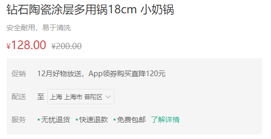
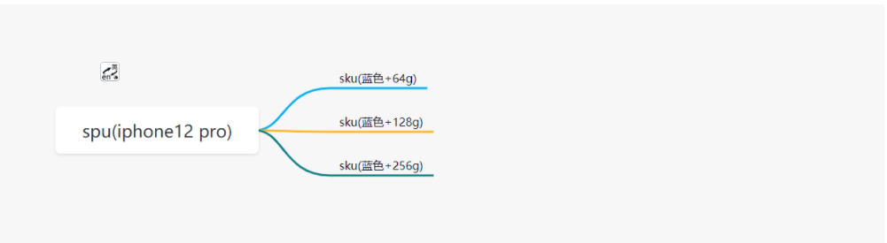
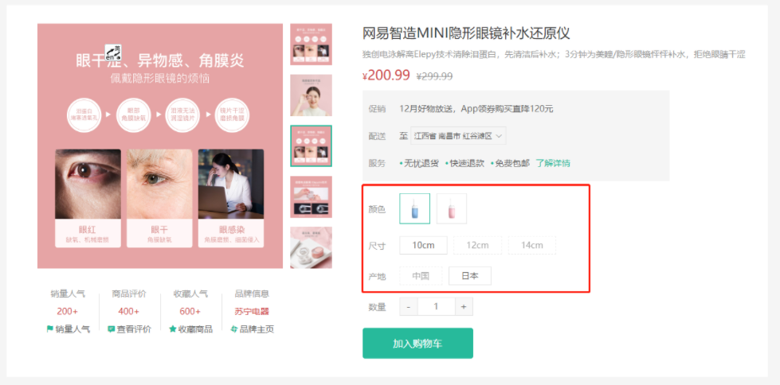
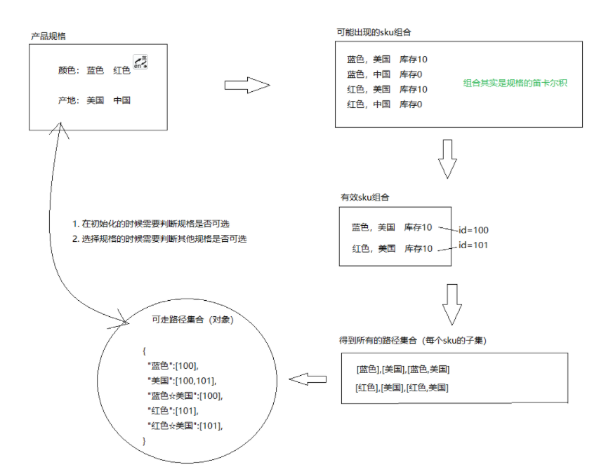
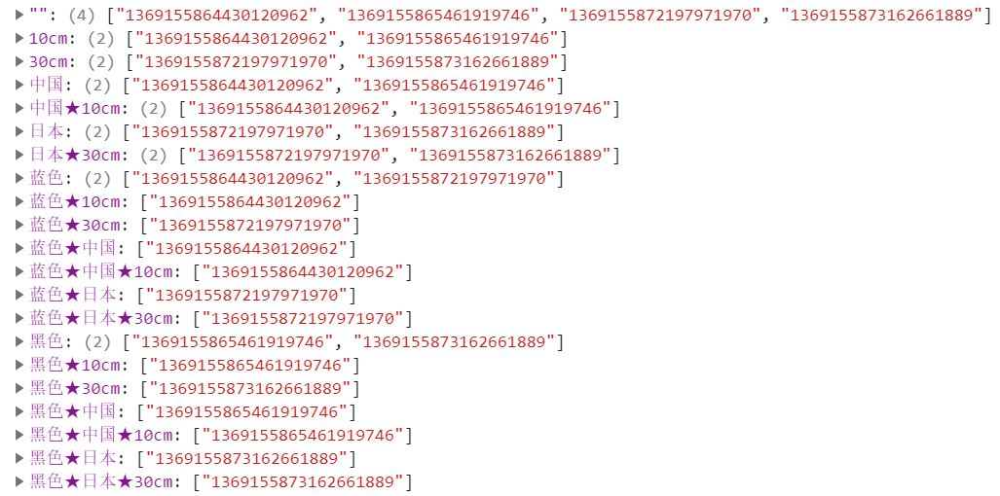
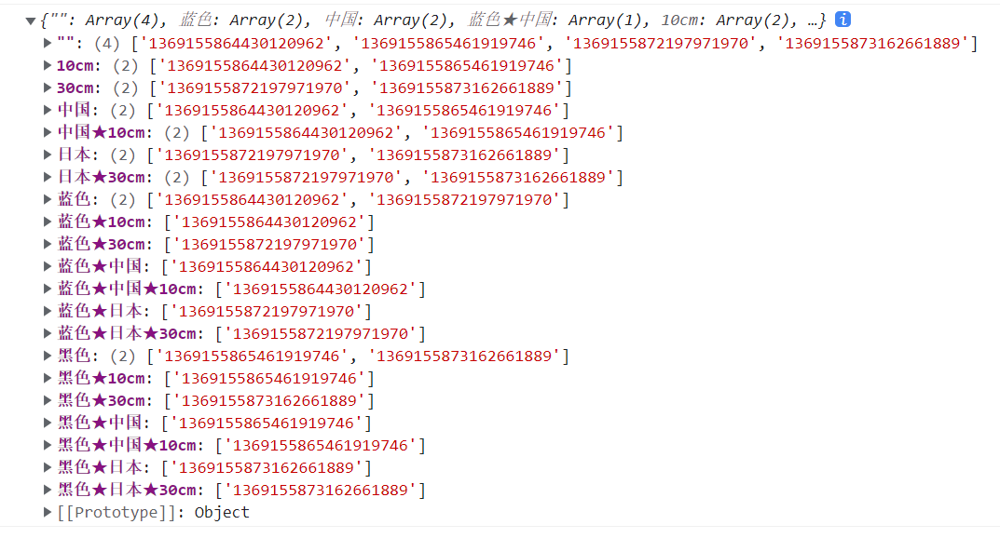
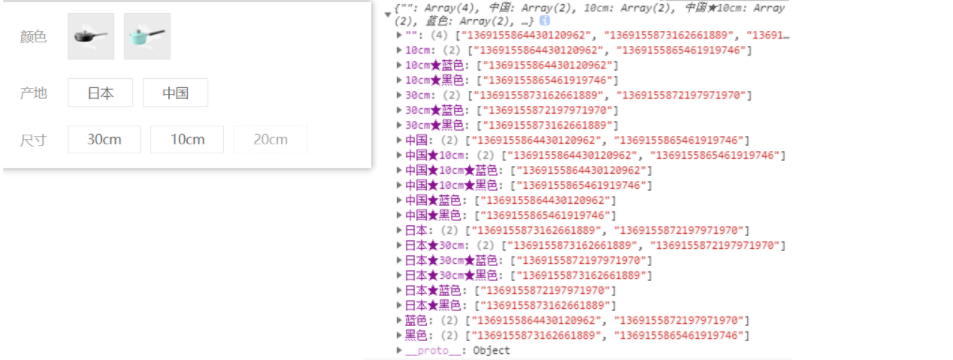
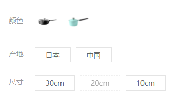
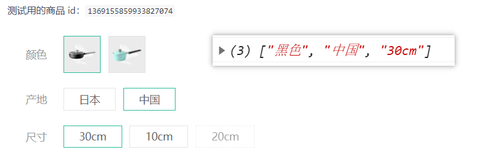

# 商品详情

## 路由配置

> 目标：完成商品详情的基础布局和路由配置


(1)新建页面组件

`src/views/goods/index.vue`

```vue
<script lang="ts" setup></script>
<template>
  <div class="xtx-goods-page">
    <div class="container">
      <!-- 面包屑 -->
      <XtxBread>
        <XtxBreadItem to="/">首页</XtxBreadItem>
        <XtxBreadItem to="/">手机</XtxBreadItem>
        <XtxBreadItem to="/">华为</XtxBreadItem>
        <XtxBreadItem to="/">p30</XtxBreadItem>
      </XtxBread>
      <!-- 商品信息 -->
      <div class="goods-info"></div>
      <!-- 商品详情 -->
      <div class="goods-footer">
        <div class="goods-article">
          <!-- 商品+评价 -->
          <div class="goods-tabs"></div>
        </div>
        <!-- 24热榜+专题推荐 -->
        <div class="goods-aside"></div>
      </div>
    </div>
  </div>
</template>

<style scoped lang="less">
.goods-info {
  min-height: 600px;
  background: #fff;
}
.goods-footer {
  display: flex;
  margin-top: 20px;
  .goods-article {
    width: 940px;
    margin-right: 20px;
  }
  .goods-aside {
    width: 280px;
    min-height: 1000px;
  }
}
.goods-tabs {
  min-height: 600px;
  background: #fff;
}
.goods-warn {
  min-height: 600px;
  background: #fff;
  margin-top: 20px;
}
</style>

```

（2）路由配置

`src/router/index.js`

```js
routes: [
  {
    path: '/',
    component: Layout,
    children: [
      {
        path: '',
        component: () => import('@/views/home/index.vue'),
      },
      {
        path: '/category/:id',
        component: () => import('@/views/category/index.vue'),
      },
      {
        path: '/category/sub/:id',
        component: () => import('@/views/category/sub.vue'),
      },
      {
        path: '/goods/:id',
        component: () => import('@/views/goods/index.vue'),
      },
    ],
  },
  {
    path: '/login',
    component: () => import('@/views/Login/index.vue'),
  },
],
```

（3）修改跳转路径 `category/components/goods-item.vue`

```vue
<template>
  <RouterLink :to="`/goods/${goods.id}`" class="goods-item">
    
    <p class="name ellipsis">{{ goods.name }}</p>
    <p class="desc ellipsis">{{ goods.desc }}</p>
    <p class="price">&yen;{{ goods.price }}</p>
  </RouterLink>
</template>
```

## 渲染面包屑

> 目标：使用真实数据渲染面包屑导航


**实现步骤**

1. 获取商品详情数据
2. 根据商品详情数据渲染

**代码落地**

（1）在`types/data.d.ts`中定义商品的数据类型

```js
// 商品模块的类型声明
export type GoodsInfo = {
  id: string
  name: string
  spuCode: string
  desc: string
  price: string
  oldPrice: string
  discount: number
  inventory: number
  salesCount: number
  commentCount: number
  collectCount: number
  mainVideos: any[]
  videoScale: number
  mainPictures: string[]
  isPreSale: boolean
  isCollect?: any
  recommends?: any
  userAddresses?: any
  evaluationInfo?: any
}

```

（2）新建文件`store/good.ts`  

```js
import { ApiRes } from '@/types/data'
import { GoodsInfo } from '@/types/goods'
import request from '@/utils/request'
import { defineStore } from 'pinia'

export default defineStore('goods', {
  state: () => ({
    // 商品详细信息
    info: {} as GoodsInfo,
  }),
  actions: {
    async getGoodsInfo(id: string) {
      const res = await request.get<ApiRes<GoodsInfo>>('/goods', {
        params: {
          id,
        },
      })
      this.info = res.data.result
    },
  },
})
```

（3）在`store/index.ts`文件中引入good模块

```ts
import useCategoryStore from './modules/category'
import useHomeStore from './modules/home'
import useGoodStore from './modules/goods'
const useStore = () => {
  return {
    category: useCategoryStore(),
    home: useHomeStore(),
    goods: useGoodStore()
  }
}

export default useStore

```

修改类型声明

```ts
// 商品模块的类型声明
export type GoodsInfo = {
  id: string
  name: string
  spuCode: string
  desc: string
  price: string
  oldPrice: string
  discount: number
  inventory: number
  salesCount: number
  commentCount: number
  collectCount: number
  mainVideos: any[]
  videoScale: number
  mainPictures: string[]
  isPreSale: boolean
  isCollect?: any
  recommends?: any
  userAddresses?: any
  evaluationInfo?: any
  categories: {
    id: string
    name: string
  }[]
}

```

（4）在组件中获取数据并且渲染

```vue
<script lang="ts" setup name="Goods">
import useStore from '@/store'
import { storeToRefs } from 'pinia'
import { watchEffect } from 'vue'
import { useRoute } from 'vue-router'
const { goods } = useStore()
const route = useRoute()
watchEffect(() => {
  const id = route.params.id as string
  goods.getGoodsInfo(id)
})

const { info } = storeToRefs(goods)
</script>


<template>
  <div class="xtx-goods-page" v-if="info.categories">
    <div class="container">
      <!-- 面包屑 -->
      <XtxBread>
        <XtxBreadItem to="/">首页</XtxBreadItem>
        <XtxBreadItem :to="`/category/${info.categories[1].id}`">
          {{ info.categories[1].name }}
        </XtxBreadItem>
        <XtxBreadItem :to="`/category/sub/${info.categories[0].id}`">
          {{ info.categories[0].name }}
        </XtxBreadItem>
        <XtxBreadItem>{{ info.name }}</XtxBreadItem>
      </XtxBread>
      <!-- 商品信息 -->
      <div class="goods-info"></div>
      <!-- 商品详情 -->
      <div class="goods-footer">
        <div class="goods-article">
          <!-- 商品+评价 -->
          <div class="goods-tabs"></div>
        </div>
        <!-- 24热榜+专题推荐 -->
        <div class="goods-aside"></div>
      </div>
    </div>
  </div>
</template>
```

:::danger 注意

1. 由于发送请求需要时间，在刷新页面的时候，会发现渲染报错，因为数据还没有获取到，所以需要加v-if进行判断，保证数据加载完成后才渲染。
2. 当商品详情页跳转到分类页，或者分类页跳转到商品详情页时会报错，此时需要在`watchEffect`中进行额外的判断。

:::

## 商品详情-商品图片-基本功能

（1）新建组件`src/views/goods/components/goods-image.vue`

```vue
<script lang="ts" setup name="GoodsImage"></script>
<template>
  <div class="goods-image">
    <div class="middle">
      
    </div>
    <ul class="small">
      <li v-for="item in 5" :key="item" :class="{ active: item === 1 }">
        
      </li>
    </ul>
  </div>
</template>

<style scoped lang="less">
.goods-image {
  width: 480px;
  height: 400px;
  position: relative;
  display: flex;
  .middle {
    width: 400px;
    height: 400px;
    background: #f5f5f5;
  }
  .small {
    width: 80px;
    li {
      width: 68px;
      height: 68px;
      margin-left: 12px;
      margin-bottom: 15px;
      cursor: pointer;
      &:hover,
      &.active {
        border: 2px solid @xtxColor;
      }
    }
  }
}
</style>

```

（2）渲染组件商品图片组件`src/views/goods/index.vue`

```vue
<!-- 商品信息 -->
<div class="goods-info">
  <div class="media">
    <GoodsImage></GoodsImage>
  </div>
  <div class="spec"></div>
</div>


<style scoped lang="less">
.goods-info {
  min-height: 600px;
  background: #fff;
  display: flex;
  .media {
    width: 580px;
    height: 600px;
    padding: 30px 50px;
  }
  .spec {
    flex: 1;
    padding: 30px 30px 30px 0;
  }
}
</style>
```

（3）功能实现`src/views/goods/index.vue`

父传子

```vue
<GoodsImage :images="info.mainPictures"></GoodsImage>
```

子组件渲染

```vue
<script lang="ts" setup name="GoodsImage">
import { ref } from 'vue'

defineProps<{
  images: string[]
}>()
// 默认高亮的下标
const active = ref(0)
</script>
<template>
  <div class="goods-image">
    <div class="middle">
      
    </div>
    <ul class="small">
      <li
        v-for="(item, index) in images"
        :key="item"
        :class="{ active: index === active }"
        @mouseenter="active = index"
      >
        
      </li>
    </ul>
  </div>
</template>
```

## 放大镜效果-基本结构

（1）准备大图片容器：`src/views/goods/components/goods-image.vue`

```diff
  <div class='goods-image'>
+   <div class="large" :style="[{backgroundImage:`url(${images[current]})`}]"></div>
      <div class="middle">
```

（2）提供大图片容器的样式

```diff
.goods-image {
  width: 480px;
  height: 400px;
  position: relative;
  display: flex;
+  z-index: 500;
+  .large {
+    position: absolute;
+    top: 0;
+    left: 412px;
+    width: 400px;
+    height: 400px;
+    box-shadow: 0 0 10px rgba(0,0,0,0.1);
+    background-repeat: no-repeat;
+    background-size: 800px 800px;
+    background-color: #f8f8f8;
+  }
```

（3）准备移动的遮罩层

```diff
    <div class="middle" ref="target">
      
+      <div class="layer"></div>
    </div>
```

（4）给遮罩层添加样式

```diff
  .middle {
    width: 400px;
    height: 400px;
+    position: relative;
+    cursor: move;
+    .layer {
+      width: 200px;
+      height: 200px;
+      background: rgba(0,0,0,.2);
+      left: 0;
+      top: 0;
+      position: absolute;
+    }
  }
```

## 放大镜效果-控制显示隐藏

:::提示

通过[useMouseInElement](https://vueuse.org/core/usemouseinelement/)可以获取到鼠标相关的信息

:::

（1）使用`useMouseInElement`或许鼠标在元素中的信息

```js
<script lang="ts" setup name="GoodsImage">
import { useMouseInElement } from '@vueuse/core'
import { ref } from 'vue'

defineProps<{
  images: string[]
}>()

const current = ref(0)

const target = ref(null)
const { isOutside, elementX, elementY } = useMouseInElement(target)
</script>
```

（2）通过`v-show`渲染

```diff
<template>
  <div class="goods-image">
    <!-- 大图片容器 -->
    <div
      class="large"
      :style="[{ backgroundImage: `url(${images[current]})` }]"
+      v-show="!isOutside"
    ></div>
    <div class="middle" ref="target">
      
      <!-- 遮罩层 -->
+      <div class="layer" v-show="!isOutside"></div>
    </div>
    <ul class="small">
      <li
        v-for="(item, index) in images"
        :key="index"
        :class="{ active: index === current }"
      >
        
      </li>
    </ul>
  </div>
</template>
```

## 放大镜效果-控制移动

（1）提供遮罩和大图片的坐标

```js
<script lang="ts" setup name="GoodsImage">
import { computed, ref } from 'vue'
import { useMouseInElement } from '@vueuse/core'
defineProps<{
  images: string[]
}>()
// 默认高亮的下标
const active = ref(0)
const target = ref(null)
const { isOutside, elementX, elementY } = useMouseInElement(target)

const position = computed(() => {
  let x = elementX.value - 100
  let y = elementY.value - 100
  if (x <= 0) x = 0
  if (x >= 200) x = 200
  if (y <= 0) y = 0
  if (y >= 200) y = 200
  return {
    x,
    y,
  }
})
</script>
```

（2）渲染

```diff

<template>
  <div class="goods-image">
    <div
      class="large"
      :style="[
        {
          backgroundImage: `url(${images[current]})`,
+          backgroundPosition: `${-position.x * 2}px ${-position.y * 2}px`,
        },
      ]"
+      v-show="!isOutside"
    ></div>
    <div class="middle" ref="target">
      
      <div
        class="layer"
+        v-show="!isOutside"
+        :style="{ left: position.x + 'px', top: position.y + 'px' }"
      ></div>
    </div>
    <ul class="small">
      <li
        v-for="(item, index) in images"
        :key="index"
        :class="{ active: index === current }"
      >
        
      </li>
    </ul>
  </div>
</template>
```


## 商品详情-商品基本信息

展示商品基本信息



（1）底部销量信息封装 `src/views/goods/components/goods-sales.vue`

```vue
<script lang="ts" setup name="GoodsSales"></script>

<template>
  <ul class="goods-sales">
    <li>
      <p>销量人气</p>
      <p>200+</p>
      <p><i class="iconfont icon-task-filling"></i>销量人气</p>
    </li>
    <li>
      <p>商品评价</p>
      <p>400+</p>
      <p><i class="iconfont icon-comment-filling"></i>查看评价</p>
    </li>
    <li>
      <p>收藏人气</p>
      <p>600+</p>
      <p><i class="iconfont icon-favorite-filling"></i>收藏商品</p>
    </li>
    <li>
      <p>品牌信息</p>
      <p>苏宁电器</p>
      <p><i class="iconfont icon-dynamic-filling"></i>品牌主页</p>
    </li>
  </ul>
</template>

<style scoped lang="less">
.goods-sales {
  display: flex;
  width: 400px;
  align-items: center;
  text-align: center;
  height: 140px;
  li {
    flex: 1;
    position: relative;
    ~ li::after {
      position: absolute;
      top: 10px;
      left: 0;
      height: 60px;
      border-left: 1px solid #e4e4e4;
      content: '';
    }
    p {
      &:first-child {
        color: #999;
      }
      &:nth-child(2) {
        color: @priceColor;
        margin-top: 10px;
      }
      &:last-child {
        color: #666;
        margin-top: 10px;
        i {
          color: @xtxColor;
          font-size: 14px;
          margin-right: 2px;
        }
        &:hover {
          color: @xtxColor;
          cursor: pointer;
        }
      }
    }
  }
}
</style>

```

（2）商品名字组件封装2 `src/views/goods/components/goods-name.vue`

```vue
<script lang="ts" setup name="GoodName"></script>
<template>
  <p class="g-name">2件装 粉釉花瓣心意点缀 点心盘*2 碟子盘子</p>
  <p class="g-desc">花瓣造型干净简约 多功能使用堆叠方便</p>
  <p class="g-price">
    <span>108.00</span>
    <span>199.00</span>
  </p>
  <div class="g-service">
    <dl>
      <dt>促销</dt>
      <dd>12月好物放送，App领券购买直降120元</dd>
    </dl>
    <dl>
      <dt>配送</dt>
      <dd>至</dd>
    </dl>
    <dl>
      <dt>服务</dt>
      <dd>
        <span>无忧退货</span>
        <span>快速退款</span>
        <span>免费包邮</span>
        <a href="javascript:;">了解详情</a>
      </dd>
    </dl>
  </div>
</template>

<style lang="less" scoped>
.g-name {
  font-size: 22px;
}
.g-desc {
  color: #999;
  margin-top: 10px;
}
.g-price {
  margin-top: 10px;
  span {
    &::before {
      content: '¥';
      font-size: 14px;
    }
    &:first-child {
      color: @priceColor;
      margin-right: 10px;
      font-size: 22px;
    }
    &:last-child {
      color: #999;
      text-decoration: line-through;
      font-size: 16px;
    }
  }
}
.g-service {
  background: #f5f5f5;
  width: 500px;
  padding: 20px 10px 0 10px;
  margin-top: 10px;
  dl {
    padding-bottom: 20px;
    display: flex;
    align-items: center;
    dt {
      width: 50px;
      color: #999;
    }
    dd {
      color: #666;
      &:last-child {
        span {
          margin-right: 10px;
          &::before {
            content: '•';
            color: @xtxColor;
            margin-right: 2px;
          }
        }
        a {
          color: @xtxColor;
        }
      }
    }
  }
}
</style>

```

（3）引入组件并且渲染 `src/views/goods/index.vue`

```js
import GoodsSales from './components/goods-sales.vue'
import GoodsName from './components/goods-name.vue'


<!-- 商品信息 -->
<div class="goods-info">
  <div class="media">
    <GoodsImage :images="goods.good.mainPictures"></GoodsImage>
    <GoodsSales />
  </div>
  <div class="spec">
    <GoodsName :goods="info" />
  </div>
</div>
```

（4）渲染数据 `src/views/goods/components/goods-name.vue`

```vue
<script lang="ts" setup name="GoodName">
import { GoodsInfo } from '@/types/goods'

defineProps<{
  goods: GoodsInfo
}>()
</script>
<template>
  <p class="g-name">{{ goods.name }}</p>
  <p class="g-desc">{{ goods.desc }}</p>
  <p class="g-price">
    <span>{{ goods.price }}</span>
    <span>{{ goods.oldPrice }}</span>
  </p>
  <div class="g-service">
    <dl>
      <dt>促销</dt>
      <dd>12月好物放送，App领券购买直降120元</dd>
    </dl>
    <dl>
      <dt>配送</dt>
      <dd>至</dd>
    </dl>
    <dl>
      <dt>服务</dt>
      <dd>
        <span>无忧退货</span>
        <span>快速退款</span>
        <span>免费包邮</span>
        <a href="javascript:;">了解详情</a>
      </dd>
    </dl>
  </div>
</template>

<style lang="less" scoped>
.g-name {
  font-size: 22px;
}
.g-desc {
  color: #999;
  margin-top: 10px;
}
.g-price {
  margin-top: 10px;
  span {
    &::before {
      content: '¥';
      font-size: 14px;
    }
    &:first-child {
      color: @priceColor;
      margin-right: 10px;
      font-size: 22px;
    }
    &:last-child {
      color: #999;
      text-decoration: line-through;
      font-size: 16px;
    }
  }
}
.g-service {
  background: #f5f5f5;
  width: 500px;
  padding: 20px 10px 0 10px;
  margin-top: 10px;
  dl {
    padding-bottom: 20px;
    display: flex;
    align-items: center;
    dt {
      width: 50px;
      color: #999;
    }
    dd {
      color: #666;
      &:last-child {
        span {
          margin-right: 10px;
          &::before {
            content: '•';
            color: @xtxColor;
            margin-right: 2px;
          }
        }
        a {
          color: @xtxColor;
        }
      }
    }
  }
}
</style>

```

## 城市选择-基本功能

> 能够封装城市选择组件，并且完成基础的显示隐藏的交互功能

（1）封装通用组件`src/components/city/index.vue`

```vue
<script lang="ts" setup name="XtxCity"></script>
<template>
  <div class="xtx-city">
    <div class="select">
      <span class="placeholder">请选择配送地址</span>
      <span class="value"></span>
      <i class="iconfont icon-angle-down"></i>
    </div>
    <div class="option">
      <span class="ellipsis" v-for="i in 24" :key="i">北京市</span>
    </div>
  </div>
</template>

<style scoped lang="less">
.xtx-city {
  display: inline-block;
  position: relative;
  z-index: 400;
  .select {
    border: 1px solid #e4e4e4;
    height: 30px;
    padding: 0 5px;
    line-height: 28px;
    cursor: pointer;
    &.active {
      background: #fff;
    }
    .placeholder {
      color: #999;
    }
    .value {
      color: #666;
      font-size: 12px;
    }
    i {
      font-size: 12px;
      margin-left: 5px;
    }
  }
  .option {
    width: 542px;
    border: 1px solid #e4e4e4;
    position: absolute;
    left: 0;
    top: 29px;
    background: #fff;
    min-height: 30px;
    line-height: 30px;
    display: flex;
    flex-wrap: wrap;
    padding: 10px;
    > span {
      width: 130px;
      text-align: center;
      cursor: pointer;
      border-radius: 4px;
      padding: 0 3px;
      &:hover {
        background: #f5f5f5;
      }
    }
  }
}
</style>

```

全局注册

```ts
import XtxCity from '@/components/city/index.vue'
export default {
  install(app: App) {
    app.component('XtxCity', XtxCity)
  },
}

```

提供类型 `src/global.d.ts`

```ts

import XtxCity from '@/components/city/index.vue'
declare module 'vue' {
    XtxCity: typeof XtxCity
  }
}
```

（2）在商品详情组件中渲染city组件 `src/views/goods/components/goods-name.vue`

```vue
<dl>
  <dt>配送</dt>
  <dd>至 <XtxCity></XtxCity></dd>
</dl>
```

（3）控制城市的显示和隐藏

```diff
<script lang="ts" setup name="XtxCity">
+ import { ref } from 'vue'
+const active = ref(false)
+const toggle = () => {
+  active.value = !active.value
+}
</script>


<template>
  <div class="xtx-city">
+    <div class="select" @click="toggle" :class="{ active: active }">
      <span class="placeholder">请选择配送地址</span>
      <span class="value"></span>
      <i class="iconfont icon-angle-down"></i>
    </div>
+    <div class="option" v-show="active">
      <span class="ellipsis" v-for="i in 24" :key="i">北京市</span>
    </div>
  </div>
</template>
```

（4）点击弹层外部，关闭弹层

```diff
<script lang="ts" setup>
import { ref } from 'vue'
+import { onClickOutside } from '@vueuse/core'
const active = ref(false)
const toggle = () => {
  active.value = !active.value
}
// 点击外面，关闭弹窗
+const target = ref(null)
+onClickOutside(target, () => {
+  active.value = false
+})
</script>
<template>
+  <div class="xtx-city" ref="target">
    <div class="select" @click="toggle" :class="{ active: active }">
      <span class="placeholder">请选择配送地址</span>
      <span class="value"></span>
      <i class="iconfont icon-angle-down"></i>
    </div>
    <div class="option" v-if="active">
      <span class="ellipsis" v-for="i in 24" :key="i">北京市</span>
    </div>
  </div>
</template>
```

## 城市选择-动态渲染

:::danger 注意

城市数据并不是直接从接口服务器中获取的，而是从阿里云服务器上获取的数据，所以不能使用封装好的request发送请求，直接使用原生的axios发送请求即可。https://yjy-oss-files.oss-cn-zhangjiakou.aliyuncs.com/tuxian/area.json

:::

（1）定义数据类型

```ts
// 城市列表类型
export type AreaList = {
  code: string
  level: number
  name: string
  areaList: AreaList[]
}

```

（2）获取数据`src/components/city/index.vue`

```js
<script lang="ts" setup name="XtxCity">
import { ref } from 'vue'
import { onClickOutside } from '@vueuse/core'
import type { AreaList } from '@/types/goods'
import axios from 'axios'
// 控制弹层的显示隐藏
const active = ref(false)
const toggle = () => {
  active.value = !active.value
}
const target = ref(null)
onClickOutside(target, (e) => {
  // console.log(e)
  // 当点击target元素的外面的时候，就会触发
  active.value = false
})

const cityList = ref<AreaList[]>([])
const getCityList = async () => {
  const res = await axios.get<AreaList[]>(
    'https://yjy-oss-files.oss-cn-zhangjiakou.aliyuncs.com/tuxian/area.json'
  )
  cityList.value = res.data
}
getCityList()
</script>
```

（3）渲染数据`src/components/City/index.vue`

```html
<template>
  <div class="xtx-city" ref="target">
    <div class="select" :class="{ active: active }" @click="toggle">
      <span class="placeholder">请选择配送地址</span>
      <span class="value"></span>
      <i class="iconfont icon-angle-down"></i>
    </div>
    <div class="option" v-show="active">
      <span class="ellipsis" v-for="item in cityList" :key="item.code">
        {{ item.name }}
      </span>
    </div>
  </div>
</template>
```

## 城市选择-交互逻辑

> 点击某个省，显示省下面的市。点击市，显示市下面的县。
>
> 根据level判断级别。

 （1）给城市注册点击事件

```diff
<div class="option" v-if="active">
  <span
    class="ellipsis"
    v-for="item in cityList"
    :key="item.code"
+    @click="selectCity(item)"
  >
    {{ item.name }}
  </span>
</div>
```

（2）城市切换逻辑

```js
// 选择城市
const changeResult = ref({
  provinceCode: '',
  provinceName: '',
  cityCode: '',
  cityName: '',
  countyCode: '',
  countyName: ''
})

const selectCity = (city: AreaList) => {
  if (city.level === 0) {
    // 省
    changeResult.value.provinceName = city.name
    changeResult.value.provinceCode = city.code
    cityList.value = city.areaList
  }
  if (city.level === 1) {
    // 市
    changeResult.value.cityName = city.name
    changeResult.value.cityCode = city.code
    cityList.value = city.areaList
  }
  if (city.level === 2) {
    // 县（区）
    changeResult.value.countyName = city.name
    changeResult.value.countyCode = city.code
    // 关闭弹窗
    active.value = false
  }
}
```

（3）关闭时恢复城市数据

```jsx
const cityList = ref<AreaList[]>([])
const cacheList = ref<AreaList[]>([])

function getCityData() {
  axios
    .get<AreaList[]>(
      'https://yjy-oss-files.oss-cn-zhangjiakou.aliyuncs.com/tuxian/area.json'
    )
    .then((res) => {
      cityList.value = res.data
      cacheList.value = res.data
    })
}

// 监听关闭弹窗的处理，恢复数据
watch(active, (value) => {
  // 当关闭active的时候，需要回复数据
  if (!value) {
    cityList.value = cacheList.value
  }
})
```

## 城市选择-完整地址处理

> 注意：完整地址需要父组件传递给子组件，将来如果登录的用户，父组件可以获取到完整的地址。

（1）父组件讲城市数据传递给子组件

```jsx
<script lang="ts" setup>
const userAddress = ref('江西省 九江市 不知道县')
</script>

 <XtxCity :userAddress="userAddress"></XtxCity></dd>
```

（2）子组件接收，并且进行展示

```jsx
defineProps<{
  userAddress?: string
}>()

<div class="select" @click="toggle" :class="{ active }">
  <span class="value" v-if="userAddress">{{ userAddress }}</span>
  <span class="placeholder" v-else>请选择配送地址</span>
  <i class="iconfont icon-angle-down"></i>
</div>
```

（3）子组件选择完城市，需要将数据传递给父组件

```ts
// 选择的城市结果类型
export type CityResult = {
  provinceCode: string
  provinceName: string
  cityCode: string
  cityName: string
  countyCode: string
  countyName: string
}


const emit = defineEmits<{
  (e: 'changeCity', value: CityResult): void
}>()


const selectCity = (city: AreaList) => {
  if (city.level === 0) {
    // 省
    changeResult.value.provinceName = city.name
    changeResult.value.provinceCode = city.code
    cityList.value = city.areaList
  }
  if (city.level === 1) {
    // 市
    changeResult.value.cityName = city.name
    changeResult.value.cityCode = city.code
    cityList.value = city.areaList
  }
  if (city.level === 2) {
    // 县（区）
    changeResult.value.countyName = city.name
    changeResult.value.countyCode = city.code
    // 关闭弹窗
    active.value = false
    // 子传父
    emit('changeCity', changeResult.value)
  }
}
```

（4）父组件接受数据并且处理

```jsx
<dl>
  <dt>配送</dt>
  <dd>
    至
    <XtxCity
      @changeCity="changeCity"
      :fullPath="fullPath"
    ></XtxCity>
  </dd>
</dl>

const userAddress = ref('江西省 九江市 不知道县')
const changeCity = (chagneResult: CityResult) => {
  userAddress.value =
    chagneResult.provinceName +
    ' ' +
    chagneResult.cityName +
    ' ' +
    chagneResult.countyName
}

<XtxCity :userAddress="userAddress" @changeCity="changeCity"></XtxCity>
```

## 商品规格-spu与sku的概念

> 了解电商核心概念SPU与SKU

官方话术：

- SPU（Standard Product Unit）：标准化产品单元。是商品信息聚合的最小单位，是一组可复用、易检索的标准化信息的集合，该集合描述了一个产品的特性。通俗点讲，属性值、特性相同的商品就可以称为一个SPU。
- SKU（Stock Keeping Unit）库存量单位，即库存进出计量的单位， 可以是以件、盒、托盘等为单位。SKU是物理上不可分割的最小存货单元。在使用时要根据不同业态，不同管理模式来处理。


画图理解：



总结一下：

- spu代表一个商品，拥有很多相同的属性。
- sku代表该商品可选规格的任意组合，他是库存单位的唯一标识。

## 商品规格-基础结构和样式

> 目标，完成规格组件的基础布局。



（1）创建组件结构 `src/views/goods/components/goods-sku.vue`

```vue
<script setup lang="ts" name="GoodsSku"></script>
<template>
  <div class="goods-sku">
    <dl>
      <dt>颜色</dt>
      <dd>
        
        
      </dd>
    </dl>
    <dl>
      <dt>尺寸</dt>
      <dd>
        <span class="disabled">10英寸</span>
        <span class="selected">20英寸</span>
        <span>30英寸</span>
      </dd>
    </dl>
    <dl>
      <dt>版本</dt>
      <dd>
        <span>美版</span>
        <span>港版</span>
      </dd>
    </dl>
  </div>
</template>

<style scoped lang="less">
.sku-state-mixin () {
  border: 1px solid #e4e4e4;
  margin-right: 10px;
  cursor: pointer;
  &.selected {
    border-color: @xtxColor;
  }
  &.disabled {
    opacity: 0.6;
    border-style: dashed;
    cursor: not-allowed;
  }
}
.goods-sku {
  padding-left: 10px;
  padding-top: 20px;
  dl {
    display: flex;
    padding-bottom: 20px;
    align-items: center;
    dt {
      width: 50px;
      color: #999;
    }
    dd {
      flex: 1;
      color: #666;
      > img {
        width: 50px;
        height: 50px;
        margin-top: 5px;
        .sku-state-mixin ();
      }
      > span {
        display: inline-block;
        height: 30px;
        line-height: 30px;
        padding: 0 20px;
        margin-top: 5px;
        .sku-state-mixin ();
      }
    }
  }
}
</style>


```

（2）使用组件 `src/views/goods/index.vue`

```vue
import GoodsSku from './components/goods-sku.vue'

<div class="spec">
  <GoodsName :goods="info" />
  <!-- 规格组件 -->
  <GoodsSku />
</div>
```

## 商品规格-规格组件渲染

> 1369155859933827074

（1）父传子 `src/views/goods/index.vue`

```vue
<!-- 商品规格 -->
<GoodsSku :goods="info" />
```

（2）基本渲染

增加规格类型

```ts
// 商品的规格类型
export type Spec = {
  name: string
  values: {
    desc: string
    name: string
    picture: string
  }[]
}
// 商品模块的类型声明
export type GoodsInfo = {
  id: string
  name: string
  spuCode: string
  desc: string
  price: string
  oldPrice: string
  discount: number
  inventory: number
  salesCount: number
  commentCount: number
  collectCount: number
  mainVideos: any[]
  videoScale: number
  mainPictures: string[]
  isPreSale: boolean
  isCollect?: any
  recommends?: any
  userAddresses?: any
  evaluationInfo?: any
  categories: {
    id: string
    name: string
  }[]
  specs: Spec[]
}
```


```vue
<script setup lang="ts" name="GoodsSku">
import { GoodsInfo } from '@/types/goods'

defineProps<{
  goods: GoodsInfo
}>()
</script>
<template>
  <div class="goods-sku">
    <dl v-for="item in goods.specs" :key="item.name">
      <dt>{{ item.name }}</dt>
      <dd>
        <template v-for="sub in item.values" :key="sub.name">
          
          <span v-else>{{ sub.name }}</span>
        </template>
      </dd>
    </dl>
  </div>
</template>
```

## 商品规格-选中功能

修改types/goods.d.ts的类型

```ts
// 商品的规格的值的类型
export type SpecValue = {
  desc: string
  name: string
  picture: string
  selected: boolean
}
// 商品的规格类型
export type Spec = {
  name: string
  values: SpecValue[]
}
// 商品模块的类型声明
export type GoodsInfo = {
  id: string
  name: string
  spuCode: string
  desc: string
  price: string
  oldPrice: string
  discount: number
  inventory: number
  salesCount: number
  commentCount: number
  collectCount: number
  mainVideos: any[]
  videoScale: number
  mainPictures: string[]
  isPreSale: boolean
  isCollect?: any
  recommends?: any
  userAddresses?: any
  evaluationInfo?: any
  categories: {
    id: string
    name: string
  }[]
  specs: Spec[]
}
```

（1）注册点击事件

```jsx
<dd>
  <template v-for="sub in item.values" :key="sub.name">
    
    <span v-else @click="changeSelected(item, sub)">{{ sub.name }}</span>
  </template>
</dd>
```

（2）逻辑处理

```vue
<script setup lang="ts" name="GoodsSku">
import { GoodsInfo, Spec, SpecValue } from '@/types/goods'
defineProps<{
  goods: GoodsInfo
}>()

/**
 * 选中规格
 * @param item
 * @param sub
 */
const changeSelected = (item: Spec, sub: SpecValue) => {
  if (sub.selected) {
    // 如果已经是选中了，取消选中
    sub.selected = false
  } else {
    // 把同级所有(包括sub)的全部取消选中
    item.values.forEach((v) => (v.selected = false))
    // 让sub选中
    sub.selected = true
  }
}
</script>
```

（3）控制选中的类名

```vue
<template v-for="sub in item.values" :key="sub.name">
  
  <span
    v-else
    @click="changeSelected(item, sub)"
    :class="{ selected: sub.selected }"
    >{{ sub.name }}</span
  >
</template>
```


## 商品规格-禁用思路分析

> 推荐演示商品：http://localhost:8080/#/product/1369155859933827074
>
> 目标：大致了解禁用效果的整体思路，注意只是了解。



大致步骤：

1. 根据后台返回的skus数据得到有效sku组合（过滤掉库存为0的）
2. 根据有效的sku组合得到所有的子集集合（如何得到幂集）
3. 根据子集集合组合成一个路径字典，也就是对象。
4. 在组件初始化的时候去判断每个规格是否点击
5. 在点击规格的时候去判断其他规格是否可点击
6. 判断的依据是，拿着说有规格和现在已经选中的规则取搭配，得到可走路径。
   1. 如果可走路径在字典中，可点击
   2. 如果可走路径不在字典中，禁用

## 商品规格-路径字典

> 目的：根据后台skus数据得到可走路径字典对象



- js算法库 https://github.com/trekhleb/javascript-algorithms
- 幂集算法 https://raw.githubusercontent.com/trekhleb/javascript-algorithms/master/src/algorithms/sets/power-set/bwPowerSet.js

（1）`src/utils/power-set.ts`

```js
/**
 * Find power-set of a set using BITWISE approach.
 *
 * @param {*[]} originalSet
 * @return {*[][]}
 */
export default function bwPowerSet(originalSet: any[]) {
  const subSets = []

  // We will have 2^n possible combinations (where n is a length of original set).
  // It is because for every element of original set we will decide whether to include
  // it or not (2 options for each set element).
  const numberOfCombinations = 2 ** originalSet.length

  // Each number in binary representation in a range from 0 to 2^n does exactly what we need:
  // it shows by its bits (0 or 1) whether to include related element from the set or not.
  // For example, for the set {1, 2, 3} the binary number of 0b010 would mean that we need to
  // include only "2" to the current set.
  for (
    let combinationIndex = 0;
    combinationIndex < numberOfCombinations;
    combinationIndex += 1
  ) {
    const subSet = []

    for (
      let setElementIndex = 0;
      setElementIndex < originalSet.length;
      setElementIndex += 1
    ) {
      // Decide whether we need to include current element into the subset or not.
      if (combinationIndex & (1 << setElementIndex)) {
        subSet.push(originalSet[setElementIndex])
      }
    }

    // Add current subset to the list of all subsets.
    subSets.push(subSet)
  }

  return subSets
}

```

（2）新增sku的类型

```ts
// 商品规格的值
export type SpecValue = {
  desc: string
  name: string
  picture: string
  selected: boolean
}
// 商品规格
export type Spec = {
  name: string
  values: SpecValue[]
}

// sku的类型
export type Sku = {
  id: string
  inventory: number
  oldPrice: string
  price: string
  skuCode: string
  specs: {
    name: string
    valueName: string
  }[]
}
// 商品模块的类型声明
export type GoodsInfo = {
  id: string
  name: string
  spuCode: string
  desc: string
  price: string
  oldPrice: string
  discount: number
  inventory: number
  salesCount: number
  commentCount: number
  collectCount: number
  mainVideos: any[]
  videoScale: number
  mainPictures: string[]
  isPreSale: boolean
  isCollect?: any
  recommends?: any
  userAddresses?: any
  evaluationInfo?: any
  categories: {
    id: string
    name: string
  }[]
  specs: Spec[]
  skus: Sku[]
}
```

（3）处理路径字典

```js

/**
 * 获取路径字典
 */
const getPathMap = () => {
  const pathMap: any = {}
  // 1. 过滤掉库存为0的sku
  const skus = props.goods.skus.filter((item) => item.inventory > 0)
  // console.log(skus)
  // 2. 遍历有效的sku,获取sku的幂集
  skus.forEach((item) => {
    const arr = item.specs.map((sub) => sub.valueName)
    // console.log(arr)
    // 3. 调用powerSet获取幂集
    const powerSet = bwPowerSet(arr)
    // 4. 把这些powerSet合并到一个路径字典中
    powerSet.forEach((sub) => {
      const key = sub.join('★')
      // 5. 判断pathMap中有没有key
      if (key in pathMap) {
        // 6. 存在
        pathMap[key].push(item.id)
      } else {
        // 7. 不存在
        pathMap[key] = [item.id]
      }
    })
  })

  return pathMap
}

console.log(getPathMap())
```

结果示例



## 商品规格-默认禁用按钮

> 测试商品id： 1379052170040578049 和 1369155859933827074

目标：在组件初始化的时候，点击规格的时候，去更新其他按钮的禁用状态。

核心思路：

   遍历所有的规格按钮，判断规格按钮在 `pathMap` 中是否存在， 如果不存在，就要禁用



（1）修改types，增加disabled属性

```ts
// 商品规格的值
export type SpecValue = {
  desc: string
  name: string
  picture: string
  selected: boolean
  disabled: boolean
}
```

（2）根据disabled属性控制按钮是否禁用

```vue

<span
  @click="changeSelected(sub, item)"
  v-else
  :class="{ selected: sub.selected, disabled: sub.disabled }"
  >{{ sub.name }}</span
>
```

（3）封装更新按钮禁用状态的函数

```ts
// 更新按钮的禁用状态
const updateDisabledStatus = () => {
  props.goods.specs.forEach((item) => {
    item.values.forEach((sub) => {
      if (sub.name in pathMap) {
        // 当前规格的名字在pathMap存在，不禁用
        sub.disabled = false
      } else {
        // 当前规格在pathMap找不到，禁用
        sub.disabled = true
      }
    })
  })
}
updateDisabledStatus()
```



（4）禁用的时候不允许选中

```diff

// 点击选中规格
// spec: 规格
// val: 规格的值
const changeSelected = (spec: Spec, sub: SpecValue) => {
+  if (sub.disabled) return
  // 增加一个selected
  if (sub.selected) {
    sub.selected = false
  } else {
    // 让所有的都不选中
    spec.values.forEach((item) => {
      item.selected = false
    })
    // 让自己选中
    sub.selected = true
  }
}
```

## 商品规格-获取选中的值  

> 默认进来的禁用已经完成， 但是一旦我们选中某个按钮了，会需要额外决定其他按钮是否禁用 （中国，日本是否禁用）



（1）在选择规格的时候，需要重新更新禁用状态

```diff
// 点击选中规格
// spec: 规格
// val: 规格的值
const changeSelected = (spec: Spec, sub: SpecValue) => {
  if (sub.disabled) return
  // 增加一个selected
  if (sub.selected) {
    sub.selected = false
  } else {
    // 让所有的都不选中
    spec.values.forEach((item) => {
      item.selected = false
    })
    // 让自己选中
    sub.selected = true
  }
+  // 在点击规格的时候，需要更新禁用状态
+  // 更新禁用状态
+  updateDisabledStatus(props.goods.specs, pathMap)
}
```

 （2）**需要封装一个方法，获取选中的值：**

 什么都没选： `["", "", ""]`

 选中黑色: `["黑色", "", ""]`

 选中10cm: `["", "", "10cm"]`

```ts
// 获取选中的规格
const getSelectedSpec = () => {
  const arr: string[] = []
  props.goods.specs.forEach((item) => {
    const temp = item.values.find((sub) => sub.selected)
    arr.push(temp ? temp.name : '')
  })
  return arr
}

```

（3）禁用方法中调用获取选中的值

```ts
// 禁用按钮的方法
// 按钮时根据specs遍历生成的，因此需要给spces添加disabled属性用于控制按钮
const updateDisabledStatus = (specs: Spec[], pathMap: PathMap) => {
  getSelectedSpec(props.goods.specs)
  specs.forEach((spec) => {
    spec.values.forEach((v) => {
      if (v.name in pathMap) {
        // 能找到
        v.disabled = false
      } else {
        // 找不到
        v.disabled = true
      }
    })
  })
}
```


## 商品规格-禁用功能完成

（1）修改禁用时的逻辑

```ts

// 禁用按钮的方法
// 按钮时根据specs遍历生成的，因此需要给spces添加disabled属性用于控制按钮
const updateDisabledStatus = (specs: Spec[], pathMap: PathMap) => {
  specs.forEach((spec, index) => {
    spec.values.forEach((v) => {
      const selectedSpec = getSelectedSpec(specs)
      selectedSpec[index] = v.name
      // console.log('selectedSpec', selectedSpec)
      const key = selectedSpec.filter((item) => item).join('★')
      console.log(key)
      // 不能简单的判断当前规格在pathMap中是否存在
      if (key in pathMap) {
        // 能找到
        v.disabled = false
      } else {
        // 找不到
        v.disabled = true
      }
    })
  })
}
```

## 商品规格-组件通讯-默认选中

> 目的：根据传入的skuId进行默认选中，选择规格后触发change事件传出选择的sku数据。

大致步骤：

- 根据传入的SKUID选中对应规格按钮

落的代码：

（1）父组件传入skuId

```js
<GoodsSku :goods="info" skuId="1369155864430120962"  />
```

（2）接收skuId `src/views/goods/components/goods-sku.vue`

```js
const props = defineProps<{
  goods: GoodsInfo
  skuId?: String
}>()
```

（3）初始化默认选中状态

```js
// 初始化时，设置默认选中效果
const initSelectedSpec = () => {
  const sku = props.goods.skus.find((item) => item.id === props.skuId)
  // console.log(sku)
  if (sku) {
    // 如果根据父组件传递的skuId找到了对应的sku,设置默认选中
    props.goods.specs.forEach((item, index) => {
      // 获取到sku中选中的规格
      const value = sku.specs[index].valueName
      console.log(value)
      // 让value对应的规格选中
      const spec = item.values.find((item) => item.name === value)
      spec!.selected = true
    })
  }
}
initSelectedSpec()
```

（4）注意，设置默认选中必须在默认禁用之前设置

```ts
// 先设置默认选中
initSelectedSpec()
// 初始化时，控制所有按钮的状态
updateDisabledStatus(props.goods.specs, pathMap)
```

## 商品规格-组件通讯-子传父

> goods-sku组件选择了所有的规格之后，还需要将sku的信息传递给父组件，父组件可以用于渲染商品的数据，且加入购物车时也会用到。

（1）根据选择的完整sku规格传出sku信息 `src/views/goods/components/goods-sku.vue`

```ts
const emit = defineEmits<{
  (e: 'changeSku', skuId: string): void
}>()


// 点击选中规格
// spec: 规格
// val: 规格的值
const changeSelected = (spec: Spec, sub: SpecValue) => {
  if (sub.disabled) return
  // 增加一个selected
  if (sub.selected) {
    sub.selected = false
  } else {
    // 让所有的都不选中
    spec.values.forEach((item) => {
      item.selected = false
    })
    // 让自己选中
    sub.selected = true
  }
  // 获取选中的值
  // getSelectedSpec(props.goods.specs)
  // 在点击规格的时候，需要更新禁用状态
  // 更新禁用状态
  updateDisabledStatus(props.goods.specs, pathMap)

    // 1. 判断规格是否全部选中
    const selected = getSelectedSpec().filter((v) => v)
    if (selected.length === props.goods.specs.length) {
      // 说明全部选中
      // 2. 去pathMap找到对应的skuid
      const key = selected.join('★')
      const [skuId] = pathMap[key]
      // 3. 子传父，给父组件
      emit('changeSku', skuId)
    }
}
```

（2）父组件注册事件

```ts
<div class="spec">
  <GoodsName :goods="info" />
  <!-- 规格组件 -->
  <GoodsSku
    :goods="info"
    @changeSku="changeSku"
    skuId="1369155864430120962"
  />
</div>
```

（3）父组件根据skuId渲染商品的信息

```ts
const changeSku = (skuId: string) => {
  // console.log(skuId)
  const sku = info.value.skus.find((item) => item.id === skuId)
  if (sku) {
    info.value.inventory = sku.inventory
    info.value.price = sku.price
    info.value.oldPrice = sku.oldPrice
  }
}
```

## 数量选择组件-基本结构

（1）准备基本结构

```vue
<script lang="ts" setup name="XtxNumbox"></script>
<template>
  <div class="xtx-numbox">
    <div class="label">数量</div>
    <div class="numbox">
      <a href="javascript:;">-</a>
      <input type="text" readonly value="1" />
      <a href="javascript:;">+</a>
    </div>
  </div>
</template>

<style scoped lang="less">
.xtx-numbox {
  display: flex;
  align-items: center;
  .label {
    width: 60px;
    color: #999;
    padding-left: 10px;
  }
  .numbox {
    width: 120px;
    height: 30px;
    border: 1px solid #e4e4e4;
    display: flex;
    > a {
      width: 29px;
      line-height: 28px;
      text-align: center;
      background: #f8f8f8;
      font-size: 16px;
      color: #666;
      &:first-of-type {
        border-right: 1px solid #e4e4e4;
      }
      &:last-of-type {
        border-left: 1px solid #e4e4e4;
      }
    }
    > input {
      width: 60px;
      padding: 0 5px;
      text-align: center;
      color: #666;
    }
  }
}
</style>

```

（2）全局注册

```ts
import XtxNumbox from '@/components/numbox/index.vue'
export default {
  install(app: App) {
    app.component('XtxNumbox', XtxNumbox)
  },
}

```

（3）提供类型声明

```ts
import XtxNumbox from '@/components/numbox/index.vue'
declare module 'vue' {
  export interface GlobalComponents {
    XtxNumbox: typeof XtxNumbox
  }
}

export {}

```

（4）渲染

```ts
<div class="spec">
  <GoodsName :goods="info" />
  <!-- 规格组件 -->
  <GoodsSku
    :goods="info"
    @changeSku="changeSku"
    skuId="1369155864430120962"
  />
  <!-- 数字选择框 -->
  <XtxNumbox></XtxNumbox>
</div>
```

## 数量选择组件-v-model语法糖

> 目标：掌握vue3.0的v-model语法糖原理 

在vue2.0中v-mode语法糖简写的代码 `<Son :value="msg" @input="msg=$event" />`

在vue3.0中v-model语法糖有所调整：`<Son :modelValue="msg" @update:modelValue="msg=$event" />`

演示代码：

```vue
<script lang="ts" setup>
defineProps({
  money: {
    type: Number,
    default: 0,
  },
})

const emit = defineEmits(['update:money'])
</script>

<template>
  <h3>子组件-{{ money }}</h3>
  <button @click="emit('update:money', money + 1)">+1</button>
</template>

<style scoped lang="less"></style>

```

**总结：** vue3.0封装组件支持v-model的时候，父传子`:modelValue` 子传父 `@update:modelValue`

**补充：** vue2.0的 `xxx.sync` 语法糖解析 父传子 `:xxx` 子传父 `@update:xxx` 在vue3.0 使用 `v-model:xxx` 代替。

## 数量选择组件-功能实现

大致功能分析：

- 默认值为1
- 可限制最大最小值
- 点击-就是减1 点击+就是加1
- 需要完成v-model得实现
- 存在无label情况

```vue
<script lang="ts" setup name="XtxNumbox">
const props = defineProps({
  modelValue: {
    type: Number,
    default: 1,
  },
  min: {
    type: Number,
    default: 1,
  },
  max: {
    type: Number,
    default: 20,
  },
  showLabel: {
    type: Boolean,
    default: false,
  },
})

const emit = defineEmits<{
  (e: 'update:modelValue', value: number): void
}>()

const add = () => {
  if (props.modelValue >= props.max) return
  emit('update:modelValue', props.modelValue + 1)
}

const sub = () => {
  if (props.modelValue <= props.min) return
  emit('update:modelValue', props.modelValue - 1)
}
</script>
<template>
  <div class="xtx-numbox">
    <div class="label" v-if="showLabel"><slot>数量</slot></div>
    <div class="numbox">
      <a href="javascript:;" @click="sub">-</a>
      <input type="text" readonly :value="modelValue" />
      <a href="javascript:;" @click="add">+</a>
    </div>
  </div>
</template>

<style scoped lang="less">
.xtx-numbox {
  display: flex;
  align-items: center;
  .label {
    width: 60px;
    color: #999;
    padding-left: 10px;
  }
  .numbox {
    width: 120px;
    height: 30px;
    border: 1px solid #e4e4e4;
    display: flex;
    > a {
      width: 29px;
      line-height: 28px;
      text-align: center;
      background: #f8f8f8;
      font-size: 16px;
      color: #666;
      &:first-of-type {
        border-right: 1px solid #e4e4e4;
      }
      &:last-of-type {
        border-left: 1px solid #e4e4e4;
      }
    }
    > input {
      width: 60px;
      padding: 0 5px;
      text-align: center;
      color: #666;
    }
  }
}
</style>

```


## 商品详情-按钮组件

> 目的：封装一个通用按钮组件，有大、中、小、超小四种尺寸，有默认、主要、次要、灰色四种类型。

封装组件：`src/components/button/index.vue`

```vue
<script lang="ts" setup name="XtxButton">
import { PropType } from 'vue'

defineProps({
  size: {
    type: String as PropType<'large' | 'middle' | 'small' | 'mini'>,
    default: 'middle',
  },
  type: {
    type: String as PropType<'default' | 'primary' | 'plain' | 'gray'>,
    default: 'default',
  },
})
</script>
<template>
  <button class="xtx-button ellipsis" :class="[size, type]">
    <slot />
  </button>
</template>

<style scoped lang="less">
.xtx-button {
  appearance: none;
  border: none;
  outline: none;
  background: #fff;
  text-align: center;
  border: 1px solid transparent;
  border-radius: 4px;
  cursor: pointer;
}
.large {
  width: 240px;
  height: 50px;
  font-size: 16px;
}
.middle {
  width: 180px;
  height: 50px;
  font-size: 16px;
}
.small {
  width: 100px;
  height: 32px;
}
.mini {
  width: 60px;
  height: 32px;
}
.default {
  border-color: #e4e4e4;
  color: #666;
}
.primary {
  border-color: @xtxColor;
  background: @xtxColor;
  color: #fff;
}
.plain {
  border-color: @xtxColor;
  color: @xtxColor;
  background: lighten(@xtxColor, 50%);
}
.gray {
  border-color: #ccc;
  background: #ccc;
  color: #fff;
}
</style>

```

全局注册组件

```ts
import XtxButton from '@/components/button/index.vue'
export default {
  install(app: App) {
    app.component('XtxButton', XtxButton)
}

```

定义组件类型

```ts
import XtxButton from '@/components/button/index.vue'
declare module 'vue' {
  export interface GlobalComponents {
    XtxButton: typeof XtxButton
  }
}

export {}

```

使用组件：`src/views/goods/index.vue`

```vue
<!-- 商品信息 -->
<div class="goods-info">
  <div class="media">
    <GoodsImage :images="info.mainPictures"></GoodsImage>
    <GoodsSales />
  </div>
  <div class="spec">
    <GoodsName :goods="info" />
    <!-- 规格组件 -->
    <GoodsSku
      :goods="info"
      @changeSku="changeSku"
      skuId="1369155864430120962"
    />
    <!-- 数字选择框 -->
    <XtxNumbox :max="info.inventory" isLabel v-model="count"></XtxNumbox>
    <XtxButton type="primary" style="margin-top: 20px">
      加入购物车
    </XtxButton>
  </div>
```

## 商品详情-详情渲染

（1）新增组件 `src/goods/components/goods-detail.vue`

```vue
<script setup lang="ts">
import type { GoodsInfo } from '@/types/goods'

interface Props {
  goods: GoodsInfo
}
defineProps<Props>()
</script>

<template>
  <div class="goods-tabs">
    <nav>
      <a>商品详情</a>
    </nav>
    <div class="goods-detail">
      <!-- 属性 -->
      <ul class="attrs">
        <li v-for="item in goods.details.properties" :key="item.value">
          <span class="dt">{{ item.name }}</span>
          <span class="dd">{{ item.value }}</span>
        </li>
      </ul>
      <!-- 图片 -->
      
    </div>
  </div>
</template>

<style scoped lang="less">
.goods-tabs {
  min-height: 600px;
  background: #fff;
  nav {
    height: 70px;
    line-height: 70px;
    display: flex;
    border-bottom: 1px solid #f5f5f5;
    a {
      padding: 0 40px;
      font-size: 18px;
      position: relative;
      > span {
        color: @priceColor;
        font-size: 16px;
        margin-left: 10px;
      }
    }
  }
}
.goods-detail {
  padding: 40px;
  .attrs {
    display: flex;
    flex-wrap: wrap;
    margin-bottom: 30px;
    li {
      display: flex;
      margin-bottom: 10px;
      width: 50%;
      .dt {
        width: 100px;
        color: #999;
      }
      .dd {
        flex: 1;
        color: #666;
      }
    }
  }
  > img {
    width: 100%;
  }
}
</style>

```

（2）提供数据类型

```ts

type GoodsDetail = {
  pictures: string[]
  properties: {
    name: string
    value: string
  }[]
}
// 商品模块的类型声明
export type GoodsInfo = {
  id: string
  name: string
  spuCode: string
  desc: string
  price: string
  oldPrice: string
  discount: number
  inventory: number
  salesCount: number
  commentCount: number
  collectCount: number
  mainVideos: any[]
  videoScale: number
  mainPictures: string[]
  isPreSale: boolean
  isCollect?: any
  recommends?: any
  userAddresses?: any
  evaluationInfo?: any
  categories: {
    id: string
    name: string
  }[]
  specs: Spec[]
  skus: Sku[]
  details: GoodsDetail
}
```

（3）商品组件中渲染

```vue
<div class="goods-footer">
  <div class="goods-article">
    <!-- 商品+评价 -->
    <div class="goods-tabs">
      <!-- 商品详情 -->
      <GoodsDetail :goods="info" />
    </div>
  </div>
  <!-- 24热榜+专题推荐 -->
  <div class="goods-aside"></div>
</div>


<style scoped lang="less">
.goods-info {
  min-height: 600px;
  background: #fff;
  display: flex;
  .media {
    width: 580px;
    height: 600px;
    padding: 30px 50px;
  }
  .spec {
    flex: 1;
    padding: 30px 30px 30px 0;
  }
}
.goods-footer {
  display: flex;
  margin-top: 20px;
  .goods-article {
    width: 940px;
    margin-right: 20px;
  }
  .goods-aside {
    width: 280px;
    min-height: 1000px;
  }
}
</style>

```

## 商品详情-热榜组件

（1）基本结构

```vue
<script setup lang="ts">
import GoodsItem from '@/views/category/components/goods-item.vue'
import type { PropType } from 'vue'
const props = defineProps({
  type: {
    type: Number as PropType<1 | 2 | 3>,
    default: 1,
  },
})

// 标题对象
const titleObj = {
  1: '24小时热销榜',
  2: '周热销榜',
  3: '总热销榜',
}
</script>

<template>
  <div class="goods-hot">
    <h3>{{ titleObj[props.type] }}</h3>
    <div class="goods-list">
      <!-- 商品区块 -->
      <GoodsItem v-for="(item, index) in 4" :key="index" />
    </div>
  </div>
</template>

<style scoped lang="less">
.goods-hot {
  background-color: #fff;
  margin-bottom: 20px;
  h3 {
    height: 70px;
    background: @helpColor;
    color: #fff;
    font-size: 18px;
    line-height: 70px;
    padding-left: 25px;
    margin-bottom: 10px;
    font-weight: normal;
  }
  .goods-list {
    display: flex;
    flex-direction: column;
    align-items: center;
  }
}
</style>

```

(2)父组件中渲染

```vue
<!-- 24热榜+专题推荐 -->
<div class="goods-aside">
  <!-- 24热榜+专题推荐 -->
  <div class="goods-aside">
    <GoodsHot :type="1" />
    <GoodsHot :type="2" />
    <GoodsHot :type="3" />
  </div>
</div>
```

(3)发送请求并且渲染

```vue
<script setup lang="ts">
import { ApiRes, GoodItem } from '@/types/data'
import request from '@/utils/request'
import GoodsItem from '@/views/category/components/goods-item.vue'
import { onMounted, PropType, ref } from 'vue'
import { useRoute } from 'vue-router'
const props = defineProps({
  type: {
    type: Number as PropType<1 | 2 | 3>,
    default: 1,
  },
})

// 标题对象
const titleObj = {
  1: '24小时热销榜',
  2: '周热销榜',
  3: '总热销榜',
}

// 发送请求获取数据
const route = useRoute()
const id = route.params.id as string
const list = ref<GoodItem[]>([])
onMounted(async () => {
  const res = await request.get<ApiRes<GoodItem[]>>('/goods/hot', {
    params: {
      id: id,
      type: props.type,
    },
  })
  list.value = res.data.result
})
</script>

<template>
  <div class="goods-hot">
    <h3>{{ titleObj[props.type] }}</h3>
    <div class="goods-list">
      <!-- 商品区块 -->
      <GoodsItem v-for="(item, index) in list" :key="index" :goods="item" />
    </div>
  </div>
</template>

<style scoped lang="less">
.goods-hot {
  background-color: #fff;
  margin-bottom: 20px;
  h3 {
    height: 70px;
    background: @helpColor;
    color: #fff;
    font-size: 18px;
    line-height: 70px;
    padding-left: 25px;
    margin-bottom: 10px;
    font-weight: normal;
  }
  .goods-list {
    display: flex;
    flex-direction: column;
    align-items: center;
  }
}
</style>

```

