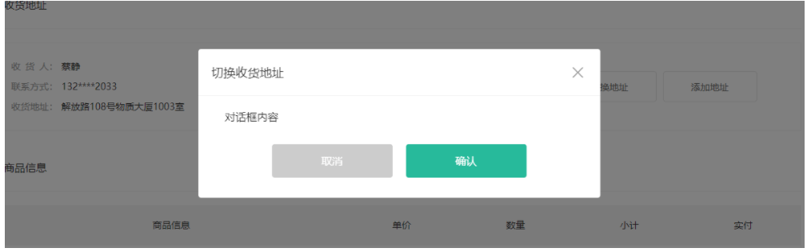

# 结算

## 结算页面布局和路由

落地代码：

1. 定义组件基础解构和配置路由

`src/views/member/pay/checkout.vue` 定义组件

```vue
<script lang="ts" setup name="XtxPayCheckoutPage"></script>

<template>
  <div class="xtx-pay-checkout-page">
    <div class="container">
      <XtxBread>
        <XtxBreadItem to="/">首页</XtxBreadItem>
        <XtxBreadItem to="/cart">购物车</XtxBreadItem>
        <XtxBreadItem>填写订单</XtxBreadItem>
      </XtxBread>
      <div class="wrapper">
        <!-- 收货地址 -->
        <h3 class="box-title">收货地址</h3>
        <div class="box-body">
          <div class="address">
            <div class="text">
              <ul>
                <li><span>收&ensp;货&ensp;人：</span>朱超</li>
                <li><span>联系方式：</span>132****2222</li>
                <li>
                  <span>收货地址：</span>海南省三亚市解放路108号物质大厦1003室
                </li>
              </ul>
              <!-- <div class="none">您需要先添加收货地址才可提交订单。</div> -->
            </div>
            <div class="action">
              <XtxButton class="btn">切换地址</XtxButton>
              <XtxButton class="btn">添加地址</XtxButton>
            </div>
          </div>
        </div>
        <!-- 商品信息 -->
        <h3 class="box-title">商品信息</h3>
        <div class="box-body">
          <table class="goods">
            <thead>
              <tr>
                <th width="520">商品信息</th>
                <th width="170">单价</th>
                <th width="170">数量</th>
                <th width="170">小计</th>
                <th width="170">实付</th>
              </tr>
            </thead>
            <tbody>
              <tr v-for="item in 4" :key="item">
                <td>
                  <a href="javascript:;" class="info">
                    
                    <div class="right">
                      <p>轻巧多用锅雪平锅 麦饭石不粘小奶锅煮锅</p>
                      <p>颜色：白色 尺寸：10cm 产地：日本</p>
                    </div>
                  </a>
                </td>
                <td>&yen;100.00</td>
                <td>2</td>
                <td>&yen;200.00</td>
                <td>&yen;200.00</td>
              </tr>
            </tbody>
          </table>
        </div>
        <!-- 配送时间 -->
        <h3 class="box-title">配送时间</h3>
        <div class="box-body">
          <a class="my-btn active" href="javascript:;"
            >不限送货时间：周一至周日</a
          >
          <a class="my-btn" href="javascript:;">工作日送货：周一至周五</a>
          <a class="my-btn" href="javascript:;">双休日、假日送货：周六至周日</a>
        </div>
        <!-- 支付方式 -->
        <h3 class="box-title">支付方式</h3>
        <div class="box-body">
          <a class="my-btn active" href="javascript:;">在线支付</a>
          <a class="my-btn" href="javascript:;">货到付款</a>
          <span style="color: #999">货到付款需付5元手续费</span>
        </div>
        <!-- 金额明细 -->
        <h3 class="box-title">金额明细</h3>
        <div class="box-body">
          <div class="total">
            <dl>
              <dt>商品件数：</dt>
              <dd>5件</dd>
            </dl>
            <dl>
              <dt>商品总价：</dt>
              <dd>¥5697.00</dd>
            </dl>
            <dl>
              <dt>运<i></i>费：</dt>
              <dd>¥0.00</dd>
            </dl>
            <dl>
              <dt>应付总额：</dt>
              <dd class="price">¥5697.00</dd>
            </dl>
          </div>
        </div>
        <!-- 提交订单 -->
        <div class="submit">
          <XtxButton type="primary">提交订单</XtxButton>
        </div>
      </div>
    </div>
  </div>
</template>

<style scoped lang="less">
.wrapper {
  background: #fff;
  padding: 0 20px;
  .box-title {
    font-size: 16px;
    font-weight: normal;
    padding-left: 10px;
    line-height: 70px;
    border-bottom: 1px solid #f5f5f5;
  }
  .box-body {
    padding: 20px 0;
  }
}
.address {
  border: 1px solid #f5f5f5;
  display: flex;
  align-items: center;
  .text {
    flex: 1;
    min-height: 90px;
    display: flex;
    align-items: center;
    .none {
      line-height: 90px;
      color: #999;
      text-align: center;
      width: 100%;
    }
    > ul {
      flex: 1;
      padding: 20px;
      li {
        line-height: 30px;
        span {
          color: #999;
          margin-right: 5px;
          > i {
            width: 0.5em;
            display: inline-block;
          }
        }
      }
    }
    > a {
      color: @xtxColor;
      width: 160px;
      text-align: center;
      height: 90px;
      line-height: 90px;
      border-right: 1px solid #f5f5f5;
    }
  }
  .action {
    width: 420px;
    text-align: center;
    .btn {
      width: 140px;
      height: 46px;
      line-height: 44px;
      font-size: 14px;
      &:first-child {
        margin-right: 10px;
      }
    }
  }
}
.goods {
  width: 100%;
  border-collapse: collapse;
  border-spacing: 0;
  .info {
    display: flex;
    text-align: left;
    img {
      width: 70px;
      height: 70px;
      margin-right: 20px;
    }
    .right {
      line-height: 24px;
      p {
        &:last-child {
          color: #999;
        }
      }
    }
  }
  tr {
    th {
      background: #f5f5f5;
      font-weight: normal;
    }
    td,
    th {
      text-align: center;
      padding: 20px;
      border-bottom: 1px solid #f5f5f5;
      &:first-child {
        border-left: 1px solid #f5f5f5;
      }
      &:last-child {
        border-right: 1px solid #f5f5f5;
      }
    }
  }
}
.my-btn {
  width: 228px;
  height: 50px;
  border: 1px solid #e4e4e4;
  text-align: center;
  line-height: 48px;
  margin-right: 25px;
  color: #666666;
  display: inline-block;
  &.active,
  &:hover {
    border-color: @xtxColor;
  }
}
.total {
  dl {
    display: flex;
    justify-content: flex-end;
    line-height: 50px;
    dt {
      i {
        display: inline-block;
        width: 2em;
      }
    }
    dd {
      width: 240px;
      text-align: right;
      padding-right: 70px;
      &.price {
        font-size: 20px;
        color: @priceColor;
      }
    }
  }
}
.submit {
  text-align: right;
  padding: 60px;
  border-top: 1px solid #f5f5f5;
}
// 对话框地址列表
.xtx-dialog {
  .addressWrapper {
    max-height: 500px;
    overflow-y: auto;
  }
  .text {
    flex: 1;
    min-height: 90px;
    display: flex;
    align-items: center;
    &.item {
      border: 1px solid #f5f5f5;
      margin-bottom: 10px;
      cursor: pointer;
      &.active,
      &:hover {
        border-color: @xtxColor;
        background: lighten(@xtxColor, 50%);
      }
      > ul {
        padding: 10px;
        font-size: 14px;
        line-height: 30px;
      }
    }
  }
}
</style>

```

`src/router/index.ts` 配置路由

```ts
{
  path: '/member/checkout',
  component: () => import('@/views/member/pay/checkout.vue')
}
```

给结算按钮注册点击事件

```jsx
<XtxButton type="primary" @click="goCheckout">下单结算</XtxButton>
```

提供跳转函数

```jsx
// 跳转到结算页
const goCheckout = () => {
  if (cart.selectedList.length === 0) {
    return Message.warning('请至少选择一件商品')
  }
  router.push('/member/checkout')
}
```

## 拦截未登录的用户

> 对于结算页面，没有登录的用户是无法访问的

（1）拦截未登录的用户`src/router/index.ts`

```js
// 配置路由导航守卫，拦截 /member开头的所有的地址
router.beforeEach((to, from, next) => {
  // 判断用户登没登录
  const { cart } = useStore()
  if (cart.isLogin) {
    next()
  } else {
    if (to.path.includes('/member')) {
      next({
        path: '/login',
      })
    } else {
      next()
    }
  }
})

```

（2）增加回跳的url地址

```diff
// 配置路由导航守卫，拦截 /member开头的所有的地址
router.beforeEach((to, from, next) => {
  // 判断用户登没登录
  const { cart } = useStore()
  if (cart.isLogin) {
    next()
  } else {
    if (to.path.includes('/member')) {
      next({
        path: '/login',
+        query: {
+          redirectUrl: to.fullPath
+        }
      })
    } else {
      next()
    }
  }
})

```

（3）修改登录成功的逻辑

```jsx
// 通过第三方登录，跳转到首页
Message.success('登录成功')
const redirectUrl = (route.query.redirectUrl as string) || '/'
router.push(redirectUrl)
```

## 结算页面-渲染

（1）新建文件

```ts
import { defineStore } from 'pinia'

const useCheckoutStore = defineStore({
  id: 'checkout',
  state: () => ({
  }),
  actions: {}
})

export default useCheckoutStore

```

（2）仓库集成

```ts
import useCheckoutStore from './modules/checkout'
export default function useStore() {
  return {
    checkout: useCheckoutStore()
  }
}

```

（3）提供类型

```ts
export interface UserAddress {
  id: string
  receiver: string
  contact: string
  provinceCode: string
  cityCode: string
  countyCode: string
  address: string
  isDefault: number
  fullLocation: string
  postalCode: string
  addressTags: string
}

export interface Good {
  id: string
  name: string
  picture: string
  count: number
  skuId: string
  attrsText: string
  price: string
  payPrice: string
  totalPrice: string
  totalPayPrice: string
}

export interface Summary {
  goodsCount: number
  totalPrice: number
  totalPayPrice: number
  postFee: number
  discountPrice: number
}

// 生成订单
export interface CheckoutInfo {
  userAddresses: UserAddress[]
  goods: Good[]
  summary: Summary
}

```

（4）发送请求，获取结算数据

```js
import { CheckoutInfo } from '@/types/checkout'
import { ApiRes } from '@/types/data'
import request from '@/utils/request'
import { defineStore } from 'pinia'

const useCheckoutStore = defineStore({
  id: 'checkout',
  state: () => ({
    checkoutInfo: {} as CheckoutInfo
  }),
  actions: {
    async getCheckoutInfo() {
      const res = await request.get<ApiRes<CheckoutInfo>>('/member/order/pre')
      this.checkoutInfo = res.data.result
    }
  }
})

export default useCheckoutStore

```

（5）渲染`src/views/member/pay/checkout.vue` 内容

```vue
<script lang="ts" setup name="XtxPayCheckoutPage">
import useStore from '@/store'

const { checkout } = useStore()
checkout.getCheckoutInfo()
</script>

<tbody>
  <tr v-for="item in checkout.checkoutInfo.goods" :key="item.id">
    <td>
      <a href="javascript:;" class="info">
        
        <div class="right">
          <p>{{ item.name }}</p>
          <p>{{ item.attrsText }}</p>
        </div>
      </a>
    </td>
    <td>&yen;{{ item.payPrice }}</td>
    <td>{{ item.count }}</td>
    <td>&yen;{{ item.totalPrice }}</td>
    <td>&yen;{{ item.totalPayPrice }}</td>
  </tr>
</tbody>


<div class="total">
  <dl>
    <dt>商品件数：</dt>
    <dd>{{ checkout.checkoutInfo.summary.goodsCount }}件</dd>
  </dl>
  <dl>
    <dt>商品总价：</dt>
    <dd>¥{{ checkout.checkoutInfo.summary.totalPrice }}</dd>
  </dl>
  <dl>
    <dt>运<i></i>费：</dt>
    <dd>¥{{ checkout.checkoutInfo.summary.postFee }}</dd>
  </dl>
  <dl>
    <dt>应付总额：</dt>
    <dd class="price">
      ¥{{ checkout.checkoutInfo.summary.totalPayPrice }}
    </dd>
  </dl>
</div>


<div class="xtx-pay-checkout-page" v-if="checkout.checkoutInfo.goods">
</div>
```

## 收货地址-基础封装

（1）分离收货地址组件

`src/member/pay/components/checkout-address.vue` 定义组件

```vue
<script lang="ts" setup name="CheckoutAddress"></script>
<template>
  <div class="checkout-address">
    <div class="text">
      <!-- <div class="none">您需要先添加收货地址才可提交订单。</div> -->
      <ul>
        <li>
          <span>收<i />货<i />人：</span>朱超
        </li>
        <li><span>联系方式：</span>132****2222</li>
        <li><span>收货地址：</span>海南省三亚市解放路108号物质大厦1003室</li>
      </ul>
      <a href="javascript:;">修改地址</a>
    </div>
    <div class="action">
      <XtxButton class="btn">切换地址</XtxButton>
      <XtxButton class="btn">添加地址</XtxButton>
    </div>
  </div>
</template>

<style scoped lang="less">
.checkout-address {
  border: 1px solid #f5f5f5;
  display: flex;
  align-items: center;
  .text {
    flex: 1;
    min-height: 90px;
    display: flex;
    align-items: center;
    .none {
      line-height: 90px;
      color: #999;
      text-align: center;
      width: 100%;
    }
    > ul {
      flex: 1;
      padding: 20px;
      li {
        line-height: 30px;
        span {
          color: #999;
          margin-right: 5px;
          > i {
            width: 0.5em;
            display: inline-block;
          }
        }
      }
    }
    > a {
      color: @xtxColor;
      width: 160px;
      text-align: center;
      height: 90px;
      line-height: 90px;
      border-right: 1px solid #f5f5f5;
    }
  }
  .action {
    width: 420px;
    text-align: center;
    .btn {
      width: 140px;
      height: 46px;
      line-height: 44px;
      font-size: 14px;
      &:first-child {
        margin-right: 10px;
      }
    }
  }
}
</style>

```

`src/views/member/pay/checkout.vue` 使用组件

```ts
import CheckoutAddress from './components/checkout-address.vue'

<div class="wrapper">
  <!-- 收货地址 -->
  <h3 class="box-title">收货地址</h3>
  <div class="box-body">
    <CheckoutAddress />
  </div>
```

原有结构和样式代码需要删除。

## 收获地址渲染

- 计算属性得到默认显示地址

```js
getters: {
  showAddress(): UserAddress | null {
    // 如果没有地址，返回null
    if (this.checkoutInfo.userAddresses.length === 0) {
      return null
    }
    // 如果有地址，找默认地址
    const defaultAddress = this.checkoutInfo.userAddresses.find(
      (item) => item.isDefault === 0
    )
    if (defaultAddress) {
      return defaultAddress
    } else {
      return this.checkoutInfo.userAddresses[0]
    }
  },
},
```

- 渲染组件

```vue
<div class="checkout-address">
  <div class="text">
    <div class="none" v-if="!checkout.showAddress">
      您需要先添加收货地址才可提交订单。
    </div>
    <template v-else>
      <ul>
        <li>
          <span>收<i />货<i />人：</span>{{ checkout.showAddress?.address }}
        </li>
        <li><span>联系方式：</span>{{ checkout.showAddress?.contact }}</li>
        <li>
          <span>收货地址：</span>
          {{
            checkout.showAddress?.fullLocation +
            ' ' +
            checkout.showAddress?.address
          }}
        </li>
      </ul>
      <a href="javascript:;">修改地址</a>
    </template>
  </div>
  <div class="action">
    <XtxButton class="btn">切换地址</XtxButton>
    <XtxButton class="btn" @click="dialogVisible = true">添加地址</XtxButton>
  </div>
</div>

```

## 对话框组件封装

> 目的：实现一个对话框组件可设置标题，动态插入内容，动态插入底部操作按钮，打开关闭功能。



### 基本结构

落的代码：

1. 定义一个基础布局

`src/components/dialog/index.vue` 定义组件

```vue
<script lang="ts" setup name="XtxDialog"></script>
<template>
  <div class="xtx-dialog">
    <div class="wrapper">
      <div class="header">
        <h3>切换收货地址</h3>
        <a href="JavaScript:;" class="iconfont icon-close-new"></a>
      </div>
      <div class="body">对话框内容</div>
      <div class="footer">
        <XtxButton type="gray" style="margin-right: 20px">取消</XtxButton>
        <XtxButton type="primary">确认</XtxButton>
      </div>
    </div>
  </div>
</template>

<style scoped lang="less">
.xtx-dialog {
  position: fixed;
  left: 0;
  top: 0;
  width: 100%;
  height: 100%;
  z-index: 8887;
  background: rgba(0, 0, 0, 0.5);
  // background: rgba(0, 0, 0, 0);
  // &.fade {
  //   transition: all 0.4s;
  //   background: rgba(0, 0, 0, 0.5);
  // }
  .wrapper {
    width: 600px;
    background: #fff;
    border-radius: 4px;
    position: absolute;
    top: 50%;
    left: 50%;
    transform: translate(-50%, -50%);
    // transform: translate(-50%, -60%);
    // opacity: 0;
    // &.fade {
    //   transition: all 0.4s;
    //   transform: translate(-50%, -50%);
    //   opacity: 1;
    // }
    .body {
      padding: 20px 40px;
      font-size: 16px;
      .icon-warning {
        color: @priceColor;
        margin-right: 3px;
        font-size: 16px;
      }
    }
    .footer {
      text-align: center;
      padding: 10px 0 30px 0;
    }
    .header {
      position: relative;
      height: 70px;
      line-height: 70px;
      padding: 0 20px;
      border-bottom: 1px solid #f5f5f5;
      h3 {
        font-weight: normal;
        font-size: 18px;
      }
      a {
        position: absolute;
        right: 25px;
        top: 25px;
        font-size: 24px;
        width: 20px;
        height: 20px;
        line-height: 20px;
        text-align: center;
        color: #999;
        &:hover {
          color: #666;
        }
      }
    }
  }
}
</style>

```

需要全局注册

```ts
import XtxDialog from '@/components/dialog/index.vue'

app.component('XtxDialog', XtxDialog)

XtxDialog: typeof XtxDialog
```

`src/views/playground` 使用组件

```vue
<XtxDialog />
```

### 标题控制

实现设置标题

`src/components/library/xtx-dialog.vue` 定义组件

```ts
defineProps({
  title: {
    type: String,
    default: ''
  }
})


<div class="header">
  <h3>{{ title }}</h3>
  <a href="JavaScript:;" class="iconfont icon-close-new"></a>
</div>
```

`src/views/playground/index.vue` 使用组件

```vue
<XtxDialog title="切换收货地址" />
```

### 插槽的使用

实现插入内容

`src/components/dialog/index.vue` 定义组件

```diff
      <div class="body">
+        <slot />
      </div>
```

`src/views/playground/index.vue`使用组件

```vue
<XtxDialog title="切换收货地址" >
  对话框内容
</XtxDialog>
```

实现插入底部操作按钮

`src/components/dialog/index.vue` 定义组件

```diff
      <div class="footer">
+        <slot name="footer" />
      </div>
```

`src/views/playground/index.vue`使用组件

```vue
    <XtxDialog title="切换收货地址">
      对话框内容 
      <template #footer>
        <XtxButton type="gray" style="margin-right:20px">取消</XtxButton>
        <XtxButton type="primary">确认</XtxButton>
      </template>
    </XtxDialog>
```

### 实现打开关闭功能

1. 打开关闭通过v-model来实现
2. 动画根据打开关闭状态来控制

`src/components/dialog/index.vue` 定义组件

```ts
<script lang="ts" setup name="XtxDialog">
import { onClickOutside } from '@vueuse/core'
import { ref, watch } from 'vue'

const props = defineProps({
  title: {
    type: String,
    default: '',
  },
  visible: {
    type: Boolean,
    default: false,
  },
})
const emit = defineEmits<{
  (e: 'update:visible', visible: boolean): void
}>()

// 控制动画
const show = ref(false)
watch(
  () => props.visible,
  (value) => {
    setTimeout(() => {
      show.value = value
    }, 20)
  },
  {
    immediate: true,
  }
)
const close = () => {
  emit('update:visible', false)
}

const target = ref(null)
onClickOutside(target, () => {
  close()
})
</script>
<template>
  <div class="xtx-dialog" v-if="visible" :class="{ fade: show }">
    <div class="wrapper" ref="target" :class="{ fade: show }">
      <div class="header">
        <h3>{{ title }}</h3>
        <a
          href="JavaScript:;"
          class="iconfont icon-close-new"
          @click="close"
        ></a>
      </div>
      <div class="body">
        <!-- 默认插槽 -->
        <slot></slot>
      </div>
      <div class="footer">
        <!-- 底部插槽 -->
        <slot name="footer"></slot>
      </div>
    </div>
  </div>
</template>

<style scoped lang="less">
.xtx-dialog {
  position: fixed;
  left: 0;
  top: 0;
  width: 100%;
  height: 100%;
  z-index: 8887;
  // background: rgba(0, 0, 0, 0.5);
  background: rgba(0, 0, 0, 0);
  &.fade {
    transition: all 0.4s;
    background: rgba(0, 0, 0, 0.5);
  }
  .wrapper {
    width: 600px;
    background: #fff;
    border-radius: 4px;
    position: absolute;
    top: 50%;
    left: 50%;
    // transform: translate(-50%, -50%);
    transform: translate(-50%, -60%);
    opacity: 0;
    &.fade {
      transition: all 0.4s;
      transform: translate(-50%, -50%);
      opacity: 1;
    }
    .body {
      padding: 20px 40px;
      font-size: 16px;
      .icon-warning {
        color: @priceColor;
        margin-right: 3px;
        font-size: 16px;
      }
    }
    .footer {
      text-align: center;
      padding: 10px 0 30px 0;
    }
    .header {
      position: relative;
      height: 70px;
      line-height: 70px;
      padding: 0 20px;
      border-bottom: 1px solid #f5f5f5;
      h3 {
        font-weight: normal;
        font-size: 18px;
      }
      a {
        position: absolute;
        right: 25px;
        top: 25px;
        font-size: 24px;
        width: 20px;
        height: 20px;
        line-height: 20px;
        text-align: center;
        color: #999;
        &:hover {
          color: #666;
        }
      }
    }
  }
}
</style> 

```

`src/views/playground/index` 使用组件

```vue
<template>
  <button @click="visible = true">显示</button>
  <XtxDialog title="添加地址" v-model:visible="visible">
    <div>我是一个表单</div>
    <template #footer>
      <XtxButton type="gray" style="margin-right: 20px" @click="visible = false"
        >取消</XtxButton
      >
      <XtxButton type="primary" @click="visible = false">确认</XtxButton>
    </template>
  </XtxDialog>
</template>
```

### Teleport组件的使用

> https://staging-cn.vuejs.org/guide/built-ins/teleport.html#teleport

```ts
<Teleport to="body">
  <XtxDialog title="添加地址" v-model:visible="visible">
    <div class="form">我是一个表单</div>
    <template #footer>
      <XtxButton
        type="gray"
        style="margin-right: 20px"
        @click="visible = false"
      >
        取消
      </XtxButton>
      <XtxButton type="primary" @click="visible = false">确认</XtxButton>
    </template>
  </XtxDialog>
</Teleport>
```


## 添加收货地址-基本结构

> 目的：实现收货地址的添加。

落的代码：

（1）基本结构

```vue
<script lang="ts" setup name="CheckoutAddress">
import { ref } from 'vue'

const dialogVisible = ref(false)
</script>
<template>
  <XtxDialog title="添加收货地址" v-model:visible="dialogVisible">
    <div class="address-edit">表单</div>
    <template v-slot:footer>
      <XtxButton type="gray" style="margin-right: 20px">取消</XtxButton>
      <XtxButton type="primary">确认</XtxButton>
    </template>
  </XtxDialog>
</template>

<style scoped lang="less"></style>

```

（2）表单布局结构和样式

```vue
    <div class="xtx-form">
      <div class="xtx-form-item">
        <div class="label">收货人：</div>
        <div class="field">
          <input class="input" placeholder="请输入收货人" />
        </div>
      </div>
      <div class="xtx-form-item">
        <div class="label">手机号：</div>
        <div class="field">
          <input class="input" placeholder="请输入手机号" />
        </div>
      </div>
      <div class="xtx-form-item">
        <div class="label">地区：</div>
        <div class="field">
          <XtxCity placeholder="请选择所在地区"/>
        </div>
      </div>
      <div class="xtx-form-item">
        <div class="label">详细地址：</div>
        <div class="field">
          <input class="input" placeholder="请输入详细地址" />
        </div>
      </div>
      <div class="xtx-form-item">
        <div class="label">邮政编码：</div>
        <div class="field">
          <input class="input" placeholder="请输入邮政编码" />
        </div>
      </div>
      <div class="xtx-form-item">
        <div class="label">地址标签：</div>
        <div class="field">
          <input class="input" placeholder="请输入地址标签，逗号分隔" />
        </div>
      </div>
    </div>
<style lang="less" scoped>
.xtx-dialog {
  :deep(.wrapper) {
    width: 780px;
    .body {
      font-size: 14px;
    }
  }
}
.xtx-form {
  padding: 0;
  input {
    outline: none;
    &::placeholder {
      color: #ccc;
    }
  }
}
.xtx-city {
  width: 320px;
  :deep(.select) {
    height: 50px;
    line-height: 48px;
    display: flex;
    padding: 0 10px;
    justify-content: space-between;
    .placeholder {
      color: #ccc;
    }
    i {
      color: #ccc;
      font-size: 18px;
    }
    .value {
      font-size: 14px;
    }
  }
  :deep(.option) {
    top: 49px;
  }
}
</style>
```

（3）点击添加地址，显示弹窗

```vue
<div class="action">
  <XtxButton class="btn">切换地址</XtxButton>
  <XtxButton class="btn" @click="dialogVisible = true">添加地址</XtxButton>
</div>
```

## 开关组件

（1）基本结构

```ts
<template>
  <div class="xtx-switch">
    <span
      class="el-switch__core"
      :class="active ? 'active' : 'inactive'"
      @click="change"
    ></span>
  </div>
</template>

<script lang="ts" setup name="XtxSwitch">
import { ref, watch } from 'vue'
const props = defineProps({
  modelValue: {
    type: [Boolean, Number, String],
    default: true
  },
  activeValue: {
    type: [Boolean, Number, String],
    default: true
  },
  inactiveValue: {
    type: [Boolean, Number, String],
    default: false
  }
})
const emit = defineEmits(['update:modelValue'])

const active = ref(false)
watch(
  props,
  () => {
    if (props.activeValue === props.modelValue) {
      active.value = true
    }
    if (props.modelValue === props.inactiveValue) {
      active.value = false
    }
  },
  {
    immediate: true
  }
)
const change = () => {
  if (active.value) {
    emit('update:modelValue', props.inactiveValue)
  } else {
    emit('update:modelValue', props.activeValue)
  }
}
</script>

<style lang="less" scoped>
.el-switch__core {
  margin: 0;
  display: inline-block;
  position: relative;
  width: 40px;
  height: 20px;
  border: 1px solid #dcdfe6;
  outline: none;
  border-radius: 10px;
  box-sizing: border-box;
  background: #dcdfe6;
  cursor: pointer;
  transition: border-color 0.3s, background-color 0.3s;
  vertical-align: middle;
}
.el-switch__core:after {
  content: '';
  position: absolute;
  top: 1px;
  left: 1px;
  border-radius: 100%;
  transition: all 0.3s;
  width: 16px;
  height: 16px;
  background-color: #fff;
}
.active::after {
  left: 100%;
  margin-left: -17px;
}
.active {
  width: 40px;
  border-color: rgb(19, 206, 102);
  background-color: rgb(19, 206, 102);
}
.inactive {
  width: 40px;
  border-color: rgb(255, 73, 73);
  background-color: rgb(255, 73, 73);
}
</style>

```

需要全局注册

（2）基本使用

```vue
<div class="xtx-form-item">
  <div class="label">是否默认：</div>
  <div class="field">
    <XtxSwitch
      v-model="formData.isDefault"
      :active-value="0"
      :inactive-value="1"
    />
  </div>
</div>
```


## 添加收货地址-收集表单数据

（1）提供数据

```ts
const formData = ref({
  receiver: '',
  contact: '',
  provinceCode: '',
  cityCode: '',
  countyCode: '',
  address: '',
  postalCode: '',
  addressTags: '',
  isDefault: 1,
  fullLocation: ''
})

const changeCty = (city: CityResult) => {
  formData.value.provinceCode = city.provinceCode
  formData.value.cityCode = city.cityCode
  formData.value.countyCode = city.countyCode
  formData.value.fullLocation =
    city.provinceName + ' ' + city.cityName + ' ' + city.countyName
}
```

（2）绑定表单

```ts
<div class="xtx-form">
  <div class="xtx-form-item">
    <div class="label">收货人：</div>
    <div class="field">
      <input
        v-model="formData.receiver"
        class="input"
        placeholder="请输入收货人"
      />
    </div>
  </div>
  <div class="xtx-form-item">
    <div class="label">手机号：</div>
    <div class="field">
      <input
        v-model="formData.contact"
        class="input"
        placeholder="请输入手机号"
      />
    </div>
  </div>
  <div class="xtx-form-item">
    <div class="label">地区：</div>
    <div class="field">
      <XtxCity
        :user-address="formData.fullLocation"
        placeholder="请选择所在地区"
        @changeCity="changeCty"
      />
    </div>
  </div>
  <div class="xtx-form-item">
    <div class="label">详细地址：</div>
    <div class="field">
      <input
        v-model="formData.address"
        class="input"
        placeholder="请输入详细地址"
      />
    </div>
  </div>
  <div class="xtx-form-item">
    <div class="label">邮政编码：</div>
    <div class="field">
      <input
        v-model="formData.postalCode"
        class="input"
        placeholder="请输入邮政编码"
      />
    </div>
  </div>
  <div class="xtx-form-item">
    <div class="label">地址标签：</div>
    <div class="field">
      <input
        v-model="formData.addressTags"
        class="input"
        placeholder="请输入地址标签，逗号分隔"
      />
    </div>
    <div class="xtx-form-item">
      <div class="label">默认地址：</div>
      <div class="field">
        <XtxSwitch
          v-model="formData.isDefault"
          :active-value="0"
          :inactive-value="1"
        ></XtxSwitch>
      </div>
    </div>
  </div>
</div>
```

## 添加收货地址-完成

（1）定义actions方法

```ts
async addAddress(address: UserAddress) {
  await request.post('/member/address', address)
  // 添加完地址，重新渲染
  this.getCheckoutInfo()
},
```

（2）添加收货地址

```ts
const confirm = async () => {
  await checkout.addAddress(formData.value as UserAddress)
  // 提示消息
  Message.success('添加地址成功')
  // 关闭弹窗
  dialogVisible.value = false
}
```

（3）关闭时，重置表单

```ts

watch(dialogVisible, (value) => {
  if (!value) {
    formData.value = {
      receiver: '',
      contact: '',
      provinceCode: '',
      cityCode: '',
      countyCode: '',
      address: '',
      postalCode: '',
      addressTags: '',
      isDefault: 1,
      fullLocation: ''
    }
  }
})
```


## 修改收货地址

（1）点击修改收货地址

```ts
<a href="javascript:;" @click="editAddress">修改地址</a>

const editAddress = () => {
  dialogVisible.value = true
  if (checkout.showAddress) {
    // 防止修改的时候，直接影响到当前显示的地址
    formData.value = {
      ...checkout.showAddress,
    }
  }
}
```

（2）判断头部

```ts
<!-- 添加地址对话框 -->
<XtxDialog
  :title="`${formData.id ? '修改收货地址' : '添加收货地址'}`"
  v-model:visible="dialogVisible"
>
```

（3）点击确定

```ts
const confirm = async () => {
  if (formData.value.id) {
    await checkout.updateAddress(formData.value)
  } else {
    await checkout.addAddress(formData.value)
  }
  // 提示消息
  Message.success('操作成功')
  // 关闭弹窗
  dialogVisible.value = false
}

```

## 切换地址-基本结构

（1）准备切换地址的弹层

```ts
<XtxDialog title="切换收货地址" v-model:visible="visible">
  <template #default>
    <div
      class="text item"
      v-for="item in checkout.checkoutInfo.userAddresses"
      :key="item.id"
    >
      <ul>
        <li>
          <span>收<i />货<i />人：</span>{{ item.receiver }}
        </li>
        <li><span>联系方式：</span>{{ item.contact }}</li>
        <li>
          <span>收货地址：</span
          >{{ item.fullLocation.replace(/ /g, '') + item.address }}
        </li>
      </ul>
    </div>
  </template>
  <template #footer>
    <XtxButton
      type="gray"
      style="margin-right: 20px"
      @click="visible = false"
    >
      取消
    </XtxButton>
    <XtxButton type="primary" @click="visible = false">确认</XtxButton>
  </template>
</XtxDialog>
```

（2）准备数据

```ts
const visible = ref(false)
```

（3）点击切换地址显示

```vue
<div class="action">
  <XtxButton class="btn" @click="visible = true">切换地址</XtxButton>
  <XtxButton class="btn" @click="dialogVisible = true">添加地址</XtxButton>
</div>
```

（4）准备样式

```diff
.text {
flex: 1;
min-height: 90px;
display: flex;
align-items: center;
+    &.item {
+      border: 1px solid #f5f5f5;
+      margin-bottom: 10px;
+      cursor: pointer;
+      &.active,&:hover {
+        border-color: @xtxColor;
+        background: lighten(@xtxColor,50%);
+      }
+      > ul {
+        padding: 10px;
+        font-size: 14px;
+      }
+    }
```

（5）控制默认高亮

```vue
<div
  class="text item"
  :class="{ active: item.id === checkout.showAddress?.id }"
  v-for="item in checkout.checkoutInfo.userAddresses"
  :key="item.id"
>
```

## 切换地址-设置默认地址

（1）注册点击事件

```vue
<div
  class="text item"
  v-for="item in checkout.checkoutInfo.userAddresses"
  :key="item.id"
  @click="selectedAddress = item"
  :class="{ active: selectedAddress && item.id === selectedAddress.id }"
>
```

（2）提供默认值

```ts
// 记录选中的地址
const selectAddress = ref<UserAddress>()
```

（3）显示弹窗，显示默认地址

```ts
watch(visible, (value) => {
  if (value) {
    selectAddress.value = checkout.showAddress!
  }
})
```

（4）确认时，修改地址

```ts
const changeAddress = async () => {
  // 把当前选中的地址变成默认地址
  if (selectAddress.value) {
    await checkout.updateAddress({
      ...selectAddress.value,
      isDefault: 0,
    })
    Message.success('修改地址成功')
    visible.value = false
  }
}
```

## 提交订单功能

（1）注册事件

```ts
<!-- 提交订单 -->
<div class="submit">
  <XtxButton type="primary" @click="submitCheckout">提交订单</XtxButton>
</div>
```

（2）核心逻辑

```ts

const submitCheckout = async () => {
  // 如果地址为空，不能提交订单
  if (!checkout.showAddress) {
    return Message.warning('请选择收货地址')
  }
  const res = await request.post('/member/order', {
    goods: checkout.checkoutInfo.goods.map((item) => {
      return {
        skuId: item.skuId,
        count: item.count,
      }
    }),
    addressId: checkout.showAddress.id,
  })
  // 成功提醒用户
  Message({ type: 'success', text: '下单成功~' })
  // 🔔重新获取购物车列表
  cart.getCartList()
  // 跳转到支付页面
  router.push('/member/pay')
}
```

