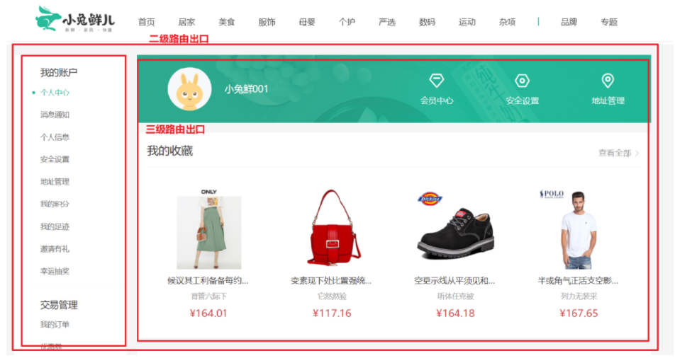
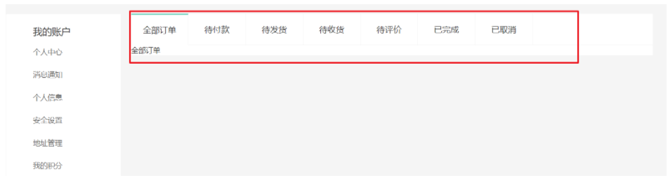
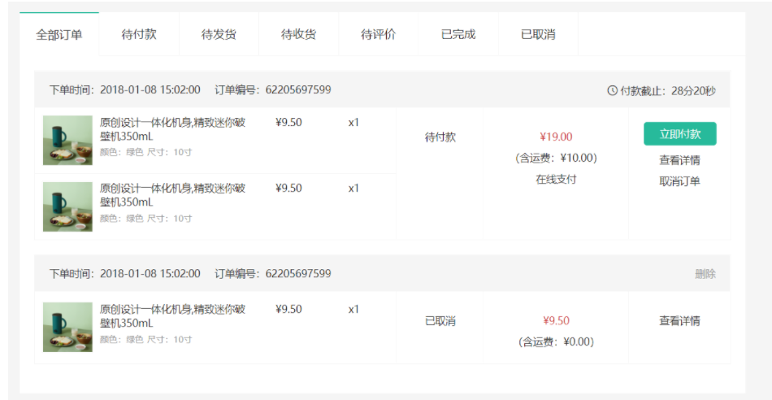

# 个人中心

##  个人中心-路由配置 

> 本节目标：个人中心二级路由配置。



（1）创建组件 `src/views/member/layout/index.vue`

```vue
<script setup lang="ts">
//
</script>

<template>
  <div>个人中心布局</div>
</template>
```

（2）配置路由

```ts
{
    path: "/",
    component: Layout,
    children: [
      ...
      {
          path: '/member',
          component: () => import('@/views/member/layout/index.vue')
        }
    ],
  },
```

（3）修改首页头部导航的链接

```vue
<li>
  <RouterLink to="/member" ><i class="iconfont icon-user"></i>
  	{{ profile.nickname || profile.account }}
  </RouterLink>
</li>

<li><RouterLink to="/member">会员中心</RouterLink></li>
```

##  个人中心-三级路由配置

> 本节目的：完成个人中心页面基础架子，配置路由。


落地代码：

（1）准备个人中心左菜单组件 `src/views/member/layout/components/member-aside.vue`

```vue
    <script setup lang="ts">
    //
    </script>

    <template>
      <div class="xtx-member-aside">
        <div class="user-manage">
          <h4>我的账户</h4>
          <div class="links">
            <a href="javascript:;">个人中心</a>
            <a href="javascript:;">消息通知</a>
            <a href="javascript:;">个人信息</a>
            <a href="javascript:;">安全设置</a>
            <a href="javascript:;">地址管理</a>
            <a href="javascript:;">我的积分</a>
            <a href="javascript:;">我的足迹</a>
            <a href="javascript:;">邀请有礼</a>
            <a href="javascript:;">幸运抽奖</a>
          </div>
          <h4>交易管理</h4>
          <div class="links">
            <a href="javascript:;">我的订单</a>
            <a href="javascript:;">优惠券</a>
            <a href="javascript:;">礼品卡</a>
            <a href="javascript:;">评价晒单</a>
            <a href="javascript:;">售后服务</a>
          </div>
          <h4>我的收藏</h4>
          <div class="links">
            <a href="javascript:;">收藏的商品</a>
            <a href="javascript:;">收藏的专题</a>
            <a href="javascript:;">关注的品牌</a>
          </div>
          <h4>帮助中心</h4>
          <div class="links">
            <a href="javascript:;">帮助中心</a>
            <a href="javascript:;">在线客服</a>
          </div>
        </div>
      </div>
    </template>

    <style scoped lang="less">
    .xtx-member-aside {
      width: 220px;
      margin-right: 20px;
      border-radius: 2px;
      .user-manage {
        background-color: #fff;
        h4 {
          font-size: 18px;
          font-weight: 400;
          padding: 20px 52px 5px;
          border-top: 1px solid #f6f6f6;
        }

        .links {
          padding: 0 52px 10px;
        }

        a {
          display: block;
          line-height: 1;
          padding: 15px 0;
          font-size: 14px;
          color: #666;
          position: relative;

          &:hover {
            color: @xtxColor;
          }
          &.active {
            color: @xtxColor;

            &:before {
              display: block;
            }
          }

          &:before {
            content: "";
            display: none;
            width: 6px;
            height: 6px;
            border-radius: 50%;
            position: absolute;
            top: 19px;
            left: -16px;
            background-color: @xtxColor;
          }
        }
      }
    }
    </style>
```

（2）准备个人中心布局容器组件 `src/views/member/layout/index.vue`

```vue

<script setup lang="ts">
import MemberAside from './components/member-aside.vue'
</script>

<template>
  <div class="container">
    <MemberAside />
    <div class="article">
      <!-- 三级路由的出口 -->
      <RouterView />
    </div>
  </div>
</template>

<style scoped lang="less">
.container {
  display: flex;
  padding-top: 20px;
  .article {
    width: 1000px;
  }
}
</style>
```

（3）准备中心首页组件：`src/views/member/home/index.vue`

```vue
<script setup lang="ts">
//
</script>

<template>
  <div class="member-home">
    <h2>个人中心</h2>
  </div>
</template>
```

（4）准备订单组件：`src/views/member/order/index.vue`

```vue
<script setup lang="ts">
//
</script>

<template>
  <div class="member-order">
    <h3>订单列表</h3>
  </div>
</template>
```

（5）配置路由规则

```ts
{
  path: '/member',
  component: () => import('@/views/member/layout/index.vue'),
  children: [
    {
      path: '',
      component: () => import('@/views/member/home/index.vue')
    },
    {
      path: 'order',
      component: () => import('@/views/member/order/index.vue')
    }
  ]
}
```

## 个人中心-菜单激活

> 目标：动态激活左侧菜单

大致步骤：

- 添加个人中心路由地址，设置精准匹配类名
- 添加我的订单路由与组件

```ts
router-link-active         包含匹配
router-link-exact-active   精确匹配
```

（1）提供样式：`src/components/app-member-aside.vue`

```diff
<template>
  <div class="xtx-member-aside">
    <div class="user-manage">
      <h4>我的账户</h4>
      <div class="links">
+        <RouterLink to="/member">个人中心</RouterLink>
         ...
      </div>
      <h4>交易管理</h4>
      <div class="links">
+        <RouterLink to="/member/order">我的订单</RouterLink>
         ...
      </div>
      ...
    </div>
  </div>
</template>

<style scoped lang="less">
.xtx-member-aside {
   ...
  .user-manage {
    ...
    a {
      ...
      
+      // 个人中心-左侧菜单高亮类名
+      &.router-link-exact-active {
+        color: @xtxColor;
+        &:before {
+          display: block;
+        }
+      }

      ...
    }
  }
}
</style>
```

（2）首页跳转

```vue
<li><RouterLink to="/member/order">我的订单</RouterLink></li>
```

## 个人中心-首页布局

> 本节目标：完成个人中心-首页基础布局

大致步骤：

- 准备概览组件
- 组件面板组件

落地代码：

（1）准备概览组件`src/views/member/home/components/home-overview.vue`

```vue
<script setup lang="ts">
//
</script>

<template>
  <!-- 概览 -->
  <div class="home-overview">
    <!-- 用户信息 -->
    <div class="user-meta">
      <div class="avatar">
        
      </div>
      <h4>徐菲菲</h4>
    </div>
    <div class="item">
      <a href="javascript:;">
        <span class="iconfont icon-hy"></span>
        <p>会员中心</p>
      </a>
      <a href="javascript:;">
        <span class="iconfont icon-aq"></span>
        <p>安全设置</p>
      </a>
      <a href="javascript:;">
        <span class="iconfont icon-dw"></span>
        <p>地址管理</p>
      </a>
    </div>
  </div>
</template>

<style scoped lang="less">
.home-overview {
  height: 132px;
  background: url(@/assets/images/center-bg.png) no-repeat center / cover;
  display: flex;
  .user-meta {
    flex: 1;
    display: flex;
    align-items: center;
    .avatar {
      width: 85px;
      height: 85px;
      border-radius: 50%;
      overflow: hidden;
      margin-left: 60px;
      img {
        width: 100%;
        height: 100%;
      }
    }
    h4 {
      padding-left: 26px;
      font-size: 18px;
      font-weight: normal;
      color: white;
    }
  }
  .item {
    flex: 1;
    display: flex;
    align-items: center;
    justify-content: space-around;
    &:first-child {
      border-right: 1px solid #f4f4f4;
    }
    a {
      color: white;
      font-size: 16px;
      text-align: center;
      .iconfont {
        font-size: 32px;
      }
      p {
        line-height: 32px;
      }
    }
  }
}
</style>
```

（2）组件面板组件 `src/views/member/home/components/home-panel.vue`

```vue

<script setup lang="ts">
interface Props {
  title: string;
}
defineProps<Props>();
</script>

<template>
  <div class="home-panel">
    <div class="header">
      <h4>{{ title }}</h4>
      <XtxMore to="/" />
    </div>
    <!-- 商品列表 -->
    <div class="goods-list"></div>
  </div>
</template>

<style scoped lang="less">
.home-panel {
  background-color: #fff;
  padding: 0 20px;
  margin-top: 20px;
  height: 400px;
  .header {
    height: 66px;
    border-bottom: 1px solid #f5f5f5;
    padding: 18px 0;
    display: flex;
    justify-content: space-between;
    align-items: baseline;
    h4 {
      font-size: 22px;
      font-weight: normal;
    }
  }
}
</style>
```

（3）使用面板组件，猜你喜欢组件 `src/views/member/home/index.vue`

```vue

<script setup lang="ts">
import HomeOverview from "./components/home-overview.vue";
import HomePanel from "./components/home-panel.vue";
</script>

<template>
  <div class="member-home">
    <HomeOverview />
    <HomePanel title="收藏的商品" />
    <HomePanel title="我的足迹" />
  </div>
</template>
```

## 个人中心-渲染页面

> 目的：用户信息展示，面板内商品展示。

```ts
<script setup lang="ts">
import useStore from '@/store'
import { storeToRefs } from 'pinia'
import defaultImg from '@/assets/images/200.png'

const { user } = useStore()
// 解构 profile 并保持响应式
const { profile } = storeToRefs(user)
// 图片加载失败会触发 error 事件，加载失败使用默认占位图
const imgError = () => {
  profile.value.avatar = defaultImg
}
</script>

<template>
  <!-- 概览 -->
  <div class="home-overview">
    <!-- 用户信息 -->
    <!-- 用户信息 -->
    <div class="user-meta">
      <div class="avatar">
        
      </div>
      <h4>
        {{ profile.nickname || profile.account || profile.mobile }}
      </h4>
    </div>
    <div class="item">
      <a href="javascript:;">
        <span class="iconfont icon-hy"></span>
        <p>会员中心</p>
      </a>
      <a href="javascript:;">
        <span class="iconfont icon-aq"></span>
        <p>安全设置</p>
      </a>
      <a href="javascript:;">
        <span class="iconfont icon-dw"></span>
        <p>地址管理</p>
      </a>
    </div>
  </div>
</template>
```

# tabs组件封装

## TSX/JSX 基础

###  概述

`TSX/JSX` 语法糖（`React` 团队设计发明的，`Vue` 也进行了支持）

1. 在 `Vue3` 中其实就是`createVNode` 的语法糖，负责创建虚拟DOM用的。底层依赖 `babel` 插件支持。
2. 我们在 playground组件中，演示 `jsx/tsx` 语法。

### h函数与render函数

代码演示1：

```vue
<script lang="ts">
import { h } from 'vue'
export default {
  render() {
    // return createVNode(标签名, { 属性名: 属性值 }, 子节点)
    return h('div', { id: 'box' }, 'hello')
  }
}
</script>

```

代码演示2：

```vue
<script lang="ts">
import { h } from 'vue'
export default {
  render() {
    // return h(元素名称, { 属性名: 属性值 }, 子节点)
    return h('div', { id: 'box' }, [
      h('p', {}, '我是一个段落1'),
      h('p', {}, '我是一个段落2')
    ])
  }
}
</script>

```

思考：渲染以下结构？

```vue
<ul>
  <li>111</li>
  <li>222</li>
  <li>333</li>
  <li>444</li>
</ul>
```

写起来很麻烦，有没有更简单的写法呢？

### jsx与render 函数

> 本节目标：学习 `jsx/tsx` 的基础语法。

- `jsx/tsx` 其实是 `createVNode` 函数的语法糖。
- 要开启 `jsx` 需要安装 `@vitejs/plugin-vue-jsx` 插件，同时在 Vite 中配置开启插件。
- `vue` 组件中指定 `<script lang="tsx">` 或 `<script lang="jsx">` 即可书写 `tsx/jsx`。
- `jsx/tsx` 语法，需要简单了解其基本使用https://v3.cn.vuejs.org/guide/render-function.html#jsx

配置

`yarn add @vitejs/plugin-vue-jsx`

```diff
import { defineConfig } from 'vite'
import vue from '@vitejs/plugin-vue'
import vueSetupExtend from 'vite-plugin-vue-setup-extend'
+import vueJsx from '@vitejs/plugin-vue-jsx'
const path = require('path')
// https://vitejs.dev/config/
export default defineConfig({
  // 支持setup的name属性
+  plugins: [vue(), vueSetupExtend(), vueJsx()],
  resolve: {
    alias: {
      '@': path.resolve(__dirname, './src')
    }
  },
  css: {
    preprocessorOptions: {
      less: {
        additionalData: `
          @import '@/assets/styles/variables.less';
          @import '@/assets/styles/mixins.less';
        `
      }
    }
  },
  server: {
    port: 8080,
    host: 'www.corho.com',
    open: true,
    cors: true
  }
})

```

使用

```vue
<script lang="tsx">
export default {
  render() {
    return (
      <div>
        <p>我是一个段落1</p>
        <p>我是一个段落2</p>
      </div>
    );
  },
};
</script>
```

温馨提示：render 可配合传统选项式 data 绑定响应式数据，通过 this 获取组件数据。

### script setup与jsx 

> 本节目标：setup 中可以书写响应式数据，用于绑定到 `tsx/jsx` 结构中。

基础用法

```vue
<script lang="tsx" setup>
const VDOM = () => <h1>Hello TSX in Setup</h1>
</script>

<template>
  <VDOM />
</template>

```

> 本节目标：内容绑定，属性绑定，事件绑定，条件渲染，列表渲染。

```vue
<script setup lang="tsx">
import { ref } from "vue";

const count = ref(0);
const isHide = ref(true);
const add = () => {
  count.value += 1;
};
const list = ref([
  { id: 1, content: "吃饭", done: true },
  { id: 2, content: "睡觉", done: false },
  { id: 3, content: "打代码", done: true },
]);
// script - 数据绑定在 JSX 用一对花括号
const VDOM = () => {
  return (
    <div>
      <h1>Hello TSX in Setup</h1>
      <p>{count.value}</p>
      <button onClick={add}>点击+1</button>
      <button
        onClick={() => {
          isHide.value = !isHide.value;
        }}
      >
        切换显示隐藏
      </button>
      <h2>条件渲染</h2>
      {isHide.value ? <div>loading</div> : <div>结构2</div>}
      <h2>列表渲染</h2>
      <ul>
        {list.value.map((item) => (
          <li key={item.id}>{item.content}</li>
        ))}
      </ul>
    </div>
  );
};
</script>

<template>
  <!-- template 中数据绑定用 两对花括号 -->
  <VDOM />
</template>
```

##  tabs 组件封装

> 目的：封装一个高可用 tabs 组件。类似于：https://element-plus.gitee.io/zh-CN/component/tabs.html

大致步骤：

- `xtx-tabs` 组件容器 可以有多个 `xtx-tab-pane` 组件面板，`script` 内容 `<slot />`
- `xtx-tab-pane` 支持： 标题 `label`，名称 `name`，`template` 内容 `<slot />`
- `xtx-tabs` 组件组织结构，控制点击事件，标签页激活。

### 基本结构

（1）`src/components/tabs/index.vue`

```vue
<script setup lang="tsx" name="XtxTabs"></script>

<template>
  <div class="xtx-tabs">tabs</div>
</template>

<style lang="less">
.xtx-tabs {
  background: #fff;
  > nav {
    height: 60px;
    line-height: 60px;
    display: flex;
    border-bottom: 1px solid #f5f5f5;
    > a {
      width: 110px;
      border-right: 1px solid #f5f5f5;
      text-align: center;
      font-size: 16px;
      &.active {
        border-top: 2px solid @xtxColor;
        height: 60px;
        background: #fff;
        line-height: 56px;
      }
    }
  }
}
</style>

```

（2）`src/components/tabs/pane.vue`

```vue
<script setup lang="ts" name="XtxTabsPane">
defineProps<{
  label?: string
  name?: string
}>()
</script>

<template>
  <div class="xtx-tabs-panel">
    <slot></slot>
  </div>
</template>

```

（3）全局注册

```ts
import XtxTabs from '@/components/tabs/index.vue'
import XtxTabsPane from '@/components/tabs/pane.vue'


app.component('XtxTabs', XtxTabs)
app.component('XtxTabsPane', XtxTabsPane)

XtxTabs: typeof XtxTabs
XtxTabsPane: typeof XtxTabsPane
```

（4）playground中测试

```ts
<script lang="ts" setup></script>

<template>
  <xtx-tabs>
    <XtxTabsPane name="all" label="全部">
      <h1>全部的内容</h1>
    </XtxTabsPane>
    <XtxTabsPane name="unpay" label="待付款">
      <h1>待付款内容</h1>
    </XtxTabsPane>
  </xtx-tabs>
</template>

```

### XtxTabs处理插槽

（1）Tabs组件中不能够把内容写死， 通过 `useSlots()` 获取插槽， 渲染内容

```ts
<script setup lang="tsx">
import { Slots, useSlots } from 'vue'

const slots = useSlots()
console.log(slots)
const Tabs = () => {
  const panes = slots.default?.()
  return <div class="xtx-tabs">{panes}</div>
}
</script>

<template>
  <Tabs></Tabs>
</template>

```

（2）增加导航

```ts
<script setup lang="tsx">
import { Slots, useSlots } from 'vue'

const slots = useSlots()

const Tabs = () => {
  const panes = slots.default?.()
    const navs = (
      <nav>
        <a href="javascript:;">标题1</a>
        <a href="javascript:;">标题2</a>
        <a href="javascript:;">标题3</a>
        <a href="javascript:;">标题4</a>
        <a href="javascript:;">标题5</a>
      </nav>
    )
  return <div class="xtx-tabs">{[navs, panes]}</div>
}
</script>
```

（3）根据panes动态渲染navs

```ts
const navs = (
  <nav>
    {panes?.map((item) => {
      return <a href="javascript:;">{item.props?.label}</a>
    })}
  </nav>
)
const Tabs = () => {
  return <div class="xtx-tabs">{[navs, panes]}</div>
}
```

### 支持v-model

（1）playground中使用

```vue
<script lang="ts" setup>
import { ref } from 'vue'

const activeName = ref('test1')
</script>

<template>
  <xtx-tabs v-model="activeName">
    <XtxTabsPane name="all" label="全部">
      <h1>全部的内容</h1>
    </XtxTabsPane>
    <XtxTabsPane name="unpay" label="待付款">
      <h1>待付款内容</h1>
    </XtxTabsPane>
    <XtxTabsPane name="test1" label="测试1">
      <h1>测试1内容</h1>
    </XtxTabsPane>
    <XtxTabsPane name="test2" label="测试2">
      <h1>测试2内容</h1>
    </XtxTabsPane>
  </xtx-tabs>
</template>

```

（2）修改tabs组件

```vue
<script setup lang="tsx">
import { useSlots, VNode } from 'vue'
const props = defineProps({
  modelValue: {
    type: String,
    default: ''
  }
})
const emit = defineEmits(['update:modelValue'])

const clickFn = (item: VNode) => {
  console.log(item.props?.name)
  emit('update:modelValue', item.props?.name)
}
const slots = useSlots()
const Tabs = () => {
  const panes = slots.default?.()
  const navs = (
    <nav>
      {panes?.map((item) => {
        return (
          <a
            href="javascript:;"
            class={{ active: props.modelValue === item.props?.name }}
            onClick={() => clickFn(item)}
          >
            {item.props?.label}
          </a>
        )
      })}
    </nav>
  )
  return <div class="xtx-tabs">{[navs, panes]}</div>
}
</script>

<template>
  <Tabs></Tabs>
</template>

<style lang="less">
.xtx-tabs {
  background: #fff;
  > nav {
    height: 60px;
    line-height: 60px;
    display: flex;
    border-bottom: 1px solid #f5f5f5;
    > a {
      width: 110px;
      border-right: 1px solid #f5f5f5;
      text-align: center;
      font-size: 16px;
      &.active {
        border-top: 2px solid @xtxColor;
        height: 60px;
        background: #fff;
        line-height: 56px;
      }
    }
  }
}
</style>

```

### 面板切换 - 依赖注入

（1）tabs组件中提供数据

```diff
<script setup lang="tsx">
+import { provide } from "vue";
...
+const { modelValue } = toRefs(props);
+provide("activeNameValue", modelValue);
</script>
```

(2)tabs-pane中接收数据

```diff
<script setup lang="ts" name="pane">
import { inject } from "vue";

interface Props {
  label?: string;
  name?: string;
}
defineProps<Props>()
+const activeNameValue = inject("activeNameValue");
</script>

<template>
+  <div class="xtx-tabs-panel" v-show="activeNameValue === name">
    <slot></slot>
  </div>
</template>
```

###  封装 tabs 组件 - v-for 渲染

（1）playground中测试

```ts
<script lang="ts" setup>
import { ref } from 'vue'

// 订单状态
const orderStatus = [
  { name: 'all', label: '全部订单' },
  { name: 'unpay', label: '待付款' },
  { name: 'deliver', label: '待发货' },
  { name: 'receive', label: '待收货' },
  { name: 'comment', label: '待评价' },
  { name: 'complete', label: '已完成' },
  { name: 'cancel', label: '已取消' }
]
const activeName = ref('test1')
</script>

<template>
  <xtx-tabs v-model="activeName">
    <XtxTabsPane name="all" label="全部">
      <h1>全部的内容</h1>
    </XtxTabsPane>
    <XtxTabsPane
      v-for="item in orderStatus"
      :key="item.label"
      :name="item.name"
      :label="item.label"
    >
      <h1>{{ item.name }}的内容</h1>
    </XtxTabsPane>
  </xtx-tabs>
</template>
```

组件升级：

- 动态判断节点类型，组织tabs列表

```ts
const Tabs = () => {
  const arr = (slots as any).default()
  const panes: any[] = []

  arr.forEach((item: any) => {
    // 处理基本的写法，直接内部写 XtxTabsPanel
    if (item.type.name === 'XtxTabsPane') {
      panes.push(item)
    } else {
      // 处理v-for的情况
      if (item.children) {
        // 一个节点 => 7个panel
        item.children.forEach((panel: any) => {
          panes.push(panel)
        })
      }
    }
  })
  const navs = (
    <nav>
      {panes?.map((item) => {
        return (
          <a
            href="javascript:;"
            class={{ active: props.modelValue === item.props?.name }}
            onClick={() => clickFn(item)}
          >
            {item.props?.label}
          </a>
        )
      })}
    </nav>
  )
  return <div class="xtx-tabs">{[navs, panes]}</div>
}
```

### tab-click事件支持

```ts
const clickFn = (item: VNode, index: number) => {
  console.log(item.props?.name)
  emit('update:modelValue', item.props?.name)
  emit('tab-click', {
    tab: item,
    index: index
  })
}
```

# 订单管理




## 使用Tabs组件

```ts
<script setup lang="ts">
import { ref } from 'vue'

// 订单状态
const orderStatus = [
  { name: 'all', label: '全部订单' },
  { name: 'unpay', label: '待付款' },
  { name: 'deliver', label: '待发货' },
  { name: 'receive', label: '待收货' },
  { name: 'comment', label: '待评价' },
  { name: 'complete', label: '已完成' },
  { name: 'cancel', label: '已取消' }
]
// 用于双向绑定高亮的名称
const activeName = ref(orderStatus[0].name)
</script>

<template>
  <div class="member-order">
    <XtxTabs v-model="activeName">
      <XtxTabsPane
        v-for="item in orderStatus"
        :key="item.name"
        :name="item.name"
        :label="item.label"
      />
    </XtxTabs>
  </div>
</template>

```

##  订单管理 - 静态布局 - CV

> 目标：完成订单静态布局。



（1）新建 订单项 `order-item` 组件： `src/views/member/order/components/order-item.vue`

```vue
<script setup lang="ts">
//
</script>

<template>
  <div class="order-item">
    <div class="head">
      <span>下单时间：2022-02-07 00:05:20</span>
      <span>订单编号：62205697599</span>
      <span class="down-time">
        <i class="iconfont icon-down-time"></i>
        <b>付款截止：28分20秒</b>
      </span>
    </div>
    <div class="body">
      <div class="column goods">
        <ul>
          <li v-for="item in 2" :key="item">
            <a class="image" href="javascript:;">
              
            </a>
            <div class="info">
              <p class="name ellipsis-2">
                原创设计一体化机身,精致迷你破壁机350mL
              </p>
              <p class="attr ellipsis">
                <span>颜色：绿色</span>
                <span>尺寸：10寸</span>
              </p>
            </div>
            <div class="price">¥9.50</div>
            <div class="count">x1</div>
          </li>
        </ul>
      </div>
      <div class="column state">
        <p>待付款</p>
      </div>
      <div class="column amount">
        <p class="red">¥19.00</p>
        <p>（含运费：¥10.00）</p>
        <p>在线支付</p>
      </div>
      <div class="column action">
        <XtxButton type="primary" size="small">立即付款</XtxButton>
        <p><a href="javascript:;">查看详情</a></p>
        <p><a href="javascript:;">取消订单</a></p>
      </div>
    </div>
  </div>
</template>

<style lang="less" scoped>
.order-item {
  margin-bottom: 20px;
  border: 1px solid #f5f5f5;
  .head {
    height: 50px;
    line-height: 50px;
    background: #f5f5f5;
    padding: 0 20px;
    overflow: hidden;
    span {
      margin-right: 20px;
      &.down-time {
        margin-right: 0;
        float: right;
        i {
          vertical-align: middle;
          margin-right: 3px;
        }
        b {
          vertical-align: middle;
          font-weight: normal;
        }
      }
    }
    .del {
      margin-right: 0;
      float: right;
      color: #999;
    }
  }
  .body {
    display: flex;
    align-items: stretch;
    .column {
      border-left: 1px solid #f5f5f5;
      text-align: center;
      padding: 20px;
      > p {
        padding-top: 10px;
      }
      &:first-child {
        border-left: none;
      }
      &.goods {
        flex: 1;
        padding: 0;
        align-self: center;
        ul {
          li {
            border-bottom: 1px solid #f5f5f5;
            padding: 10px;
            display: flex;
            &:last-child {
              border-bottom: none;
            }
            .image {
              width: 70px;
              height: 70px;
              border: 1px solid #f5f5f5;
            }
            .info {
              width: 220px;
              text-align: left;
              padding: 0 10px;
              p {
                margin-bottom: 5px;
                &.name {
                  height: 38px;
                }
                &.attr {
                  color: #999;
                  font-size: 12px;
                  span {
                    margin-right: 5px;
                  }
                }
              }
            }
            .price {
              width: 100px;
            }
            .count {
              width: 80px;
            }
          }
        }
      }
      &.state {
        width: 120px;
        .green {
          color: @xtxColor;
        }
      }
      &.amount {
        width: 200px;
        .red {
          color: @priceColor;
        }
      }
      &.action {
        width: 140px;
        a {
          display: block;
          &:hover {
            color: @xtxColor;
          }
        }
      }
    }
  }
}
</style>
```

（2）在列表页中使用：`src\views\member\order\index.vue`

```vue
<script setup lang="ts">
import { ref } from 'vue'
import OrderItem from './components/order-item.vue'
// 订单状态
const orderStatus = [
  { name: 'all', label: '全部订单' },
  { name: 'unpay', label: '待付款' },
  { name: 'deliver', label: '待发货' },
  { name: 'receive', label: '待收货' },
  { name: 'comment', label: '待评价' },
  { name: 'complete', label: '已完成' },
  { name: 'cancel', label: '已取消' }
]
// 用于双向绑定高亮的名称
const activeName = ref(orderStatus[0].name)
</script>

<template>
  <div class="member-order">
    <XtxTabs v-model="activeName">
      <XtxTabsPane
        v-for="item in orderStatus"
        :key="item.name"
        :name="item.name"
        :label="item.label"
      />
      <div class="order-list">
        <OrderItem />
        <OrderItem />
        <OrderItem />
      </div>
    </XtxTabs>
  </div>
</template>

<style scoped lang="less">
.order-list {
  background-color: #fff;
  padding: 20px;
}
</style>

```

## 订单管理 - 订单列表数据获取

（1）发送请求获取订单列表 `src\views\member\order\index.vue`

```vue
<script setup lang="ts">
import { onMounted, ref } from 'vue'
import OrderItem from './components/order-item.vue'
import request from '@/utils/request'
import { ApiRes } from '@/types/data'
import { OrderListInfo } from '@/types/order'
// 订单状态
const orderStatus = [
  { name: 'all', label: '全部订单' },
  { name: 'unpay', label: '待付款' },
  { name: 'deliver', label: '待发货' },
  { name: 'receive', label: '待收货' },
  { name: 'comment', label: '待评价' },
  { name: 'complete', label: '已完成' },
  { name: 'cancel', label: '已取消' }
]
// 用于双向绑定高亮的名称
const activeName = ref(orderStatus[0].name)

// 订单列表总信息
const loadData = async () => {
  // 根据参数获取订单列表信息
  const res = await request.get<ApiRes<OrderListInfo>>('/member/order', {
    params: {
      orderState: 0
    }
  })
  console.log(res)
}
loadData()
</script>
```

（2）添加类型声明：`src/types/order.d.ts`

```ts
// 订单列表总信息
export interface OrderListInfo {
  counts: number;
  pageSize: number;
  pages: number;
  page: number;
  // 应用订单列表别名
  items: OrderPayInfo[];
}
```

##  订单管理 - 列表渲染

```ts
<script setup lang="ts">
import { ApiRes } from '@/types/data'
import request from '@/utils/request'
import { ref, watch } from 'vue'
import OrderItem from './components/order-item.vue'
import { OrderListInfo } from '@/types/order'
// 订单状态
const orderStatus = [
  { name: 'all', label: '全部订单' },
  { name: 'unpay', label: '待付款' },
  { name: 'deliver', label: '待发货' },
  { name: 'receive', label: '待收货' },
  { name: 'comment', label: '待评价' },
  { name: 'complete', label: '已完成' },
  { name: 'cancel', label: '已取消' },
]

const activeName = ref('all')

const orderState = ref(0)

const change = (tab: any, index: number) => {
  orderState.value = index
}

const orderList = ref<OrderListInfo>({} as OrderListInfo)
watch(
  orderState,
  async (value) => {
    const res = await request.get<ApiRes<OrderListInfo>>('/member/order', {
      params: {
        orderState: value,
      },
    })
    orderList.value = res.data.result
    console.log(res)
  },
  {
    immediate: true,
  }
)
</script>

<template>
  <div class="member-order">
    <XtxTabs v-model="activeName" @tab-click="change">
      <XtxTabsPane
        v-for="item in orderStatus"
        :key="item.name"
        :name="item.name"
        :label="item.label"
      >
        <div class="order-list">
          <OrderItem
            v-for="item in orderList.items"
            :key="item.id"
            :order="item"
          />
        </div>
      </XtxTabsPane>
    </XtxTabs>
  </div>
</template>

<style scoped lang="less">
.order-list {
  background-color: #fff;
  padding: 20px;
}
</style>

```

(2)子组件渲染

```ts
<script setup lang="ts">
import { OrderPayInfo } from '@/types/order'
import { useCountDown } from '@/utils/hooks'
import dayjs from 'dayjs'
// 订单状态
const orderStatus = [
  { name: 'all', label: '全部订单' },
  { name: 'unpay', label: '待付款' },
  { name: 'deliver', label: '待发货' },
  { name: 'receive', label: '待收货' },
  { name: 'comment', label: '待评价' },
  { name: 'complete', label: '已完成' },
  { name: 'cancel', label: '已取消' },
]
const props = defineProps<{
  order: OrderPayInfo
}>()

const { time, start } = useCountDown(props.order.countdown)
start()

const formatTime = (time: number) => {
  if (time < 0) {
    return '已超时'
  }
  return dayjs.unix(time).format('mm分ss秒')
}
</script>

<template>
  <div class="order-item" v-if="order.id">
    <div class="head">
      <span>下单时间：{{ order.createTime }}</span>
      <span>订单编号：{{ order.id }}</span>
      <span class="down-time">
        <i class="iconfont icon-down-time"></i>
        <b>付款截止：{{ formatTime(time) }}</b>
      </span>
    </div>
    <div class="body">
      <div class="column goods">
        <ul>
          <li v-for="item in order.skus" :key="item.id">
            <a class="image" href="javascript:;">
              
            </a>
            <div class="info">
              <p class="name ellipsis-2">
                {{ item.name }}
              </p>
              <p class="attr ellipsis">
                <span>{{ item.attrsText }}</span>
              </p>
            </div>
            <div class="price">¥{{ item.realPay }}</div>
            <div class="count">x{{ item.quantity }}</div>
          </li>
        </ul>
      </div>
      <div class="column state">
        <p>{{ orderStatus[order.orderState].label }}</p>
        <p v-if="order.orderState === 3">
          <a href="javascript:;" class="green">查看物流</a>
        </p>
        <p v-if="order.orderState === 4">
          <a href="javascript:;" class="green">评价商品</a>
        </p>
        <p v-if="order.orderState === 5">
          <a href="javascript:;" class="green">查看评价</a>
        </p>
      </div>
      <div class="column amount">
        <p class="red">¥{{ order.payMoney }}</p>
        <p>（含运费：¥{{ order.postFee }}）</p>
        <p>在线支付</p>
      </div>
      <div class="column action">
        <XtxButton v-if="order.orderState === 1" type="primary" size="small"
          >立即付款</XtxButton
        >
        <XtxButton v-if="order.orderState === 3" type="primary" size="small"
          >确认收货</XtxButton
        >
        <p><a href="javascript:;">查看详情</a></p>
        <p v-if="[2, 3, 4, 5].includes(order.orderState)">
          <a href="javascript:;">再次购买</a>
        </p>
        <p v-if="[4, 5].includes(order.orderState)">
          <a href="javascript:;">申请售后</a>
        </p>
        <p v-if="order.orderState === 1"><a href="javascript:;">取消订单</a></p>
      </div>
    </div>
  </div>
</template>

<style lang="less" scoped>
.order-item {
  margin-bottom: 20px;
  border: 1px solid #f5f5f5;
  .head {
    height: 50px;
    line-height: 50px;
    background: #f5f5f5;
    padding: 0 20px;
    overflow: hidden;
    span {
      margin-right: 20px;
      &.down-time {
        margin-right: 0;
        float: right;
        i {
          vertical-align: middle;
          margin-right: 3px;
        }
        b {
          vertical-align: middle;
          font-weight: normal;
        }
      }
    }
    .del {
      margin-right: 0;
      float: right;
      color: #999;
    }
  }
  .body {
    display: flex;
    align-items: stretch;
    .column {
      border-left: 1px solid #f5f5f5;
      text-align: center;
      padding: 20px;
      > p {
        padding-top: 10px;
      }
      &:first-child {
        border-left: none;
      }
      &.goods {
        flex: 1;
        padding: 0;
        align-self: center;
        ul {
          li {
            border-bottom: 1px solid #f5f5f5;
            padding: 10px;
            display: flex;
            &:last-child {
              border-bottom: none;
            }
            .image {
              width: 70px;
              height: 70px;
              border: 1px solid #f5f5f5;
            }
            .info {
              width: 220px;
              text-align: left;
              padding: 0 10px;
              p {
                margin-bottom: 5px;
                &.name {
                  height: 38px;
                }
                &.attr {
                  color: #999;
                  font-size: 12px;
                  span {
                    margin-right: 5px;
                  }
                }
              }
            }
            .price {
              width: 100px;
            }
            .count {
              width: 80px;
            }
          }
        }
      }
      &.state {
        width: 120px;
        .green {
          color: @xtxColor;
        }
      }
      &.amount {
        width: 200px;
        .red {
          color: @priceColor;
        }
      }
      &.action {
        width: 140px;
        a {
          display: block;
          &:hover {
            color: @xtxColor;
          }
        }
      }
    }
  }
}
</style>

```


## 订单管理-切换功能

模拟发货

https://apipc-xiaotuxian-front.itheima.net/member/order/consignment/:id


